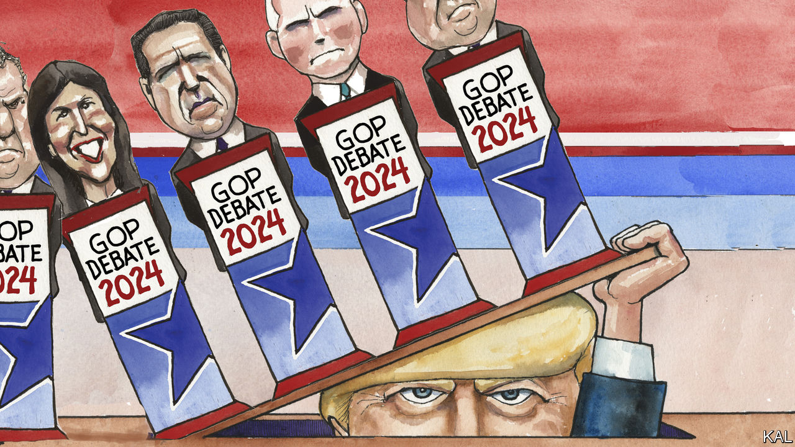

###### Lexington

# How Donald Trump won the debate he skipped 

##### Despite glimpses of Republican life without him, no obvious rival emerged 

 

> Aug 24th 2023 

In the first Republican debate of the presidential season, on August 23rd, Fox News generously granted Americans 50 minutes of escapism, or maybe denial: a glimpse of Republican politics without Donald Trump dominating the stage, as speaker or even as subject. He chose to skip the debate, leaving it to eight other candidates to bicker over how to ban abortion and whether humans caused climate change. It turned nasty fast, but some of it was clarifying, and all of it was a relief. 

And then reality hailed down in the form of a question about whether the candidates would support Mr Trump as the nominee even if he were convicted of a felony. Six of eight hands went up. Well, four hands went up, and Governor Ron DeSantis of Florida, looking around and spotting them, quickly half-raised his own hand, followed by former Vice-President Mike Pence. 

Mr Trump was at pains to smother the debate, which took place in Milwaukee, Wisconsin. He pre-taped an interview with Tucker Carlson, formerly of Fox, that was posted to X, formerly known as Twitter, just as the debate began. The two had a genial back-and-forth about matters such as whether Jeffrey Epstein really killed himself in jail or was murdered. Mr Trump acted like he had already won the nomination, largely ignoring his rivals and attacking President Joe Biden. (“He looks horrible at the beach.”) 

And, just in case any of the other Republican candidates had a breakout moment, Mr Trump had arranged to turn himself in the next day at the Fulton County Courthouse in Georgia on his latest criminal indictments over his efforts to overturn the election. That guaranteed he would command the forthcoming news cycle, regardless of the outcome in Milwaukee.

He need not have worried much, as it happened. Mr DeSantis, whose prickly ways and blundering campaign have steadily eroded his position as Mr Trump’s chief rival, delivered a middling performance, clumsily evading some questions and, despite his position at centre stage, fading back into the field for long stretches. The dominant personality was Vivek Ramaswamy, a former biotech entrepreneur and first-time candidate who has surged into third place in recent polls.

Mr Ramaswamy is 38, and according to Politico he did not vote in any election from 2004 to 2020. But he is obviously a quick study. Like insurgent candidates before him he has fearlessly thrown himself before every camera and microphone, and he seems willing to pluck a winning formula wherever he can find one. “Who the heck is this skinny guy with a funny last name and what the heck is he doing in the middle of this debate stage?” he asked with a big grin in introducing himself during the debate. 

Chris Christie, a former governor of New Jersey and an old political hand, clearly had no patience for Mr Ramaswamy’s over-caffeinated-millennial act, and he caught the echo of a line Barack Obama used about himself at the Democratic convention in 2004 (“the hope of a skinny kid, with a funny name”). “I’m afraid we’re dealing with the same type of amateur standing on the stage tonight,” Mr Christie growled.

Though his sunny manner darkened over the course of the debate, Mr Ramaswamy was not cowed, and he continued to deride and bait his opponents, individually and collectively. “I’m the only person on this stage who isn’t bought and paid for,” he declared. As a result he, rather than Mr DeSantis, became the focus of their fire. This, again, was helpful to Mr Trump, by preventing any clear alternative to him from emerging. Mr Ramaswamy, who has been careful to heap praise on Mr Trump and has promised to pardon him if elected, is more likely to wind up in a Trump cabinet than the Oval Office. 

The first nominating contest, a caucus, will take place in Iowa on January 15th, and Mr Trump has a commanding lead there as he does in national primary polls, though he remains unpopular with Americans as a whole. According to a poll published on August 21st by the , fully 42% of those who intend to caucus said they would support Mr Trump, compared with 19% for Mr DeSantis. 

Mr Trump’s legal problems appear to be strengthening him in Iowa, as they have nationally. The survey was conducted from August 13th until August 17th; after Mr Trump was indicted in Georgia on August 14th, his support jumped five points. “Trump has never been viewed favourably by more of Iowa’s likely Republican caucus goers than he is now,” the newspaper reported.

Putin’s useful idiots

Of the candidates in Milwaukee, Nikki Haley, a former governor of South Carolina and ambassador to the United Nations, presented the most compelling vision of an alternative Republican politics, at least for a general election. Although harshly critical of Mr Biden she insisted Republicans should acknowledge their own responsibility for the federal debt. When Mr Ramaswamy said he would support cutting aid to Ukraine, she said he did not understand Vladimir Putin. “You are choosing a murderer over a pro-American country,” she said. Mr Ramaswamy accused her of auditioning to be a board member of an arms manufacturer. “You have pulled down everyone on this stage,” she shot back, icily. “You have no foreign-policy experience—and it shows.” 

Mr Trump’s grip on his party is not absolute. Several candidates said Mr Pence did the right thing in rebuffing Mr Trump’s demand that he not certify the electoral college vote in Mr Biden’s favour, though, once again, Mr DeSantis had to be pinned down. “Mike did his duty,” he grumbled, finally. “I got no beef with him.” 

For his part, Mr Pence repeatedly reached for Reaganesque notes of optimism about the possibilities of America. But as delivered in his husky, solemn tones, his closing remark sounded less like a benediction than a warning. “God is not done with America yet,” he said. ■


