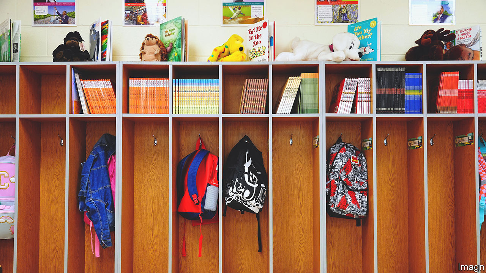
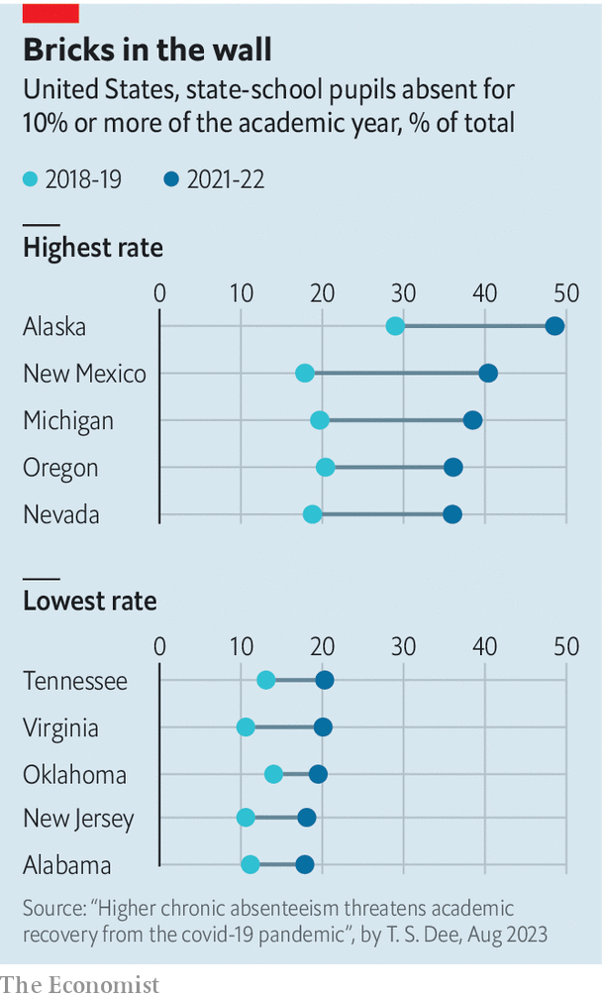

###### Absent-minded

# Post-covid, American children are still missing far too much school 

##### The pandemic seems to have permanently increased truancy 

 

> Aug 24th 2023 

Two hundred and fifty years ago, Thomas Jefferson wrote one of the first bills calling for universal, publicly funded education. He wanted all the children in his state of Virginia to attend classes. Not everyone was convinced. His bill never passed, and it took over 100 years for school to become compulsory across the whole of America. 

For most of the past century, attendance grew. Then the covid-19 pandemic happened. For the best part of two years, children were forced to learn at home, staring at laptops. As they start the 2023-24 school year, a terrifying proportion still seem barely to be back.

According to a study published in early August, in the 2021-22 academic year 28% of schoolchildren missed at least three and a half weeks of school. The study, conducted by Thomas Dee, an education professor at Stanford University, found that “chronic absenteeism”, defined as when an enrolled pupil misses 10% of the school year, almost doubled overall between 2018-19 and 2021-22. It went up in all 40 states in the study as well as in the District of Columbia. In Alaska, the state with the highest rate of chronic absenteeism, nearly half of all pupils missed enough school to be counted.

That so many children were kept out of school in the 2021-2022 school year, during which the Omicron variant of covid-19 rampaged throughout the population, is hardly surprising. Yet there are reasons to think absenteeism has persisted even as the virus has receded. In Connecticut, one of just two states which have already released data for the 2022-23 school year, the proportion of children absent fell by just three percentage points from the year before, to 21%. (In 2018-19 the rate was just 10%.) A similar pattern holds in Massachusetts, the other state to release data. And it is true of England and Australia too, suggesting that America is far from alone.

Explaining this is tricky. Students skip school for many reasons: lack of transport, poverty, the weather. But these are unlikely to have worsened of late. A more plausible explanation for the lasting rise is that, having experienced remote learning, some students—and perhaps their parents—no longer think it essential or even worthwhile to sit in a classroom. “It’s the same thing as in the workplace,” says a teacher in New Orleans. “Once you’ve gone down to only being there two or three days a week, coming back all five is hard.” His classrooms are especially empty on Fridays, he says, so he avoids scheduling the most important lessons then.

After the pandemic, people “started catering to their mental-health needs”, says Tieshia Robinson, a principal at Chicago Collegiate, a public charter school in the city. For parents, that might mean allowing children who are unhappy at school to skip days. Pupils have also grown used to staying at home at the slightest sign of physical illness, says Greg Frostad of New Mexico’s education department. Recently, covid-19 has returned, and protocols still require pupils to stay at home for five days after testing positive. 

This alarming absenteeism is coinciding with falls in enrolment. In a separate study released in February, Dr Dee found that public-school enrolment fell between autumn 2019 and autumn 2021 by 2.5% (about 1.2m pupils). Some of this is because the number of school-age children in America is shrinking, and a small part reflects a shift to private schools. But much seems to be the result of families opting out of school entirely. Private school attendance increased by 4%; homeschooling rose by 30%. Exactly what that means for the quality of tuition children are receiving is unclear. Some states insist on strict rules for homeschooled children; but some barely check on them at all.

Attending school in person is important. Studies show that even after adjusting for poverty levels and race, children who skip more school get significantly worse grades. One published by the Institute of Labour Economics, a German think-tank, by three American academics, found that missing ten maths classes reduced the chance of a high school student graduating on time by 8%. Schools also connect pupils to important services. In Baltimore, schoolchildren can get free meals or be fitted for glasses through school; and their parents can be hooked up with social services. Educators can also spot if a child is being neglected or abused. Pupils develop social skills in school, take part in after-school programmes and learn sports.

 


What will it take to coax kids back into classrooms? Skipping school frequently is illegal and in many states parents can face fines or even jail. On August 15th Missouri’s state supreme court upheld a law that permits jail time for parents if their children are truant. But there is little evidence that criminalising truancy prevents much of it. And because chronic absenteeism is powerfully correlated with disadvantage, enforcing such laws would hurt the poorest families. In Washington, dc, three-fifths of pupils who were eligible for government assistance were truant.

Instead, many schools are trying to solve some of the problems that keep children away. In New Mexico many pupils missed whole days of school to travel long distances for medical appointments, says Mr Frostad. So some of the state’s schools teamed up with federal health clinics. “Now [pupils] can be seen in 30 minutes and then be back to class,” he says. Sometimes pupils are forced to miss school because they have been suspended or expelled. Administrators are now reconsidering disciplinary policies. If a pupil has vandalised school property, for example, school officials can require that the child clean it up instead of being sent home.

Chicago Collegiate is encouraging attendance by giving pupils individual rewards and by holding class pizza parties. In Baltimore 58% of pupils miss at least 10% of the school year. The mayor, Brandon Scott, plans to award a trophy to the school with the most improved attendance rate. The state of New Mexico offers competitive grants to schools to encourage new attendance initiatives. 

Teachers and school staff are also going to pupils’ homes to urge them to attend regularly. In Baltimore Mr Scott is planning to join the city’s school leaders this year on visits to missing pupils’ homes. He has also brought back older tactics: sending truant officers to search for kids on the streets. During the 2022-23 school year, Mr Scott’s office cracked down on “squeegee boys”—kids who washed car windows for cash at intersections—after a 14-year-old boy shot and killed a 48-year-old man who had confronted a group with a baseball bat. Vans picked the kids up and hauled them to school. 

There are few easy fixes, though some look for them. In Chicago, at the start of this year, the schools inspector-general accused several schools of misreporting truant (or entirely missing) children as having transferred to other schools to mask absenteeism. Almost half of pupils in the city were reported absent in 2021-22. Most teachers, however, are simply trying to adapt. “Our youngsters, the competition for their attention has never been more difficult,” sighs a teacher in a New York City middle school. The challenge, he says, is to “make kids gravitate to school”. Mass education needs mass. ■


