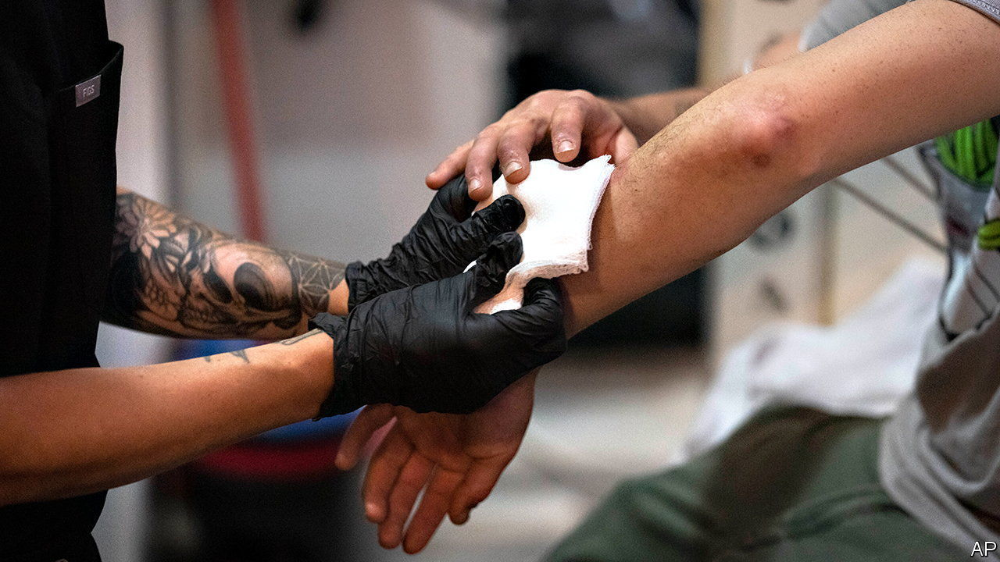

###### In the flesh

# The rise of “tranq dope” is making America’s opioid crisis worse 

##### A new drug cocktail rots people’s limbs 

 

> Aug 24th 2023 

In the early 2010s a nightmarish new drug spread across Russia and Eastern Europe. Krokodil, a cheap substitute for heroin cooked up in kitchen laboratories, left users with scaly skin and rotting wounds. Now an eerily similar drug called “tranq dope” has infiltrated America. Last month the White House issued a national plan to fight it.

Tranq dope is a combination of fentanyl, a powerful synthetic opioid, and xylazine, a veterinary tranquiliser. Adding xylazine to an opioid seems to make the high last longer. Between January 2019 and June 2022, the share of all fentanyl-related overdose deaths where xylazine was present shot up from 3% to 11%. 

The cocktail was first detected by drug authorities in the early 2000s in Puerto Rico. Later it circulated there and in limited areas within America’s north-east, such as Philadelphia. But it has now been detected in nearly every state in the country and, according to the Drug Enforcement Administration (dea), is probably being mixed “at retail level” (ie, on the street). 

Xylazine can be bought for as little as $6 per kilogram on Chinese websites, so drug suppliers can pad their profits by using it to bulk up their more expensive fentanyl, supplied mostly by Mexican drug gangs. Consequently, many end users will not know whether they are buying pure fentanyl or tranq dope, though it is increasingly risky to assume the former. In March the dea warned that almost a quarter of American fentanyl powder now contains xylazine. In Philadelphia, more than 90% does.

Though chemically different, tranq affects the body in ways reminiscent of krokodil. Researchers believe that xylazine causes the outer blood vessels to constrict, which means the skin does not get enough fresh blood. The result is deep, necrotic open sores, which can form even if the drug is snorted, not injected. Eventually, tissue simply rots away. Such wounds can easily become infected, and limbs may ultimately need to be amputated. Users appear to enter a stupor, which makes them easy to rob or assault. 

Worryingly, the emergency treatment for a fentanyl overdose does not work on non-opioids like xylazine. When people overdose, first responders give them naloxone, which acts on opioid receptors in the brain to reverse the effects of the opioid, in particular suppressed breathing. Xylazine has no such antidote.

Doctors say their primary worry is still fentanyl, rather than what it is mixed with. The opioid kills more Americans every year. In 2021 around 70,000 people died after having taken it. Fentanyl itself is increasingly used as a deadly bulker for more expensive party drugs, such as cocaine and ecstasy. Yet those taking tranq dope are at even greater risk of a fatal overdose, or of suffering a life-changing injury, such as a lost limb. The drug’s spread complicates an already complex battle against addiction and overdose deaths.

American authorities seem to be taking the challenge seriously. In February the federal Food and Drug Administration announced that it would start tracking imported xylazine, which previously was mostly unmonitored, and detain suspicious shipments. The Biden administration has also set a goal of reducing deaths from tranq dope by 15% in at least three of four American census areas by 2025, primarily by increasing testing and adjusting treatment accordingly.

Nevertheless, the dea suspects tranq will continue to spread. In Puerto Rico drug users have specifically sought it out, hoping for a lasting high. By some reports, demand is similarly rising in Philadelphia. As bleak as the opioid crisis seems, it could get grimmer. ■


