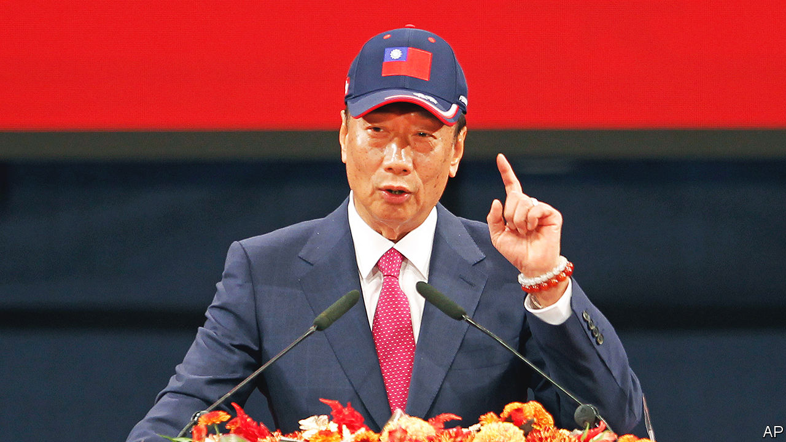

###### In the chicken coop

# A mercurial billionaire, Terry Gou, shakes up Taiwan’s presidential race 

##### A crowded pro-China field is good news for the ruling Democratic Progressive Party 

 

> Aug 28th 2023 

ALThough half-expected, it was dramatic. On August 28th Terry Gou, founder of Foxconn, one of the world’s biggest electronics manufacturers and a supplier to Apple and others, told a packed auditorium he was joining the race to be Taiwan’s next president. Wearing his trademark blue cap emblazoned with the Taiwanese flag, and giving military-style salutes, the 72-year-old billionaire said he would fight the election due next January as an independent. Having failed for a second time to win the nomination of the opposition Nationalist Party, known as the Kuomintang (KMT), he dedicated his candidacy to making Taiwan and China trust each other. Mr Gou vowed to bring half a century of peace to the Taiwan Strait: “I will never allow Taiwan to become the next Ukraine.”

In fact his entry probably makes it harder for a China-friendly candidate to win. Two such candidates are already in the race to lead Taiwan’s 24m-strong democracy: the KMT’s , the mayor of New Taipei City, who calls for talks with Beijing; and Ko Wen-je, the former mayor of Taipei, running for the Taiwan People’s Party. Mr Ko prefers to talk about bread-and-butter issues rather than China, but has in the past adopted an accommodative position similar to the KMT’s. That leaves Lai Ching-te, Taiwan’s vice-president, running for the Democratic Progressive Party (DPP), as the only candidate taking a hard line on China.

Fraught geopolitics have made the issue urgent. During the tenure of Taiwan’s DPP president, Tsai Ing-wen, Beijing’s leaders have increased  near Taiwan and predicted its unification with China in increasingly belligerent terms—even as American officials have vowed ever more often to defend the island from Chinese aggression. A win for Mr Hou, Mr Ko or, now, Mr Gou, would not end the tensions, but would probably reduce them by placating China. A win for Mr Lai, a soft-spoken former doctor who, in 2017, enraged officials in Beijing by calling himself a “pragmatic worker for Taiwan independence”, might have the opposite effect.

Even before Mr Gou’s announcement, that looked fairly likely. According to a recent poll in my-formosa.com, an online magazine, Mr Lai had the support of 39% of voters. Mr Ko had 18% and Mr Hou 16%. As a hypothetical candidate, Mr Gou had 12%.

He naturally points to his business acumen as a reason why that share might increase. A son of Chinese immigrants who came to Taiwan with the KMT in 1949, Mr Gou has a powerful rags-to-riches story. He founded a business making plastic knobs for television sets in the 1970s using money borrowed from his mother-in-law. Now Foxconn, which Mr Gou chaired until four years ago and in which he retains a significant shareholding, has huge factories in China and employs more than 1m people, who assemble iPhones and other devices. By applying the same magic to Taiwan’s economy, Mr Gou pledges to double the rate of economic growth, which is forecast to be around 2% this year, and put Taiwan on course to have the highest GDP per head in Asia within two decades.

Critics say his interests would make Mr Gou vulnerable to pressure from Beijing. Far from it, he insists: if the Communist Party threatened to confiscate Foxconn assets, “I will say: ‘Yes, please do it!’” Yet, such bravado aside, his tactics are unclear.

He will need to collect 290,000 signatures by early November to get onto the ballot. Liao Da-chi of National Sun Yat-sen University in Kaohsiung City doubts this is even his intention: “I don’t think that he wants to run to the end of the election.” She suspects his main purpose is to spur the opposition candidates to form an alliance against the DPP, which Mr Gou castigates as incompetent and impervious to the risk of a war. “My candidacy is to promote the integration of the opposition camp,” he said. “We must take down the DPP.”

If the opposition united, Mr Lai could be in trouble. Yet Mr Ko seems committed to his candidacy. And the century-old KMT would be loth to get behind a candidate other than its own. The party denounced Mr Gou’s entry into the race. So, significantly, did China’s nationalist tabloid the Mr Gou’s field-splitting candidacy, it thundered, had brought “pain to his friends and joy to his enemies”. ■ 

