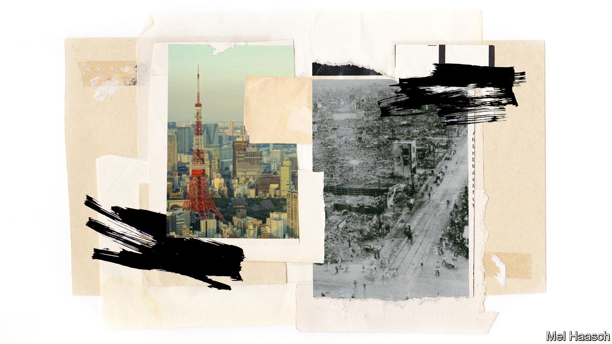

###### The Next Big One

# Japan is preparing for a massive earthquake 

##### The centenary of the Great Kanto earthquake brings angst, and lessons for the world 

 

> Aug 31st 2023 

Every year on September 1st, Japan’s ministers trek by foot to the prime minister’s office to take part in a crisis simulation. Across the country, local officials and schoolchildren drill for disasters. The date marks the Great Kanto earthquake, a 7.9-magnitude tremor that struck near the capital back in 1923. The ensuing disaster killed at least 105,000 people, including around 70,000 in Tokyo itself, destroyed 370,000 homes and changed the course of Japanese history.

This year’s centenary of the disaster has occasioned much commemoration—and angst. What will happen when the next Big One hits? Seismologists cannot predict earthquakes, but their statistical models, which are based on past patterns, can estimate the likelihood of one. The city government’s experts reckon there is a 70% chance of a magnitude 7 or higher quake hitting the capital within the next 30 years. Far fewer people will probably die than during the disaster in 1923, thanks to better technology and planning: the worst case foresees some 6,000 deaths in the city. But millions of lives will be upended. 

Another, similarly likely scenario could be much worse. A Nankai Trough earthquake, envisaged south of Kansai, Japan’s industrial heartland, could trigger a tsunami; as many as 323,000 might be killed, according to an official estimate. Japan’s approach to the risks of such catastrophes offers insights for a warming world facing more frequent disasters.

Quakes of this size could “challenge the survival of Japan as a state” and send economic shock waves around the globe, says Fukuwa Nobuo of Nagoya University. After the next Tokyo quake, recovering basic city functions could take weeks and rebuilding the capital could take years; direct damage alone could run to as much as 11trn yen ($75bn). One piece of research estimates that GDP would dip by 11% following a Nankai earthquake. 

The costs could trigger a crisis over Japan’s substantial public debt. Global supply chains would face severe disruptions. In 1923 xenophobic rumours after the quake led to the massacre of at least 6,000 Koreans living in Japan; some historians argue that the disaster hastened Japan’s descent into fascism. Modern Japan is unlikely to take a similar turn, but the political aftershocks could still be nasty. 

The shaking in 1923 began just before noon, at a subduction zone in Sagami Bay, south of Tokyo. Many of the city’s nearly 4m residents were preparing lunch over open flames. Fires spread, helped by strong winds blowing from the north, where a typhoon hit the same day. The conflagration raged for nearly two days as aftershocks kept the ground unsteady; half of the city burned. “If this were not hell, where would hell be?” one observer asked. 

A future earthquake might begin the same way, or at faultlines farther inland. The force could be devastating. At modern “Life Safety Learning” centres, Tokyoites can experience a simulated version. At magnitude 7, your correspondent was left prostrate, clutching a table leg. 

As instructors at the centre explained, survival is a matter not of luck but of preparation. In many respects, Tokyo is well prepared. Back in 1923 scientific knowledge had progressed little beyond the folk belief that shaking was caused by , giant catfish living under the surface of the earth. “Nobody knew what an earthquake was,” explains Hirata Naoshi, a seismologist at the University of Tokyo who chairs the city government’s expert panel on seismic scenarios.

Modern seismology in Japan dates back to research institutions set up after the quake. Subsequent rumblings, in particular the Great Hanshin earthquake that struck Kobe in 1995 and the Great East Japan earthquake that hit Tohoku and caused the meltdown at Fukushima in 2011, have led to even better understanding of plate tectonics. Japan collects vast amounts of data and has world-beating seismometer networks and early-warning systems. (The un reckons only half the world’s countries are equipped with adequate early-warning systems for the hazards they face.)

Japan has also focused on what turns natural hazards into human disasters. Although earthquakes cannot be stopped, people living within their range can be made less vulnerable. Disaster-related civic groups have proliferated since 1995; volunteers organise to hold drills, cultivate community ties and prepare for the worst. After the disaster in 2011 a new National Resilience Act mandated more thorough prevention and mitigation measures, with a particular eye on the possibility of a major quake under Tokyo or in the Nankai Trough. Last year the Tokyo government earmarked 6trn yen over ten years for a “Tokyo Resilience Plan”. Few details go unconsidered. When asked what worries him most, Hamanaka Akihiko of Tokyo’s disaster-prevention division pauses briefly, then says: “Toilets”. 

Infrastructure improvements have made Tokyo much safer. The Great Kanto earthquake prompted the Japanese government to introduce seismic building codes. They were substantially updated in 1981 and again in 2000. Some 92% of Tokyo structures meet the codes; bringing that number up from 81% a decade ago reduced the casualty estimates by over 3,000. 

Awareness of disaster risk makes Japanese construction companies and developers keen to invest in safety measures beyond what is legally mandated, says Kurino Haruhiko of Kajima, a big construction firm. On top of the 40-floor Ebisu Garden Place Tower in central Tokyo, Kajima recently installed a new 1,350-tonne pendulum designed to reduce the skyscraper’s sway by half. (Lax enforcement of building codes meant that an earthquake in southern Turkey earlier this year killed more than 50,000 people.)

Flames killed around 90% of the casualties in 1923. Over the ensuing decades the government purchased land in order to widen key roads, creating fire-protection belts to stop the spread. Builders switched to less flammable materials. Bitter experience had shown the need for well-designed evacuation routes: during the Kanto disaster nearly 40,000 people died in a single field in east Tokyo, where flames closed in from all sides. Neighbourhoods now have clearly marked evacuation sites. (Authorities in Maui had not posted evacuation maps for wildfires before the blaze in Lahaina in August.)

Despite the improvements, modern Tokyo is vulnerable in new ways. The city’s population has ballooned to 14m. While the rate of fire outbreak may be lower, with a greater number of households “the absolute risk is greater”, reckons Hiroi Yu of the University of Tokyo. Many neighbourhoods with concentrations of flammable wooden houses remain. Shelters have space for 3.2m people; some 5m people may be displaced. Planners fret about compound disasters, such as an earthquake during a pandemic. Disasters tend to upend even the best-laid plans. “Uncertainty is at the core of disasters,” says Ichiko Taro of Tokyo Metropolitan University. 

Tokyoites’ lifestyles have also changed in ways that make it harder to respond to disasters. More people live alone; government surveys show that single-person households tend to be less aware of and prepared for disasters. Old-style wooden houses burned easily, but they fostered closer communities and more mutual aid than modern high-rises, where residents may hardly know their neighbours. And in ageing Japan, ever-more neighbours will need extra help. Japanese tend to speak about national security in terms of threats from their menacing neighbours. But the earth beneath them is also dangerous. ■

