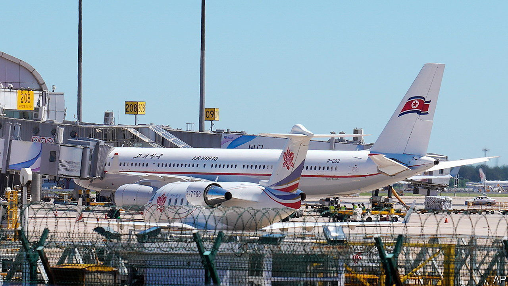

###### Cemetery gates

# North Korea’s borders are creaking open 

##### Thousands of defectors and exiles in China face a grim forced return 

 

> Aug 27th 2023 

THE GATES of North Korea, closed since January 2020 ostensibly to keep covid-19 out, are finally creaking open. On August 27th North Korean state media announced that citizens who had been  of the country during the pandemic were starting to return home. Some North Korean civil aeroplanes have already made return trips to Beijing.

Many will welcome any relaxation of restrictions, in the hope it will lead to more food imports from China to stave off the country’s endemic shortages. But for one group of North Koreans the news inspires dread. According to the UN as many as 2,000 North Korean defectors are now languishing in Chinese prisons, awaiting a possible forced return to a country that deals extremely harshly with those suspected of trying to escape its clutches.

Some North Koreans were trapped in China against their wishes when the borders shut. Many of them had gone there, with the permission of Kim Jong Un’s regime, to study or earn money for the state. After so much time away from its propagandists, they are likely to be forced to endure re-education to reassure the authorities of their ideological reliability.

Others left without the regime’s approval, either to engage in trade or to escape its tyranny. They can expect rougher treatment. Merely  without permission is punishable by up to five years of “reform through labour”. Those repatriated in the past have been subjected to torture, sexual violence, forced abortions and other forms of mistreatment, says Su Bo-bae, a researcher at the Database Centre for North Korean Human Rights, a think-tank in Seoul.

An escapee interviewed by another rights group, Rights for Female North Korean Defectors, was imprisoned after being forcibly repatriated from China. He was sentenced to hard labour and forced to adopt stress positions for five hours every morning. Violence in his facility was routine. He recalled seeing a guard grabbing an elderly woman by the hair until it came out in clumps and pounding her face.

Although the situation is most worrying for North Koreans in detention in China, all defectors there are at risk. In recent years Chinese digital surveillance infrastructure has improved and fake residency cards have become harder to obtain. The need to show a QR code linked to residence papers when entering public places during the pandemic has made undocumented North Koreans easier to spot.

Most defectors are women and many risk being separated from their children if sent back. A defector who spoke to  and other media outlets in South Korea, at a naturalisation centre for North Korean arrivals, exemplifies this. She escaped to China in 2014 and married and had children there—before escaping to the South for fear of repatriation. “I had something to protect,” she says, “I was worried about my family”.

When reminded by the UN of its legal obligation not to return anyone to a country where they might be tortured, the Chinese government routinely responds that North Korean border-crossers are economic migrants whom it handles “in keeping with Chinese laws, international law and humanitarianism”. This illustrates China’s broader see-no-evil approach to its neighbour’s transgressions. On August 17th the UN Security Council addressed North Korean human-rights abuses for the first time in five years. China’s representative called the discussion “irresponsible, unconstructive and an abuse of the council’s power”.

In the build-up to the Beijing Olympics in 2008, China permitted seven North Korean defectors to travel to third countries. Some activists have suggested it might make a similar allowance ahead of the Asian Games in Hangzhou in September. This is optimistic. Before the Olympics, China and Western countries were co-operating in a joint effort to talk the North Koreans out of their nuclear ambitions. Now Sino-American rivalry is raging and China, fiercely opposed to the West, seems unmoved by any North Korean outrage.■

