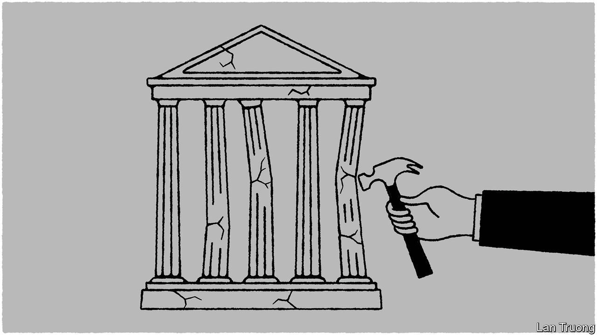

###### Banyan

# South-East Asian democracy is declining 

##### Recent events in Cambodia, Indonesia and Thailand help explain why 

 

> Aug 31st 2023 

Almost everyone agrees that democracy is declining in the 11 countries of South-East Asia. But why? The region’s diversity makes generalisations hard. It is about the size of Latin America, with 690m people, and has a gallimaufry of political structures, ranging from the autocratic sultanate of Brunei to Leninist Vietnam and impressively democratic (but tiny) Timor-Leste. Yet in three important countries in the region, Indonesia, Thailand and Cambodia, democracy is struggling, and some baleful common themes emerge.

After the fall of its long-ruling dictator, Suharto, in 1998 Indonesia was considered a standout democratic success. The world’s most populous Muslim country proved, as Dan Slater of the University of Michigan writes, that democracy can “emerge and endure in surprising ways and in a surprising place”. The election of Joko Widodo as president in 2014 seemed to many to cement that transformation. “Jokowi”, as he is known, sold himself as an incorruptible outsider to a politics still dominated by the country’s traditional business, political and military elites. 

Yet in his second term as president, from 2019, Jokowi has undermined Indonesian democracy. He has defanged the country’s anti-corruption commission and eroded civil rights with an illiberal new criminal code. He has brought individuals linked to the once-ruling army elite back into the heart of government. He backs as his successor Prabowo Subianto, a demagogue and former general. America formerly banned Mr Prabowo for alleged rights abuses. Many Indonesians see in him the spectre of the late Suharto, who was once his father-in-law. With a well stocked campaign-chest, he is the frontrunner to win a presidential election next February.

In Thailand the setback is more visible. In May a general election produced an emphatic winner, Move Forward, a party that championed breaking the grip of Thailand’s monarcho-military elite after nine years of army-backed rule. But the elite moved to deny it power, sharing it instead with Thaksin Shinawatra, a former prime minister who promptly returned after years in exile. Mr Thaksin was once considered the champion of ordinary Thais. The army twice launched coups against him and parties controlled by him. Now he is in bed with it.

As for Cambodia, the UN spent millions fostering democracy in that war-torn land. There is little to show for it. On August 22nd, following elections in which the opposition was banned, the long-serving strongman, Hun Sen, made way for his son, Hun Manet. Cambodia is now a hereditary dictatorship like North Korea. 

A feature of all three countries is a personalised or dynastic approach to power. That is most obvious in Cambodia. But Jokowi, that former outsider, is also busily fostering a dynasty of his own. His son and son-in-law have dived into politics; Mr Prabowo backs them both. And a big motivation for Mr Thaksin’s deal with the army was to foster conditions for his family to thrive in politics. His 37-year-old daughter, Paetongtarn, heads his Pheu Thai party. 

Another, related feature is the seemingly unlimited capacity for accommodation shown by all the leaders concerned. Jokowi decided to bring his two-time presidential challenger, Mr Prabowo, into his cabinet. In Cambodia the ruling party has bribed or bullied thousands of its opponents to join it. Now Camboja News, an independent website, reports that the new government has over 1,400 secretaries or undersecretaries of state, more than twice as many as its predecessor.

Accommodation is often claimed to be an Asian political virtue. But it mainly entails swelling patronage networks. As Sebastian Strangio writes in the  magazine about Cambodia, such networks exist to milk resources. Expanded networks mean more corruption and cronyism—and let ordinary folk go hang. 

A third common aspect flows from the first two: the weakening of political parties. When elites wantonly divvy up power, the function of parties as competitive platforms for change goes out of the window. Jokowi’s chief of staff, Moeldoko, was for a time also made chairman of an opposition party.

Civil-society voices still make themselves heard in all three countries—even repressive Cambodia. And Move Forward promises to keep pushing on in Thailand. The outside world should give all the support it can to such forces. South-East Asia was once a democratic inspiration. It could yet be again.■


