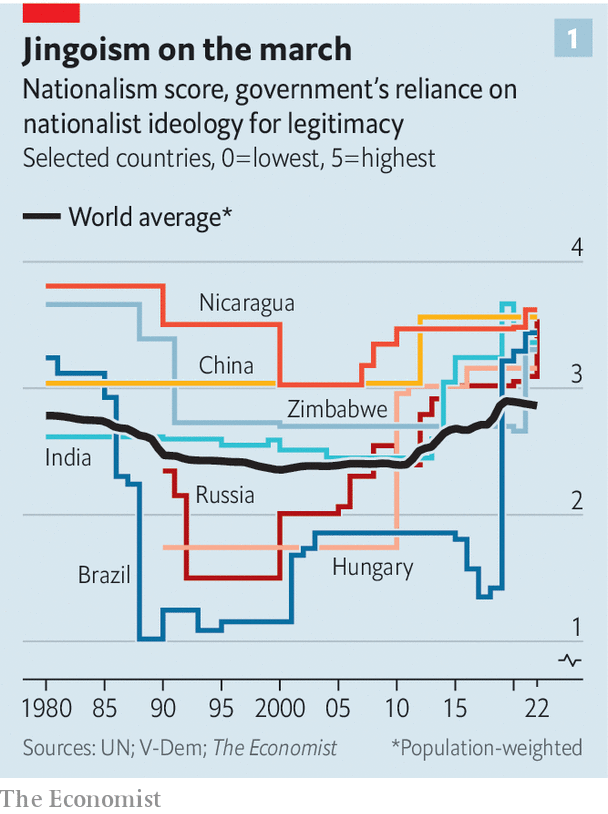
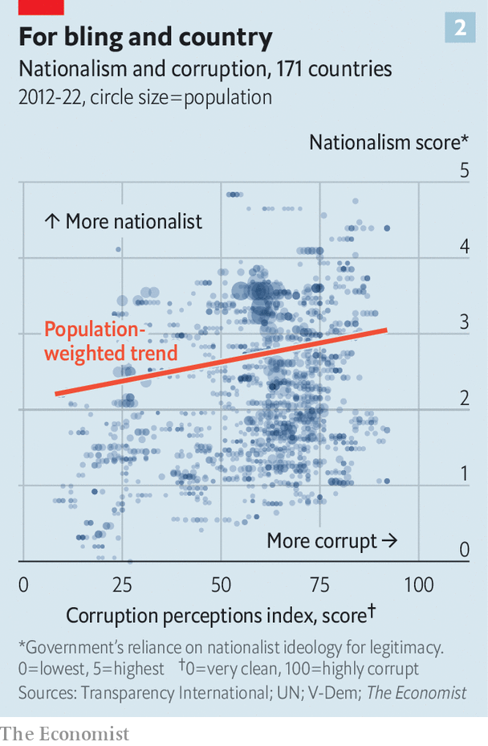
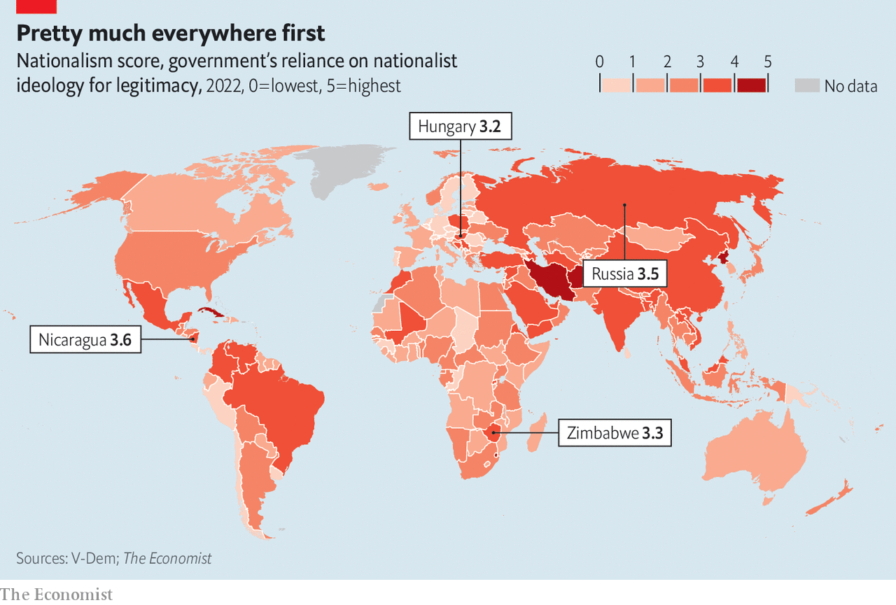

###### Looters with flags

# How cynical leaders are whipping up nationalism to win and abuse power 

##### Hatemongers often erode checks on misrule and corruption 

 

> Aug 31st 2023 

EARLIER THIS year Tunisia’s president, Kais Saied, warned that “hordes of irregular immigrants” from sub-Saharan Africa were plotting to change Tunisia’s demography, replacing the Arab majority. Black Africans, he added, brought “violence, crimes and unacceptable practices”. 

In effect, he gave Tunisians permission to be openly racist. Suddenly, many felt free to use slurs that were previously taboo, including one for black people that means, literally, “slave”. Most locals interviewed by  in the street in August used this term. “The slaves are replacing us,” said Nizar, a furniture repair man in Tunis, the capital. “They are taking all the jobs.” Worse, “They stand on the balcony in their underwear drinking alcohol.”

A wave of hatred has crashed over the country. In July, after an Arab was killed in a brawl with migrants in Sfax, Tunisia’s second city, mobs torched homes where black Africans were lodging. Landlords, scared of losing their property, evicted black tenants. When  visited, hundreds of sub-Saharan migrants were sleeping rough in the town centre, huddled together for protection. 

“Look at my head,” said Muhammad, a painter from Guinea, pointing to a hammer-blow scar. He was driven from his flat by thugs wielding stones and petrol bombs, he said; then police grabbed him and dumped him in the desert with no water. Many migrants have died this way, but Muhammad somehow made it back to Sfax. He is desperate to get to Europe. 


The president’s speech was pure fabrication. There is no plot to change Tunisia’s demography. Black Africans are a tiny share of the population, and largely just passing through. If they linger, it is simply because they are saving for the perilous journey across the Mediterranean. 

Before the speech, Mr Saied was unpopular, thanks to a dire economy. After it, he appears to have won more support. Polls are unreliable, but one in November gave him less than 30% backing; a different one in June found that 69% would vote for him. 

By vowing to guard Tunisians from a phantom menace, he has rallied them behind him. He has also deflected blame for the country’s ills. Economists think Tunisia’s inflation is largely caused by the government, but Mustafa, from Sfax, blames black people, who he says are driving up prices by eating all the bread. He plans to vote for Mr Saied at the next election. 

The president’s hate-mongering has also distracted attention from other controversial things he has been doing, such as muzzling the press, purging the judiciary and shutting down the national anti-corruption watchdog. He has been dismantling the checks and balances that promote good, clean governance, with predictable results. Tunisia has grown more fearful, less free and more corrupt. Its score on the Corruption Perceptions Index (CPI) compiled by Transparency International, a watchdog, has worsened significantly since 2021, when Mr Saied started dismantling its young, hopeful democracy. 

 


Tunisia reflects a global trend: more leaders are using nationalism as a tool to amass power—and to abuse it (see chart 1). Whereas nationalism was once a means to dismantle deplorable colonial empires, it is increasingly becoming a device to remove legitimate constraints on government power. Leaders who chafe at checks and balances need a pretext to scrap them. They cannot admit that they want to muzzle the press and purge the courts because they find it irksome to follow the rules and would prefer to rule with unfettered authority. So they accuse journalists and judges of being traitors, or agents of foreign powers. 

Nationalism can be positive or negative. The positive sort—love of one’s country—can be a force for good. “It is the strongest foundation for solidarity between people who might otherwise have few things in common,” writes Yascha Mounk in “The Great Experiment: How to Make Diverse Democracies Work”. “At its best, it can inspire a white Christian living in rural Tennessee to feel special concern for a Hispanic atheist living in Los Angeles—and vice versa.” Because it is benign and, except at a few Western universities, uncontroversial, positive nationalism is embraced by nearly all politicians. Hardly any would admit to not loving their country. 

The danger is when they espouse negative nationalism: the fear and suspicion of outsiders. The outsiders could be foreigners or domestic minorities. Perhaps because this paranoid variant is based on a deep-seated instinct—the desire to protect one’s tribe—it is highly potent. 

When people feel their country is threatened, they rise to defend it, sometimes heroically. When Vladimir Putin invaded Ukraine, Ukrainians made great sacrifices to resist him. This benefited Ukraine, which would otherwise have become a vassal state. It also boosted the poll ratings of Ukraine’s president, Volodymyr Zelensky: people rallied round the man who led their country’s defence. 

Alas, unscrupulous leaders have found they can win similar poll bumps by vowing to defend people against confected threats. Mr Putin claims that his unprovoked attack on Ukraine is really about defending Russia from Western aggression and Ukrainian Nazis. Many Russians believe him. Despite the war’s cost to Russia in blood, treasure and international isolation, independent polls suggest that Mr Putin’s approval rating has risen since he started it. 

The main drawback of paranoid nationalism is obvious. It is terrible for its targets, whether they be immigrants in Tunisia or Ukrainians whose land has been sown with mines. Neighbours of paranoid nationalist regimes have cause to be nervous, as anywhere that shares a border with Russia or China can attest. 

The other big drawback is less well understood: politics based on bigotry opens the door to misrule and corruption. As Mr Putin has ratcheted up nationalist propaganda over the past two decades, his cronies have been plundering Russia. And though he is surely the most extreme example, he is far from alone. In fact, there is a clear statistical correlation between nationalism and corruption.

 analysed data from the V-Dem Institute, a think-tank attached to the University of Gothenburg in Sweden. Every year it asks experts to describe how the world’s governments justify themselves to voters or citizens. It then creates a scale with the results. After weighting countries by population, we found that between 2012 and 2021 governments became more reliant on nationalism to justify themselves. (Specifically, on an ideology that included a nationalist element. It could also include other elements, such as populism or Islamism.) The change was significant: a typical citizen has seen an increase in her state’s use of nationalism roughly equivalent to what China has seen under its “Wolf Warrior” president, Xi Jinping. 

 


We combined our measure of how nationalist governments are with data on perceptions of public-sector corruption from Transparency International (TI) for the years 2012 to 2021. Using a statistical model, we found that where governments rely on nationalist rhetoric to stay in power, experts think the public sector is much more corrupt (see chart 2). Moreover, comparing countries with themselves over time, going back to 2012, we find that more nationalist rhetoric has been associated with more corruption, and less nationalism with less corruption. Both these findings remain true after controlling for average incomes, and changes in them, and worldwide trends in nationalism and corruption. 

There were notable exceptions (China, for instance, became cleaner and more jingoistic) but the relationship is statistically significant: a one-standard-deviation increase in nationalism was correlated with a jump of 5.31 (on a scale of 0 to 100) in corruption when comparing countries, and a 0.13 point jump when comparing within them. The latter may seem small, but corruption scores usually do not change much at all. Interestingly, when an increase in nationalism came first, it predicted a future increase in corruption. 

Why might this be so? Daniel Eriksson, the head of TI, suggests three ways that nationalism can foster the abuse of power. Politicians may whip up nationalist passions to win office or hang on to it. By granting their kin or cronies influence, they may attempt to capture the state. And by branding critics as traitors, they may erode the checks and balances that prevent the looting of public funds. 

Appeals to nationalism are effective because they are simple to understand, and far more emotive than any bread-and-butter policy proposal. “Vote for me and I’ll make incremental improvements to schools” is a fine platform but a dull slogan. “The tribe next door are attacking us!” is an electrifying one. 

Pick your poison

The enemy can take many forms. It could be immigrants, as in Tunisia. Or a geopolitical rival: Chinese and Russian propaganda constantly demonise America. Or a minority faith: India’s ruling party plays up the non-existent threat that Muslims, less than 15% of the population, pose to the Hindu majority. 

Or the enemy could be cultural change. Many nationalist leaders describe any new social trend that makes people uncomfortable as foreign, or even a vicious attempt by foreigners to subvert their country’s values. Iran’s regime uses this argument about women’s rights; Uganda’s, about tolerance for gay people. Illiberal regimes habitually describe the values they oppose as alien, which is easier than explaining why they are wrong. 

Each nationalist leader is unique, and it is hard to tell which ones believe their own rhetoric. Either way, paranoid nationalism gives them tools to gain power, consolidate it, and disguise their abuse of it. 

Consider Nicaragua. Daniel Ortega, the president, was once a revolutionary Marxist. He shot his way to power in 1979 but lost an election in 1990. Determined to regain and retain power, he muffled his Marxism, dialled up the anti-American bombast, won an election in 2006 and has gradually throttled democracy ever since. 

His choice of bogeyman is shrewd. The United States really did sponsor violent revolutionaries in his country—four decades ago. That threat is long gone, but Mr Ortega still claims that his opponents are “agents of the Yankee empire” who “stopped being Nicaraguans long ago”. In February he had more than 300 dissidents stripped of their citizenship. 

 


Following Mr Eriksson’s script, Mr Ortega has put his kin in positions of power. His vice-president and likely successor is his wife, Rosario Murillo. Eight of their nine children help them run the country. Their son Laureano is a presidential adviser. He oversaw negotiations with a Chinese firm to build a $50bn canal across Nicaragua. The project collapsed in 2015 amid allegations of skulduggery. Laureano is also an opera singer. Not all opera fans are convinced of his talent. One critic likened his voice to the “shrieks of a goat giving birth”. But he regularly lands the starring role in operas backed by a foundation he runs, which is funded by Nicaraguan taxpayers. 

Grand theft autocrat

The Ortega family run the main television channels in Nicaragua. This lets them slant the news in their favour. It is also lucrative. Between 2018 and 2020 Nicaragua’s government bought advertising worth an estimated $59m from the three biggest TV channels owned or controlled by the Ortegas, while spending a measly $230,000 at channels not affiliated with them. In all, the family is thought to control 22 companies in industries from energy to property. Nicaragua is a whopping ten points more corrupt on TI’s scale than in 2012, and now ranks lower than Congo.

In richer, more established democracies, too, paranoid nationalism offers a quick way for outsiders to grab attention and break into national politics, or remain on top. In May Viktor Orban, Hungary’s prime minister, claimed at a conservative conference, “We are all under attack.” He vows to defend Hungarians against immigration, Islam and gay rights. He proclaims the unity of all ethnic Hungarians, including those in neighbouring countries. He gives them pensions and lets them vote in Hungarian elections; they tend to vote for him. Inflaming nationalism has thus helped him win four elections. 

The Hungarian media, which are now largely controlled by Mr Orban’s cronies, parrot his claims of foreign plots. Tame courts raise few objections when rivers of aid from the European Union flow into the pockets of his chums and state assets are transferred to foundations controlled by his allies. Lorinc Meszaros, a former schoolmate of Mr Orban who owned a modest pipe-fitting business, has become the richest man in Hungary, with a fortune estimated by Forbes at $1.4bn. 

In Hungary and elsewhere, nationalism offers a plausible-sounding excuse to weaken checks and balances. Watchdogs can be designated “foreign agents” and neutered. Honest public servants can be labelled “unpatriotic” and replaced with loyalists. Dodgy dealings can be kept secret in the name of national security. 

Mr Putin was a pioneer of this approach. In 2012 he introduced a law restricting the activities of ngos that received money from abroad. In 2022 he broadened the law’s scope. Now the state can declare any individual or group to be a “foreign agent” (which sounds to many ears like “spy”) if it deems them to be “under foreign influence”. So-called “foreign agents” can be banned from any kind of political activity, or simply shut down. 

Elements of the Putin method have been widely imitated around the world. At least 50 countries have enacted rules to curb civil society in recent years, according to Amnesty International. More broadly, of the 31 countries that showed a significant deterioration on the Corruption Perceptions Index between 2012 and 2022, 80% also suffered a constriction of civil liberties, as measured by the Economist Intelligence Unit, our sister organisation. 

Labelling watchdogs “foreign agents” impedes their work. Nervous local donors grow reluctant to fund feisty ngos; advertisers shun independent media, lest their brand names be tarnished by association. India has used its Foreign Contributions Regulation Act to harass and muzzle groups from Oxfam to Greenpeace. China’s “foreign influence” rules restrict the activities of any foreign-linked ngo that might annoy the Communist Party.

In July Zimbabwe’s president signed a “Patriotic Bill” allowing long jail terms for anyone caught “wilfully damaging the sovereignty and national interest of Zimbabwe”. The opposition says it criminalised criticism of the government in the run-up to an election last week, which the ruling party “won” unfairly. 

Despite its name, the bill seems designed to make Zimbabwe worse-governed. It makes it hazardous for members of civil society, the principal check on a thieving ruling party, to have any contact with foreigners. If an independent journalist talks to a foreign diplomat, or a local election-monitoring group shares data with an international one, or an anti-corruption watchdog seeks advice from an expert abroad, jail may await. As a cherry on top, the law also makes it harder to punish predatory officials, by requiring prosecutors to prove that those who abuse office knew that their actions were wrong. 

In country after country, incumbents have found that nationalist or sectarian arguments can be used to harass or exclude from office those who challenge the status quo. Iran’s corrupt theocracy insists that all presidential candidates meet its definition of Islamic piety. In 2021 it disqualified 585 of them, including all the would-be reformers, and allowed only seven to run. A new Polish law could bar from office politicians deemed to be unduly influenced by Russia; its probable target is Donald Tusk, a leading opposition candidate who is not pro-Russian at all. Since 2015, when Poland’s nationalist ruling party took charge, the country has grown eight points grubbier on the Corruption Perceptions Index.

Shades of greed

A more nationalist government does not automatically mean a more corrupt one. It is possible for a country to become more tub-thumping, but no dirtier, at least for a while. However, in the long run, if a leader uses nationalism to erode checks and balances, it becomes easier for the people around him or his successors to plunder. This happened in Zimbabwe, where a nationalist autocrat who was far more interested in power than money, Robert Mugabe, failed to stop looting by his cronies and was ultimately overthrown by them. 

Thus, regardless of the starting point, paranoid nationalism tends to make countries worse governed and less stable. A paper co-written by Abhijit Banerjee, a Nobel prize-winning economist, found that when voters pick candidates by ethnicity instead of, say, probity or competence, they end up with less honest, less competent representatives. 

Andreas Wimmer of Columbia University crunched data from nearly 500 civil wars and found that when political parties are ethnically based, civil war is nearly twice as likely. And instability is perhaps 30 times as likely if the country in question is neither a dictatorship (which can crush unrest before it escalates) nor a full democracy (where disputes are typically resolved peacefully). In short, when a leader invokes blood and soil, expect things to get bloody, or soiled. ■

