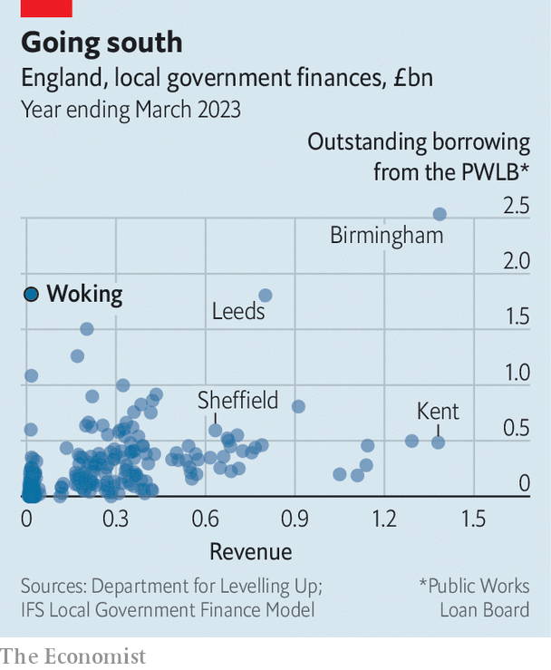

###### Local government

# A blunder costs a British town billions 

##### The fiasco in Woking is only the worst example of an unwelcome trend 

 

> Aug 29th 2023 

“WHICH OF the following do you value the most?” asked a survey that Woking council sent to its residents in July. Respondents could pick just three out of a list of a dozen local services. These included safety, clean streets, and help for the elderly, families and the young. It doesn’t take much imagination to see what is likely to come next: after officials destroyed the council’s finances, painful cuts to services are looming.

The quiet commuter town of just over 100,000, south of London, went into emergency financial measures in June, after racking up debt worth £1.8bn ($2.3bn). That’s a giant sum for a council with an annual budget of only £24m. Officials borrowed funds, then blew them on risky commercial investments, including a pair of tower blocks (30 and 36 storeys), a grandiose hotel (24 storeys) and a giant car park with a spiral ramp. These now loom over the Surrey landscape as a sorry reminder of their ineptitude. 

Outlining the investment plan in 2014, the council’s then chief executive, Ray Morgan, had likened Woking’s prospects to those of Singapore. Instead the town has become a byword for spectacular financial failure. Still, Woking is not the first to go broke. Since 2003 local governments have enjoyed greater financial freedoms, including the right to borrow for the sake of capital spending. In 2011 they got more powers as the Conservative government, set on austerity measures, sought ways to spend less on local services. 

Some councils, as they looked for new sources of income, launched innovative but risky investment strategies. They mostly borrowed money from the Public Works Loan Board (PWLB), a two-centuries-old body that is now under the control of the Treasury and which lends to local authorities and other public outfits. (Some councils also leant to others.) Typical projects included putting funds into housing or energy companies, but speculating on commercial property was often at the core of their strategies. 

Just 49 of the 352 local authorities in England accounted for a remarkable 80% of all commercial-property investments made in Britain between 2016 and 2019, the busiest period for this sort of dealmaking activity by councils. A few were quietly successful, but not all. It will take time to judge how many, overall, worked out. Woking is the fourth council to go into emergency measures recently. 

What went wrong? Woking borrowed from the PWLB, then re-loaned its funds at higher interest rates to companies that the council itself partly or wholly owned. The firms were to carry out the projects and use the revenue earned to pay off the debt. Initial losses were expected but the council (against the rules) had planned to provide more loans to cover these. In time, however, the projects were supposed to generate enough profits to provide income for the council’s stretched budgets. 

So much for the theory. The covid-19 pandemic, surging inflation, lower-than-expected spending by consumers and other problems all reduced the forecast revenues for the commercial entities. Unable to cover the losses, in June the local authority was forced to issue a section 114 notice, a declaration that its finances are in disarray. Andy Pike, an academic, calls it the “nuclear option” that puts a freeze on any new spending. 

 


The scale of mismanagement is shocking. Council staff lacked the ability or experience to manage such big and complex projects. A government-commissioned report found that Woking launched its activities without properly considering the risk or legal implications. Most obviously, it borrowed far more than was reasonable. It owes twice the amount of debt as Sheffield, which has over five times the population (see chart). Woking, which collected just over £10m in council tax last year, already faced a £9m budget shortfall next financial year. In addition it will spend tens of millions to service the debts. It is estimated to face a deficit in this financial year of a whopping £1.2bn. 

No bail-out for Woking should be counted on. The central government has no formal mechanism for doing so. More likely, the council will be granted some emergency powers, such as to raise council tax above the usual rates and to borrow (on strict terms) to cover its costs. Residents will see some of their services cut and taxes rise. In Croydon, which issued a section 114 notice late in 2022, council tax rose in March by a record 15%. 

Nothing on the scale of Woking’s failure should occur again, thankfully. The PWLB tightened its lending rules in 2020 and the Chartered Institute of Public Finance Accountants has revised its guidelines for councils. No longer is speculative investing, for example on commercial property, allowed to take place. Instead any spending must be shown to align closely with a council’s core duties.

But the fiasco in Woking illustrates a wider point: the books of local government in much of the country are in dire straits. Just 14% of council leaders say their finances are sustainable, according to a survey by the Local Government Association, which covers England. A survey by the BBC suggests council chiefs expect to be short of a cumulative £5.2bn, collectively, by April 2026, even after cuts to services worth £2.5bn are made. An overly centralised public-finance system leaves local authorities few ways to raise money, even as spiralling demand, especially in social care, puts increasing strain on services. 

Several more councils look as if they could have to issue section 114 notices. These used to be vanishingly rare occurrences. This year, it seems, there will be a flurry of them around the country. That’s not the sort of growth to welcome. ■


