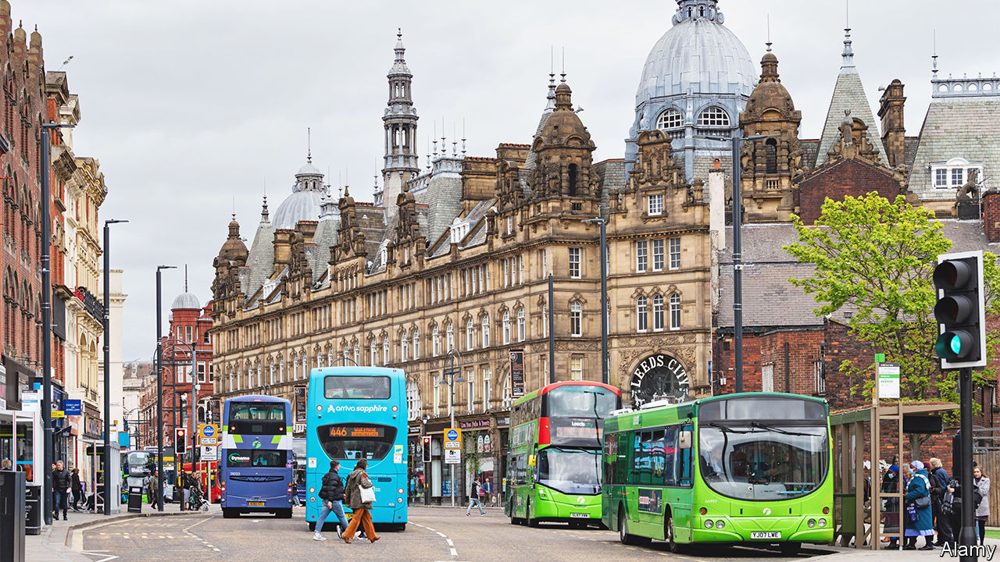

###### Slow coaches

# Britain’s smaller cities desperately need better transport 

##### Manchester launches a London-style franchise system 

 

> Aug 31st 2023 

AS WELL AS a ticket, you need patience to ride the 72 bus in Leeds. The commuter line to Bradford is notorious for delays and cancellations: by one estimate it is late 80% of the time. Other services are almost as bad. Tough luck, too, if you bought a pass for one company and a rival’s bus turns up. Operators don’t allow transfers. 

Britons still rely heavily on the humble bus, taking over 3bn local journeys on them each year. It remains an especially popular means, notably in cities, of getting people to work. And if yet more used them, they would provide a lowish-cost way to reduce both congestion and pollution: the Centre for Cities, a think-tank, says that getting 10,000 car drivers on buses instead for a year, for a daily 7km journey, would cut 20,000 tonnes of carbon emissions. 

London aside, however, many bus networks are in a poor state. Since deregulation in the 1980s, cities have struggled with them. Typically companies turn a profit on a few popular routes, but local authorities subsidise other lines. Rising fares and reduced services have gradually put off passengers. In the past three decades or so bus journeys in England as a whole fell by nearly half, even as they soared in London.

One problem is regulation. Competition law stops companies in a given city from co-ordinating their routes and timetables, leading to disjointed services. Nearly 40 companies ran routes in Greater Manchester in 2022, for example. Although buses at times have their own lanes, congestion means they move more slowly. Greener Journeys, a lobby group, suggests bus speeds have dropped by an average of nearly two-fifths in the past half-century.

The government wants more people on buses, so six years ago passed a law giving ten metropolitan mayoralties the power to switch to London-style franchising: bringing bus services back under public control, with a transport authority deciding on timetables, prices and more. Take-up, however, has been as slow as the dreaded 72. Only Greater Manchester has shifted: its first buses start running under a franchise system this month, with the whole fleet changing by 2025. Transport for Greater Manchester promises lower prices and emissions. Liverpool may follow next. 

Mayors have been reluctant for two reasons. One is the cost and hassle of swapping to a franchise model: officials lack expertise to oversee services, given complex regulations. They worry, too, about legal action from existing operators. It has taken Manchester several years to prepare its change, which is expected to cost £135m, or five times the £27m it spends each year on bus subsidies.

Second, cities must still support unprofitable routes within the franchise systems that they run. In London, before the pandemic hit, £722m was diverted annually from the Tube and passed on to the buses. Other cities lack such a handy source of funding. Help from central government has also fallen in the past decade. The Campaign for Better Transport, a lobby group, says national funds for buses now provide only a small portion of local authorities’ needs. Metropolitan mayors are anxious to find ways to get buses moving again. They will watch Manchester closely to see if the franchise system can work successfully beyond London.■


