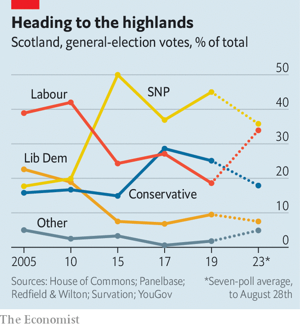

###### Scottish politics

# Can Scotland help Labour form Britain’s next government? 

##### The stakes in a by-election are unusually high 

 

> Aug 31st 2023 

“I DON’T KNOW—it’s all mince,” (Scottish slang for rubbish) says a retired cleaner in Rutherglen, when asked how she would vote in an upcoming by-election. The last time voters in that suburb south of Glasgow went to the polls she backed the Scottish National Party (snp); this time she might plump for Labour. Her ambivalence, apparently shared by many former snp voters, reflects the party’s dramatic decline. Since the beginning of the year, and in particular following the arrest in June of Nicola Sturgeon, the former first minister and the most powerful advocate of the independence dream that brought the snp to power, the party has slipped in the polls in a once unimaginable way. 

That presents an opportunity for the Labour Party, which once held sway north of the border. In 2010 it had 41 of Scotland’s current 59 seats in Westminster. After the independence referendum in 2014, Labour haemorrhaged support. In 2019 it was all but wiped out, managing to hold just one seat. It now hopes for a revival that could help it win a general election that must be held no later than January 2025. 

 


The first real test comes when Rutherglen and Hamilton West holds a by-election in October. The vote was triggered two years ago, when Margaret Ferrier, a former snp mp, took a train from London to Glasgow even though she had tested positive for covid-19. She was suspended from the snp but continued to sit as an independent. This August, following a recall petition, she lost her seat. (Some former supporters in Rutherglen say they remain furious about her behaviour while they were enduring lockdown.)

Labour could hardly find a better place than Rutherglen to test its Scottish fortunes. In the general election its priority will be to pick up the handful of seats it won in the election in 2017. Rutherglen has swung in recent general elections between the SNP (in 2015 and 2019) and Labour (2005, 2010 and 2017). In 2019 Ms Ferrier won there by 5,230 votes. A swing of only 5% would return it to Labour. 

Recent polls have suggested Labour could do a lot better than that. One, published by Survation on August 23rd, found 35% of Scottish voters support Labour and 37% the snp (an eight-point fall since 2019). Sir John Curtice, a political scientist at the University of Strathclyde, suggests that could mean each of the two parties picking up 24 seats at the general election. (The Conservatives would keep their current six seats; the Liberal Democrats would win five, a gain of one).

Such a boost from Scotland would ease Labour’s path to winning outright. Sir John calculates that for every dozen seats Labour picks up in Scotland “you can knock a couple of points off the lead it would need across the UK to win an overall majority”. Strength in Scotland also reduces the risk of a hung Parliament, and thus the awkward prospect for Labour of being dependent on support from small parties, such as the snp. Success in Rutherglen in October would probably be hailed as “historic”, says Christopher Carman, a professor of politics at the University of Glasgow.

When margins are tight, unexpected outcomes are a possibility too, of course. Were Labour to fall short in Rutherglen, that would point to bleak prospects for the party across Scotland. Labour’s narrow failure in July to win a by-election in Uxbridge and South Ruislip, Boris Johnson’s old seat, means the party is taking nothing for granted, says an activist in Rutherglen.

The snp is not less popular because support for independence is waning. Polling suggests this remains steady, at 48%, rather more than the share of voters who back the SNP. That suggests Scots are becoming more realistic about the prospect, says James Mitchell, a professor of politics at the University of Edinburgh. 

For such voters, a desire to kick out the Conservatives has been intensified by Labour’s lead in the polls. That surged following a disastrous mini-budget in September 2022. A ruling by the Supreme Court, in November, that an independence referendum is not possible unless Westminster agrees, has made it harder for the SNP to argue that it could bring about secession. It also weakened the case for Unionists to vote Conservative. 

Yet the snp did not begin to really slide in the polls until the arrest of Ms Sturgeon, four months after her resignation as party leader. Her uncharismatic successor, Humza Yousaf, is not nearly so popular. Kate Forbes, who narrowly lost the leadership contest in February, has given him little support. (“Never say never”, she said in August, when asked if she would have another go). 

The snp, which is preparing to face a Labour government for the first time in 13 years, is employing two lines of attack against the party in Scotland (which it calls a “branch office”). The first concerns Brexit, which the Scots overwhelmingly voted against. Katy Loudon, the snp candidate in Rutherglen, has castigated Sir Keir Starmer, the Labour leader, for his pledge to “make Brexit work”, pointing out that lost trade has cost the area dearly. 

The other line of attack is his refusal to part from the Tories on several social issues, especially a two-child cap on child benefit. She reminds voters that the snp’s child payment gives families on universal credit £25 a week per child. That is a potent combination for many in Rutherglen. “The snp shows more care for children and families,” says Kay, who works for the prison service. “And we don’t want to be ruled by Westminster,” she adds.

South of the border, where Labour’s chief battle is for Tory votes, the party emphasises its moderation and fiscal credibility. In Scotland the message is quite different. Michael Shanks, Labour’s Rutherglen candidate, who briefly left the party over its position on Brexit, has said he is not against reversing it. He has also said he would vote against the two-child benefit cap. He is keen to emphasise that he is a leftie. He, like Ms Loudon, repeatedly bewails the high cost of living. 

That may resonate in Rutherglen in particular, which contains some of the poorest areas of Scotland. An unscientific straw poll on Rutherglen’s Main Street, where a baronial gothic town hall towers over shabby shops, suggests that worries about money trump all other issues. Few expected their vote to matter, though. Over half of those asked said they had never voted and had no intention of doing so.■


