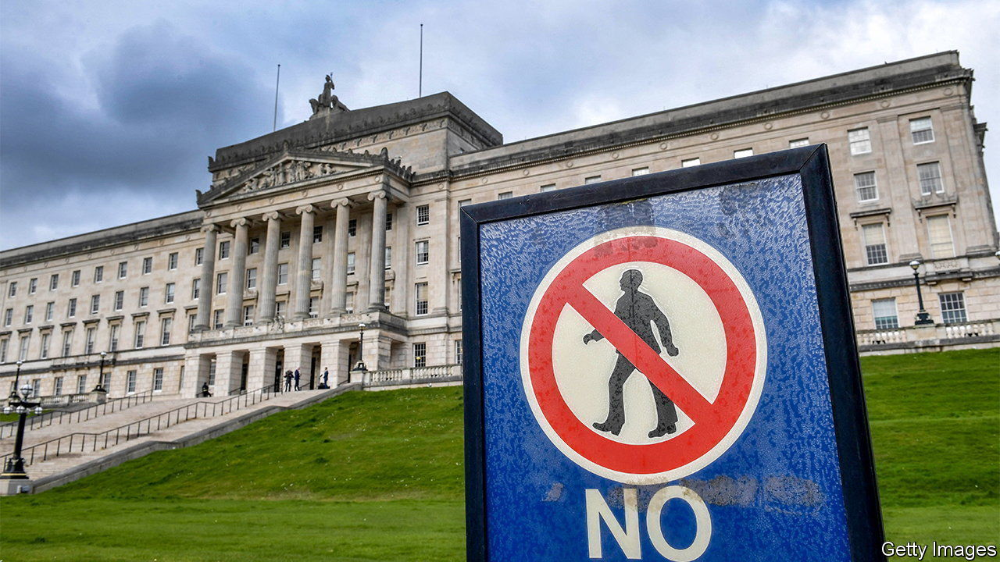

###### Northern Ireland

# Political dysfunction in Northern Ireland is the new normal 

##### Civil servants, not politicians, have to run things 

 

> Aug 31st 2023 

When Northern Ireland’s government previously collapsed, it took three long years for it to return. The restoration came in January 2020, but it tumbled again just over two years later. A year and a half after that fall, the prospects for devolved government coming back in the province are remote.

The political problems stem from the Good Friday Agreement, signed in 1998, that enforces power-sharing by unionists (who are loyal to Britain) and nationalists (who seek a united Ireland). If either of the two big parties refuses to govern, the administration falls. Previously it was the unionists, as the majority in Stormont, the regional assembly, who disliked this veto power. Now, as a minority, they are the ones exploiting it.

The main unionist party, the DUP, walked out of office last year in protest at the Brexit deal agreed by Boris Johnson with the EU. Mr Johnson had earlier attended the DUP conference, earning cheers for his promise to never create a trade border in the Irish Sea. When he did precisely that the DUP was left looking naive and vulnerable. And as voters learned what the border meant—items gone from supermarket shelves; some British companies refusing to sell to Northern Ireland; burdensome red tape—support for the DUP collapsed.

Getting the DUP back into government is proving impossible. Britain and the EU agreed on the Windsor framework in February, a new arrangement for Northern Ireland that softens parts of the sea border. The British government had expected Sir Jeffrey Donaldson, the DUP leader, to accept it. He has stalled.

In theory the Westminster government could intervene, but it is reluctant to do more than fix a budget for the province. Many who are hostile to Britain would oppose direct rule, which anyway would be seen as backtracking on efforts to encourage local rule. Instead, civil servants are told to manage as best they can. A sense of fatalism pervades. 

The devolved government in Belfast is responsible for most public services, including schools, hospitals, roads and the justice system. As happened last time the government failed, in January 2017, civil servants have taken on decision-making powers that are normally reserved for ministers. As they showed restraint and avoided controversy, the system appeared to work in the short term. Over time, however, problems have mounted as high inflation and a squeeze on public spending put pressure on officials to take highly charged decisions. The current budget for the province requires painful cuts to public services, but civil servants say that only elected politicians may decide on those. 

Meanwhile, problems grow for residents. The province’s health system, which faces a budget shortfall of £470m, is in a dire condition. Some patients have been forced to wait for a decade to get a joint replaced. Waiting lists for all sorts of surgery have grown. The education service is £382m out of pocket, as officials talk of pupils, notably disabled children, suffering severely. The budget for infrastructure spending is £167m short. Officials talk of contingency plans that include possibly switching off streetlights, no longer salting roads in the winter or even closing sewage-treatment plants.

One trade union leader, Gerry Murphy, says the tight budget set by Westminster means that officials have been “set up to fail”. Though residents of the province have so far resigned themselves to the political dysfunction—no angry marchers have yet taken to the streets of Belfast, Ballymena or Enniskillen—he expects strikes by public-sector workers soon, perhaps including the civil servants who have been asked to run things.

The pressure on the DUP is not working, perhaps because the party’s popularity rose after it quit office. The likeliest outcome is that problems drag on, perhaps until the next general election. Some senior unionists talk of waiting until the Labour Party, ahead in national polls, forms a British government and eventually arranges for closer ties with the EU, as that could in turn allow for more open trading across the Irish Sea. In other words, expect yet more painful limping on for now. ■


