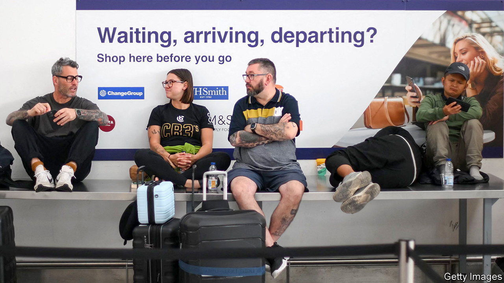

###### Clearing the air

# Who is to blame in Britain for delayed and cancelled flights? 

##### A small glitch with air-traffic control causes big problems 

 

> Aug 30th 2023 

The British summer has largely lived up to expectations—absent sun, sporting disappointment (the Ashes and the women’s football World Cup) and chaotic scenes at the country’s airports. August 28th, a bank holiday Monday, had been set to be one of the busiest days of the year for travellers. Instead, airline passengers to and from Britain were greeted by departure boards thick with messages of cancellations and delays. A “technical failure” at nats, the firm responsible for air-traffic control, left passengers and planes stranded. 

What seemed to be a minor problem with flight information received by nats had major effects. Rumours centred on a rogue flight plan from a French carrier, which supposedly put out of action the system that automatically processes them. Despite being fixed in three hours, it led to the cancellation, that day, of over a quarter of all trips into, and out of, Britain. That amounted to nearly 1,600 flights and another 1,800 across Europe, according to Cirium, an aviation-data firm. There were delays to many more. The knock-on effects of crews and planes being stuck in the wrong places lingered for days, though the worst was over by August 29th. 

Aggrieved passengers, some of whom had to camp overnight in airports, and angry airlines, which had to pay for food and accommodation for other delayed flyers and deal with fixing the disruption to their schedules, are looking to apportion blame. nats is not obliged to bear any of the extra costs. But how much of the responsibility should it shoulder? 

That a small glitch could cause days of upheaval is an indication of how close to capacity the system at nats runs. A bigger buffer at NATS would help it to cope with any future breakdowns, but no one is prepared to pay for extra redundancy. Air-navigation service providers (ansps), such as nats, account for 5-6% of airlines’ costs. Carriers already frequently complain about price rises at organisations they regard as bloodsucking monopolies. But equally no airline’s business model includes having plenty of spare planes and crews on standby to cover such an eventuality. 

nats may even be a victim of its own success. Part-privatised in 2001, it was one of the first ansps to leave public hands. It has become a profitable commercial business that manages 2.5m flights a year and provides services in 30 countries around the world. Andrew Charlton of Aviation Advocacy, a consultancy, reckons that its commitment to upgrading and renewing systems to improve overall performance may even make it more vulnerable to rare glitches. “Very occasionally technical issues occur that are complex and take longer to resolve,” laments nats. ■


