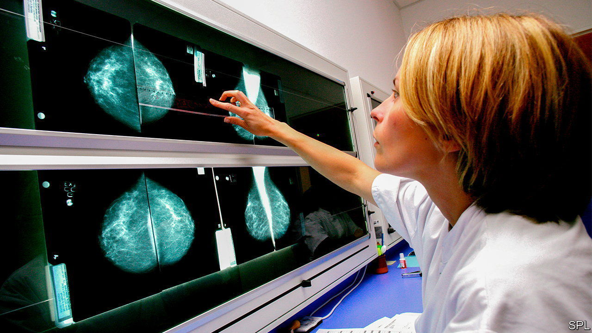
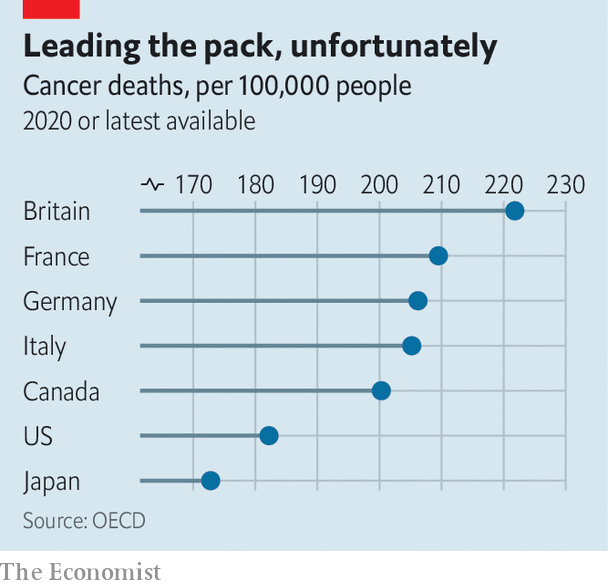

###### Big trouble with the big C

# Why Britain is so bad at diagnosing cancer 

##### Delays were a problem even before covid 

 

> Aug 31st 2023 

THE COVID-19 virus wrought havoc in Britain and killed many people. But at the start of the pandemic experts warned that unintended consequences of lockdowns might kill many more. Concerns were particularly strong with regard to cancer, as screenings were initially suspended, routine diagnostic tests deferred and the diagnosis of less obvious cases delayed. Modelling at the time suggested that disruptions would lead to thousands of additional deaths. 

The grim predictions seem so far to have been correct. In cancers most picked up by early screening, death rates have returned to the levels of 20 years ago, says Nicola Barclay, a researcher at the University of Oxford. Her team’s preliminary findings suggest that in colorectal cancer, the share of patients who survive for at least one year after being diagnosed has fallen from 79% just before the pandemic, to 76%. The damage cannot yet be measured for cancers that progress more slowly, or for fast-progressing diseases whose symptoms may be masked. The persistent cough characteristic of lung cancer, for example, is similar to a common symptom of covid. Deaths recorded as from covid may also blur the picture: some may have had another underlying cause of death. 

 


The pandemic and lockdowns are not the only cause of Britain’s problems in tackling cancer. Of 18 rich countries, Britain already had among the worst five-year-survival rates for three of the most common cancers: lung, colon and breast. It had more cancer deaths per person than any other G7 country (see chart). Poorer Britons are more likely both to develop and die from the disease.

It is tempting to blame Britain’s woeful performance on poor treatment. But much of the gap with other countries is explained by delays in treatment, and especially by late diagnosis. “Cancer is a progressive disease, so if you diagnose cancers earlier, in almost all cases you improve cancer outcomes,” says Naser Turabi of Cancer Research UK, a charity. This in part explains why the poorest, who present later, die sooner. Nine in ten people with early-stage bowel cancer, stage one, will survive for at least five years after being diagnosed. At stage four, when the cancer has metastasised, nine in ten will die.

Diagnosis usually depends on routine appointments with a general practitioner, when patients mention symptoms. Lengthening delays in patients getting to see a GP (worst again in the most deprived areas), and concerns over the overstretched NHS, well predate the pandemic. And even once referred for further tests, a target that 93% of patients with cancer symptoms should be seen by a specialist within two weeks has not been met in England for years. Another target, that patients should begin their treatment within 62 days of referral, has also been missed. That will have had deadly consequences. A study in 2020 found that every four-week delay for surgery on breast, bladder and six other tumour types increased mortality rates by 6-8%. 

The government has responded to missing its targets by jettisoning them. On August 17th the NHS in England said that the existing ten cancer targets would be reduced to three. The one for a two-week wait, for example, has gone. Making the referral process more streamlined is in line with the advice of many experts, but some are still concerned. “It’s a prime opportunity to bury failure,” says Professor Richard Sullivan of King’s College London. 

There’s plenty of failure to bury. In 2016 Welsh health officials travelled to Denmark to study its system. Once dubbed the cancer capital of the world, Denmark has dramatically cut cancer deaths since 2007, largely by fast-tracking cancer referrals from primary to secondary care. Although “one-stop shop” diagnostic centres, in which patients can rapidly undergo a series of tests and scans, are relatively easy to replicate, the planning that underpins them is not. For the model to work, hospital administrators must function efficiently, booking scans, appointments and treatments into a limited number of slots.

The Danish model has other advantages. Its primary-care system is better funded. Hospitals have more MRI and CT scanners per patient, and the radiologists to use them (in England the demoralised professionals are intermittently on strike). Visit Rigshospitalet in Copenhagen, the Danish capital, and cancer surgeons praise the da Vinci robots they use for complex keyhole surgery. Even more important is that specialist care is centralised, with patients bused in from rural areas to receive the highest-quality care.

Better outcomes also require recognition that 30-50% of cancers are preventable. Cancer is mostly an old person’s disease, but worsening nutrition may explain an alarming rise in cases of colorectal cancer among the young. Ultra-processed food makes up more than half of a typical British diet: more than anywhere in Europe. And for all its progress, Denmark’s cancer death rate is still higher than Britain’s, perhaps in part because Danes smoke more.

In general there is still much to cheer in the fight against cancer. In the long run survival rates, even in Britain, have been steadily improving. Diagnoses are likely to improve further once people can conduct some tests for cancer themselves, at home, even before symptoms appear. More vaccines will be available to prevent cancers, too. That, however, is little comfort to those who were missed during the pandemic. “Once you’ve delayed diagnosis or delayed treatments you’re in trouble,” says Professor Sullivan. ■


