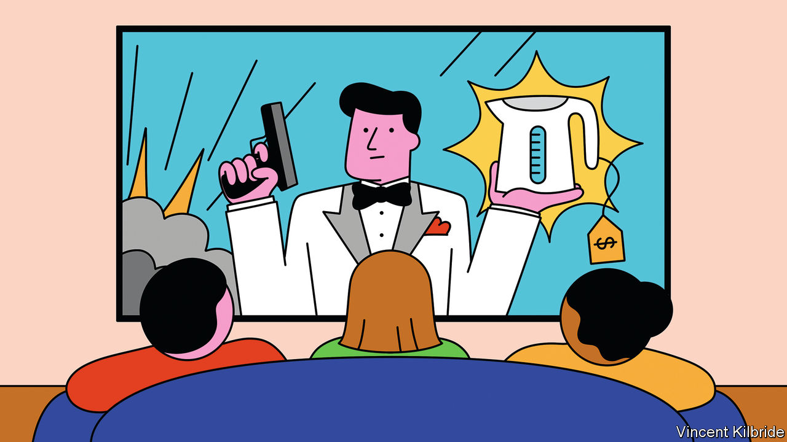
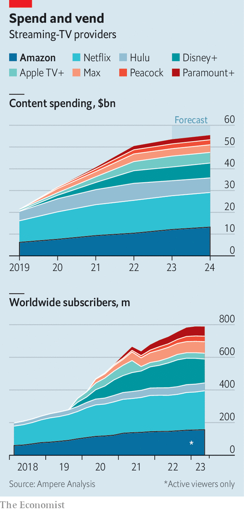

###### The shopping channel

# Amazon has Hollywood’s worst shows but its best business model 

##### It aims to make video pay by applying the techniques of e-commerce 

 

> Aug 27th 2023 

As bullets fly around a high-speed train carrying a former Miss World and a gang of spies through the Italian Alps, shopping is surely the last thing on viewers’ minds. Yet should they press pause, they will see an option to buy items from the show: the heroine’s gold necklace, her red dress, or the teetering stilettos in which she is improbably running rings around the villains. Only her exploding perfume is not yet for sale.

“Citadel”, a thriller on Amazon Prime Video, shows what happens when the world’s biggest online retailer becomes one of its biggest  producers. As well as buying merchandise from the show on Amazon’s e-commerce site, audiences can listen to its soundtrack on Amazon Music, or read about its production on Amazon’s sister site, imdb.com. Its multinational cast and plot, and planned spin-offs in a variety of languages, have been carefully chosen to appeal to shoppers around the world.

 


 old hands are snooty about Amazon’s video efforts, and understandably so. Despite a reported budget of $300m, making it the second-priciest tv series in history (after “The Rings of Power”, another Amazon project), “Citadel” received lukewarm reviews and failed to crack the top ten most-streamed shows in America (Amazon says it has done better internationally). Critics see it as emblematic of the company’s high-spending, low-impact record in video. This year Amazon will blow $12bn on streaming content, second only to Netflix (see chart). It has had some hits, including “Reacher” and “The Boys”. But its 45 streaming nominations at the upcoming Emmy awards—a record for Amazon—is less than half as many as Netflix or Warner-Discovery’s service, Max. “Amazon’s hit rate is not good, nor consistent with its spend,” admits one former executive.

Yet despite its creative misfires, Amazon is quietly assembling something that has eluded most of its rivals: a model for how to make streaming pay. Its shows may underwhelm, but it is preparing to pair them with its formidable advertising machine, and is turning its streaming app into a high-margin marketplace for third-party sales, along the lines of its all-conquering e-commerce site. Hollywood might sometimes snigger at the quality of Amazon’s output. But the Seattle firm may yet have the last laugh.

Revenue streaming

Amazon has been in the video business since 2006, when it launched Unbox, an iTunes-like downloading platform. Since then the company has deployed its tech-sized chequebook to become one of the biggest forces in Tinseltown. Its main streaming service, Prime Video ($8.99 a month, or free as part of Amazon’s broader Prime membership), attracts some 156m monthly viewers worldwide—about as many as Disney+ and second only to Netflix. Freevee, its free streaming service with ads, has another 40m or so. Twitch, a live-streaming site it acquired in 2014, attracts around 35m visitors a day, mainly to watch video-gaming content. 

Fire tv, Amazon’s range of internet-connected tv sets and streaming sticks, outsells every brand bar Samsung, with nearly 100m devices in use worldwide, according to TechInsights, a data firm. Heavy discounting has been deployed to lure people into the Fire ecosystem: earlier this year Amazon offered a 43-inch Fire television for $99.

The most obvious motive for Amazon’s video experiments is to increase the value of the Prime bundle, which keeps members coming back to shop on the e-commerce site. But video also has the potential to become a moneyspinner in its own right, in two ways.

First, advertising. In little more than a decade Amazon has created a digital-ads business that has disrupted the old duopoly of Google and Meta. Its ad revenue this year will be around $45bn, making up about 7.5% of worldwide digital advertising, estimates Insider Intelligence, a research company. It is already more than a third the size of Meta’s ad business, and growing fast. But whereas Google and Meta both have healthy video-advertising operations (through YouTube and Reels, respectively), Amazon’s inventory mainly consists of sponsored search results on its e-commerce site.

That seems to be changing. Amazon has kept Prime Video largely ad-free to preserve a “premium” feel, says one senior executive. But the introduction of commercials last year by Netflix and Disney+ has given a green light to others to do the same. Amazon has been experimenting with running ads alongside sports shows on Prime, and has shifted more of its back-catalogue to Freevee, its ad-supported streamer. Analysts expect to see more commercial breaks on Prime soon.

Among streamers, Amazon is uniquely well placed in the advertising game. Whereas Netflix acknowledges that it is mainly limited to generic “brand” advertising, Amazon has enough information on its customers, through its e-commerce site and its Fresh grocery stores, to target them with highly personalised ads. What’s more, it can measure the effectiveness of those ads, by observing viewers’ subsequent behaviour in its shops.

It has yet to exploit this ability fully, but viewers will get a taste of it later this month when Amazon is expected to run targeted, measured ads alongside its “Thursday Night Football” programme. In November it will show a blizzard of video commercials when it airs the first American-football game to coincide with Black Friday, an annual holiday to honour the shopping gods.

That makes this a “foundational year” for Amazon’s video-ad business, says Andrew Lipsman of Insider Intelligence. “The future of their advertising strategy on video is going to really take hold,” he predicts. Morgan Stanley, a bank, forecasts that within two years Amazon’s nascent video-ad business will be worth more than $5bn a year in America alone, and that in the long run its superior intel on its viewers could allow it to charge higher rates for its ads than any other video platform.

Such an ability will become more valuable as viewing shifts to streaming. Advertisements on internet-connected television make up about a third of tv ad spending in America. As that share rises, a “pot of gold” awaits sellers of digital advertising, says a former Amazon executive. What’s more, points out Mr Lipsman, “When you introduce data, it transforms markets.” tv ads are reckoned to be among the most effective, but their impact is hard to measure. As advertisers gain the ability to see how customers respond to their commercials, the tv advertising market, which is currently worth about $90bn a year in America, stands to grow, with the lion’s share of new business going to the companies that offer the best measurement.

Television’s new landlord

Amazon’s second approach to making video pay is to sell viewers not just its own output but other companies’ content, too. Whereas viewers opening the Netflix or Disney+ app see only shows on those platforms, those opening Prime Video are offered content from a range of other streamers. If a customer subscribes to one of those other services via Prime, or buys or rents a show, Amazon takes a cut, reckoned to be between 20% and 50%. And when a viewer watches a free channel via Prime, Amazon takes a slice of the advertising revenue or sells its own ads in some of the channel’s slots.

Tom Harrington of Enders Analysis, a research firm, likens the approach to Amazon’s tried-and-tested strategy in retail. The company began by selling its own products, before opening its marketplace to other traders. These days two-thirds of sales on Amazon.com are made by third parties, with Amazon taking a commission—a much higher-margin business than selling its own wares. Its aim is to be the same kind of “landlord” in video, believes Mr Harrington.

This analysis sheds light on the purpose of big-budget shows like “Citadel”. Amazon continues to stock its e-commerce site with first-party products, to maintain price competition and ensure that the marketplace has a broad enough offering to keep customers returning. Prime Video content plays a similar role: high-profile shows and live sports—something not available from most other streamers—get people to open the app, while guaranteeing them a wide range of content to choose from. “The real question isn’t how many people watched ‘Rings of Power’,” says Mr Harrington. “It’s how many people went into Prime because of ‘Rings of Power’...and then [spent] more on other content.”

Amazon seems to be succeeding in getting people to spend time on its platform. Although relatively few of its shows break into the top ten individually, Nielsen’s figures show that Prime Video’s share of streaming in America—about 8.9% of hours watched in July—is about 70% greater than that of Disney+, and more than twice that of Max.

Becoming a content landlord is not easy. Amazon’s bargaining power over suppliers is weaker in video, where there are a few big studios with their own direct-to-consumer offerings, than in e-commerce, where millions of tiny sellers use its marketplace. Amazon’s hold over consumers is weaker, too: whereas the company accounts for nearly 40% of e-commerce sales in America, its Fire tv platform handles only about 15% of streaming traffic there.

Still, the company is carving out ways of making money in an industry that is drowning in losses. Amazon may not dominate the Emmy awards, or Nielsen’s top ten. But, says a former executive, its chief aims in video are for people to watch tv through its hardware, to buy content through its store and to watch commercials served by Amazon advertising. Even if “Citadel” remains a critical flop, it may have done its job.■


