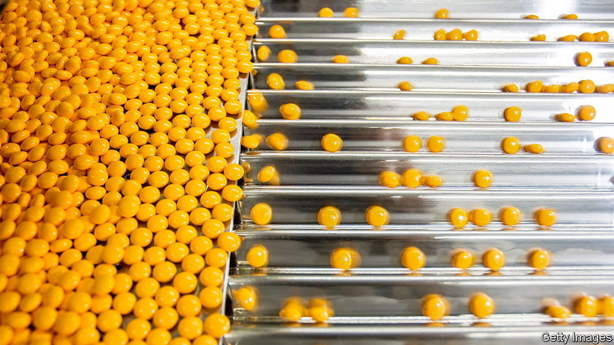

###### A bitter pill

# America’s plan to cut drug prices comes with unpleasant side-effects 

##### It is already changing how pharma companies make drugs 

 

> Aug 29th 2023 

“America is the piggy-bank of the pharma world,” gripes David Mitchell of Patients for Affordable Drugs, a consumer lobbying group. There is some truth to this. America is the world’s largest pharmaceutical market, with $630bn in sales in 2022, or 42% of the worldwide total. Its contribution to profits—65% of the global haul—is greater still. American patients have long borne the burden of these juicy returns. Prescription medicines in America cost two to three times more than in other rich countries (see chart). Patients’ out-of-pocket expenses, the slice of drug costs not covered by insurance, are also among the world’s highest.

 


One reason for high costs is that, unlike other countries, America has not regulated drug prices. Until recently it was illegal for Medicare, the government-funded health insurer for over-65s, to haggle with drug companies. That is now changing. The Inflation Reduction Act (IRA), passed last August, gives Medicare the power to negotiate directly with pharmaceutical firms. It also forces companies to pay a rebate to Medicare if their drug prices rise faster than inflation. The Congressional Budget Office, a federal agency, estimates that price-capping measures will lop $96bn from the federal deficit by 2031.

On August 29th the government named the first ten drugs chosen for price negotiation, which will take effect in 2026. The “negotiation” is rather one-sided: pharma firms have little choice but to agree to the price set by officials. Any that walk away will have to choose between paying stringent fines or withdrawing all of their drugs from the Medicare programme. 

The backlash from the pharma industry has been fierce. “This is not ‘negotiation’. It is tantamount to extortion,” protested Merck. Several firms—Boehringer Ingelheim, Bristol Myers Squibb, Johnson &amp; Johnson and Merck—have launched legal challenges. Pharma bosses are bracing for price cuts of 25-95% in drugs chosen for price negotiation. Since the law’s passage, over 50 companies have blamed the IRA in earnings calls for clouding their prospects. It is already changing how they make drugs, with some unwanted side-effects. 

One issue is a provision in the law that could change the types of drugs that these companies develop. Most medicines are either small-molecule or large-molecule drugs. The former are chemical-based pills of the kind that fill medicine cabinets. Large-molecule drugs, also called biologics, are more complex and must be injected into the bloodstream. The ira grants biologics 13 years of pricing freedom after a drug is approved, whereas small-molecule drugs get only nine years post-approval before they face Medicare’s bean-counters. Jonathan Kfoury of LEK, a consultancy, estimates that small-molecule brands could lose between 25% and 40% in overall revenue because of early price caps. 

Executives fret that the new rules will deter innovation in small-molecule pills. Last November Eli Lilly, a big American drugmaker, removed a small-molecule cancer drug from its pipeline, blaming the ira for making the investment unviable. In the same month Alkermes, an Irish biotech firm, said it would spin off its biologics-focused oncology business into an independent company. Richard Pops, the company’s boss, explained that the IRA had “made biologic medicines more valuable”.

Another contentious provision in the law starts the pricing clock at a drug’s launch. Pharma firms usually introduce a drug to small patient populations, like those with rare conditions or late-stage diseases, who have few alternatives, before widening availability. With only nine years in which to maximise returns, companies will “delay the clock” by launching their drug for the largest disease areas, believes David Fredrickson, who leads the oncology division of AstraZeneca, an Anglo-Swedish giant. Genentech, an American biotech firm owned by Roche, a Swiss drugmaker, is considering postponing the launch of its upcoming small-molecule drug for ovarian cancer. Instead it may wait a few years until the drug has been cleared for use in the much larger prostate-cancer market. 

The impact of the IRA may be muted, at least until the end of this decade: JPMorgan Chase, a bank, suggests that the new law’s price cuts will be only a “modest drag” on big pharma’s growth in its first few years. But as more medicines are added, drugmakers will feel more pain. And if the new rules dissuade pharma firms from developing small-molecule drugs, they could raise prices in the long term. Unlike biologics, which are hard to copy, small-molecule pills are drowned in cheaper knockoffs once their patent expires.

Alexis Borisy, a biotech investor, notes that uncertainty around the returns for small-molecule medicines is already influencing funding decisions. That is a problem. Big pharma relies on smaller, more agile biotech firms for ideas. Between 2015 and 2021, 65% of the 138 new drugs launched by large companies originated in external partnerships, mostly with smaller firms. Given America’s disproportionate role in the discovery of new therapies, disruptions to the innovation pipeline could have far-reaching consequences.■


