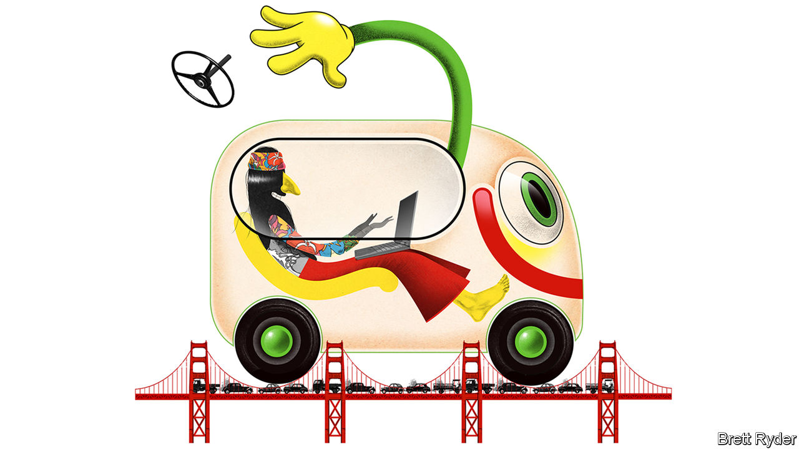

###### Schumpeter

# Cherish your Uber drivers. Soon they will be robots 

##### The robotaxi revolution is upon us 

 

> Aug 31st 2023 

This column was not written by ChatGPT. But it did have the benefit of another breathtaking technology that could change life as we know it. It was partly typed in the back of a Waymo self-driving taxi that, with ghostly serenity, climbed the hills of San Francisco, through the fog of Twin Peaks (it was still “Fogust”), around the spaced-out hippies of Haight-Ashbury to the Golden Gate Bridge. Rather than driving into wet concrete, as one of its hapless rivals did recently, it politely gave way to a cement mixer that swerved across its path. It was a scenic—and entirely trustworthy—office-on-wheels. 

Like ChatGPT, self-driving vehicles are one of those marvels of artificial intelligence (AI) that make you pinch yourself when you encounter them because they seem so strange, and then pinch yourself afterwards because they become so familiar. The strangeness is quirky rather than scary. The robotaxi arrives at the tap of an app, with your initials quaintly lit up on the laser cone on the roof. You wave at it to stop, but there’s no driver with whom to make eye contact, so you run up the hill in hot pursuit until it finds a safe spot. Get in and a disembodied voice advises you that though the experience may be “futuristic”, you still have to buckle up. Then the steering wheel gently turns itself, and at a speed steady enough that you can use your laptop without feeling sick, you set off on a journey up the foothills of the AI revolution. 

This part of the revolution is not yet on the breakneck scale of ChatGPT. Self-driving cars are AI in the physical rather than digital realm, and though it is annoying when chatbots “hallucinate”, any mischief-making by a robotaxi could be fatal. That is why safety, not speed, is paramount. Yet once you become accustomed to the experience, it is easy to imagine a future where more of life is spent in self-driving taxis; where commuters can work, watch videos or snooze while stuck in traffic; where tourists can sight-see without having to speak a foreign language; where lovers can escape the prying eyes of a driver. The questions are: how far away is that future, and what is the cost? 

An immediate answer to the first question is that there are no signs of it yet in the drug-ravaged dystopia of San Francisco’s city centre. Schumpeter arrived there after taking a train from the airport. He tried to call a Waymo, but it is an area where robotaxis still fear to tread. He had to hail an Uber to reach Waymo territory. That is telling. After years of testing, Waymo (owned by Alphabet) and its rival Cruise (majority owned by General Motors) got the go-ahead from California’s regulators in August to sell driverless taxi rides across the city 24 hours a day. But they still lack permits to serve the airport, indicating how cautious supervisors remain. Both firms operate in parts of Arizona, and are expanding into more American cities. But the staggered San Francisco roll-out suggests self-driving taxis will not become ubiquitous with anything like the speed that Ubers or electric scooters did in the 2010s. 

How quickly they proliferate will depend a lot on technology. Waymo and Cruise use a combination of detailed maps, extensive sensors and AI to achieve full autonomy, but only in the geofenced areas where they are trained. That means they can only advance step by step. Tesla hopes to muscle into their territory with full-self-driving (FSD) technology that learns more the more its cars travel, using not maps but cameras and computer power to mimic a driver’s eyes and brain. Yet Elon Musk’s claims about Tesla’s fsd capabilities create more confusion than clarity. So far the technology requires too many human interventions to compete with Waymo and Cruise. No driver can safely remove themselves from behind the wheel of a Tesla. When they eventually can, it could accelerate the robotaxi revolution considerably. 

As for the costs, there are business and societal ones. Currently Waymo and Cruise have around 500 cars on San Francisco’s streets, a fraction of the number of ride-hailing vehicles. For every robotaxi, there may be at least one highly paid Silicon Valley engineer tinkering with the technology. The service might also need to be cheaper than a human-driven taxi to attract the masses. So the firms will probably run at a steep loss for a while. Later this year Waymo and Uber intend to introduce driverless technology to users of the Uber platform in Phoenix, Arizona. That sounds promising. As Kersten Heineke of McKinsey, a consultancy, says, Waymo can take advantage of access to Uber’s large user base while Uber can start tackling the limits to its growth caused by a shortage of drivers. But self-driving technology will need to be deployed at grand scale to become cost effective. 

The societal costs are harder to gauge. Waymo says it has 100,000 would-be passengers on a waiting list in San Francisco, out of a population of about 800,000. That suggests pent-up demand. But there is also scepticism. The media are mostly focused on mishaps, such as when robotaxis disrupt emergency services or freeze en masse. An anti-car outfit called Safe Street Rebel has found a low-tech way to disable the vehicles: it puts a cone on the car bonnet to confuse their sensors. 

The wisdom of cabbies 

There are subtler concerns, too. Driving creates an unspoken chemistry between humans from all walks of life, based on a combination of self-preservation and trust. Robots may make driving safer. But that may come at a cost to human interaction. Then there are jobs. Driverless technology could eventually extinguish the taxi-driver profession, destroying a valuable source of income and a font of local knowledge, not to mention a priceless resource for journalists. In that vein, Schumpeter asked Aleksandr, a Ukrainian Uber driver in San Francisco, what he made of a driverless future, and surprisingly his eyes lit up. He hopes, he says, to buy an autonomous vehicle and use it to offer rides 24 hours a day, three times longer than he is able to drive. “I will do almost nothing while the car makes money for me,” he says. “Just like Uber.” ■


