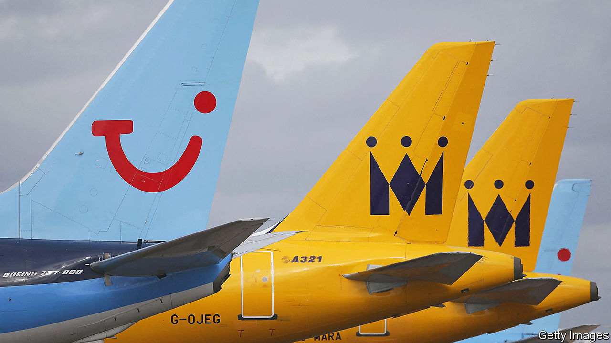

###### Flight risk

# From social-media stars to the Mexican army, everyone wants to run an airline 

##### Exotic new airlines are a sign of an industry in full recovery 

 

> Aug 31st 2023 

There are two measures of the recovery of the airline industry to its pre-covid altitude. First, data show that the 1.1bn seats on sale worldwide in July and August were only a whisker below levels in 2019. Seasoned observers point to a second, more subjective gauge: a slew of announcements of new or resurrected airlines with unlikely owners, dubious business models or questionably niche routes. Entrepreneurs are again being drawn to an industry that has long offered the glamour and excitement that a moth sees in a flame. 

One route skyward is to apply a fresh lick of paint to a defunct brand. On August 20th Monarch Airlines, a British carrier that went bust in 2017, said it would resume carrying passengers in 2024, though details of its plans are sparse. The government of Ghana, whose flag carrier collapsed in 2010, is also relaunching a national airline. It is doing so in partnership with Ashanti Airlines, a firm scarcely accustomed to running such a service in a continent whose carriers have lost a daunting $3.5bn between them in the past three years. 

In an industry where most firms struggle to a make a profit, new entrants with managers boasting a proven record might have an advantage. Yet Mexico’s government recently announced that Mexicana, another carrier that went bust in 2010, will restart services later this year—under the management of Mexico’s army, an organisation with little experience in the field save for operating an air force. Global Airlines, founded by James Asquith, a British social-media influencer and former banker, recently bought four second-hand a380 superjumbos at bargain prices, promising to make transatlantic passengers “feel like a million dollars”, even in economy class. It may struggle: used a380s are in plentiful supply because other airlines prefer newer, smaller long-haul jets, which are cheaper to run.

Other ventures operating niche routes may be equally hard to sustain. Bermudair will this month begin business-class-only flights between its island home and the United States. Later this year Beond intends to kick off a rapid expansion by taking passengers between its base in the Maldives and Dubai and Delhi, with a “private jet” experience on refitted narrow-bodied planes. Several airlines have tried over the years to run business-class-only services. Only La Compagnie, which flies between America, Europe and the Caribbean, has survived.

Red Way, a startup based in Lincoln, Nebraska, may serve as a warning. It launched in June employing the novel but misguided idea of handling marketing, ticket sales and baggage checking while outsourcing the flying to a charter airline. It ceased operations on August 31st. In June iata, an industry body based in Switzerland, doubled its forecast for net profits for the world’s airlines in 2023 to $9.8bn. But, it notes, this is equivalent to $2.20 per passenger, or half a cup of coffee in Geneva. For new airlines it is a question of whether that cup is half full or half empty.■


