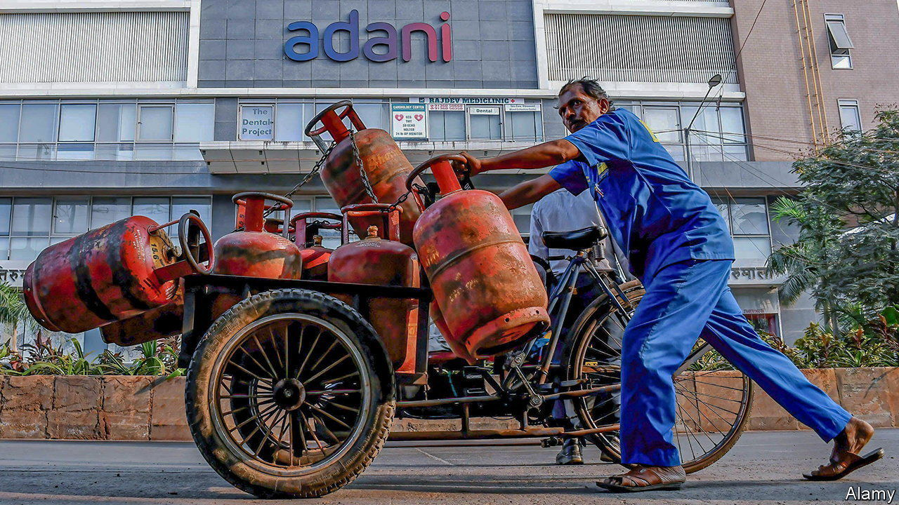

###### Indian business

# India’s scandal-hit Adani Group forges on 

##### Allegations of wrongdoing refuse to go away, but the group keeps growing 

 

> Aug 31st 2023 

Only seven months ago the Adani Group, India’s most valuable conglomerate at the time, looked as if it might topple. The multinational, which has interests in everything from rice to renewable energy, was accused of fraud, insider trading and fragile financing by Hindenburg Research, a New York-based short-selling firm. Though the group denied any wrongdoing, the valuation of Adani’s companies fell from over $200bn to under $100bn.

The Hindenburg affair is far from over. On August 31st, as India’s Supreme Court was poring over an official investigation into the claims, a report by the Organized Crime and Corruption Reporting Project, an international consortium of journalists, made new accusations of share-trading manipulation and reporting violations (which the group also denies). Yet even as the scandal drags on, the group seems to have found its feet. Share prices have stabilised. Earnings are up. Its buoyancy reflects the premium placed on any company that can keep building in a country where that can be all but impossible.

The Hindenburg report and its aftermath have embarrassed not only the Adani Group but India. Following the report’s publication in January the Supreme Court ordered the Securities and Exchange Board of India (SEBI), a market regulator, to investigate its allegations. After its deadline was extended, SEBI filed a largely complete report to the court on August 25th. Reuters reported that SEBI had examined 13 transactions and uncovered violations, albeit “technical” ones, that could result in fines. But a hearing due on August 29th was postponed. The sluggish official response has fed suspicions that the Adani Group’s dirty laundry will not be fully aired.

Investors were also perturbed on August 12th when Deloitte resigned as auditor of one of the Adani Group companies. The accounting giant said it lacked sufficient information about the Hindenburg allegations and that the Adani company had refused to hire an independent external examiner to investigate the matter (the Adani Group’s audit committee said such an examination was not needed). Share prices for the group’s companies tumbled again.

This time, however, they quickly recovered. Their rebound reflects two changes since earlier this year. First, a hole in the group’s finances has been filled. The Adani family, which owns the majority of each of the group’s companies, had borrowed using shares as collateral. As share prices declined, there loomed the possibility of margin calls that would need to be met with funds from further share sales, triggering a downward spiral. The family has since staved off this risk by making several large share sales, with the funds presumably used to repay loans. On March 3rd GQG, a Florida-based fund-management company, bought $1.9bn of shares from the Adani family office, the first of three critical transactions that brought GQG’s investment in the group to over $3bn. 

GQG estimates that it has already made a return of more than 60% on its bet. That reflects the second change in the Adani Group’s fortunes: its companies are on a winning streak. The group’s net income in the year to March was $3bn, up by nearly 50%, year on year. Income in the first quarter was up by two-thirds compared with the previous quarter. The group has altered its strategy to steer away from big, risky new areas. A multi-billion-dollar petrochemical project that would have pitted Adani against Reliance, another vast conglomerate with deep pockets, was postponed. Meanwhile the Adani Group has completed some big projects: a thermal-energy plant in Jharkhand, a solar facility in Rajasthan and more. A $100bn capital budget is earmarked for the next decade.

The question is whether all this is enough for investors to overlook the continuing stream of accusations against the group. One key investor, at least, is unperturbed. “Who wants to drive a car looking at [the] rear-view mirror? Markets look forward,” says Rajiv Jain, chairman of GQG. As for the latest claims that the Adani family’s holdings may have been higher than understood: “We like more insider ownership—higher the better.” Though the Hindenburg scandal refuses to go away, the Adani Group refuses to stop building.■


