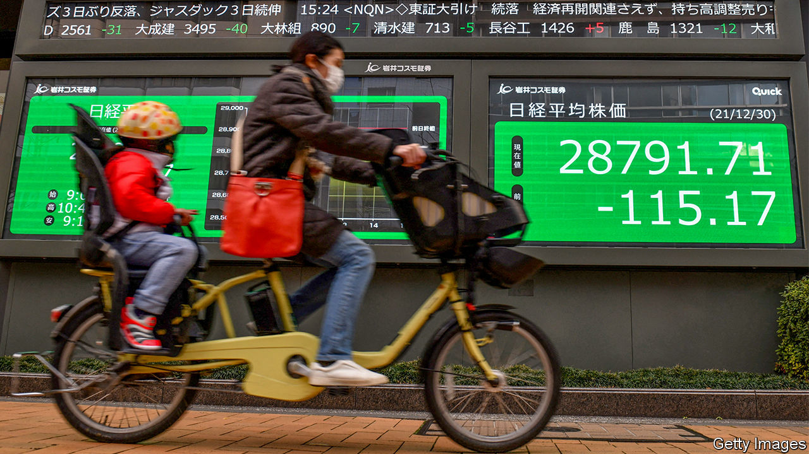
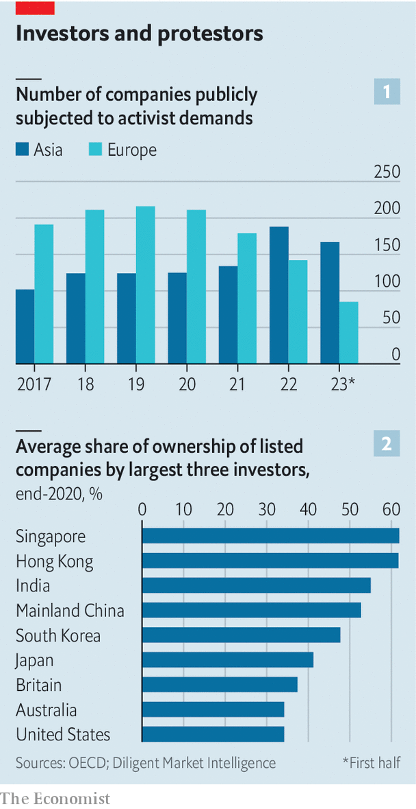

###### Shareholder shake-up

# The rise of the Asian activist investor 

##### Elderly boardrooms and huge cash piles are under new shareholder focus 

 

> Aug 31st 2023 

Not many companies whose profits have in essence flatlined over the past decade have seen their share price more than triple. By that measure Fujitec, a Japanese lift manufacturer, is a rare beast. The reason for its bull run is not past performance, but a growing expectation of change through investor activism, once anathema to Asian boardrooms. The company has faced a years-long campaign from activist investors, which led to the dismissal of three board members earlier this year. This was soon followed by the replacement of Fujitec’s chairman, the son of the firm’s founder.

 


Shaking up elderly, conservative and family-dominated firms in parts of Asia is getting easier. The number of companies subjected to activist demands across the region has risen markedly in recent years, from 102 in 2017 to 188 last year and 167 in only the first half of 2023, according to Diligent Market Intelligence, a research firm. That has raised Asia’s share of the global total from 10% to 23%, overtaking Europe (see chart 1). In the past decade a wave of shareholder-friendly rulemaking has swept the region, and a new class of Asian activist investors is emerging.

The opportunities are enormous. Stock valuations across the region are often low, particularly for middling companies outside the gaze of international investors. Management in hock to employees, related companies, founding families or government interests are found across Asia. Vast cash piles have been generated too. The non-financial companies in the Asia-Pacific region worth more than $10bn sit on $1.94trn in cash, over 50% more than they did five years ago. Cash-rich firms with entrenched management and low valuations are ripe for a shake-up.

Fujitec has been a star example of the benefits of upturning the existing management. The company’s board has been harried by Oasis Management, a Hong Kong-based activist fund which has publicly pushed for changes in capital allocation and higher payouts to shareholders, among other things, for three years. Changes to the way Japanese listed companies are run, through revised codes on stewardship and corporate governance, have made the country a new centre of investor activism. Though changes were initially pursued by Abe Shinzo, Japan’s prime minister in 2012-20, investors say the appetite for corporate shake-ups is undimmed within the Japanese bureaucracy.

Asian activism has expanded beyond Japan. In the first half of the year, South Korean companies experienced the third-highest number of activist campaigns of any country in the world, jumping from fifth place globally last year and seventh in 2021. Investors have long complained about a so-called Korea discount, with inexpensive stocks littering the market. Last year a fierce battle broke out for control of SM Entertainment, a listed K-pop production firm, when Align Partners, a boutique investment firm which had taken a 1% stake in the company, began an ultimately successful campaign to terminate sm Entertainment’s cosy relationship with its founder, Lee Soo-man.

Two factors are driving the Korean trend. The first came after a spate of scandals in 2015, when the South Korean government had made a concerted effort to halt an activist campaign by Elliott Investment Management, a Florida-based activist fund, against Samsung, a national champion. The turmoil that followed led to a jail term for Hong Wan-sun, a former head of the asset-management division of the country’s National Pension Service (nps). A stewardship code designed to stop asset managers cosying up to corporate interests has since been introduced. 

The second factor is a boom in retail investing in South Korea during the covid-19 pandemic. The number of active stock-trading accounts surged from 29m in 2019 to 50m two years later, adding millions of voters with new concerns about how companies are managed.

The role of the NPS illustrates a common theme across the region. The fund owns around $108bn in South Korean stocks, making it a whale. In other markets, large investors with political and government-linked roles wield huge influence. China has a range of state-aligned funds, pursuing a variety of goals for the central and local governments. In Thailand the king personally owns large shares of the big listed companies. All have the potential to fuel or frustrate shareholder campaigns, owing to their sheer size.

Chairmen of the bored

That helps to explain why activism is far more difficult elsewhere in the region. Despite the proliferation of seemingly shareholder-friendly codes for corporate stewardship over the past decade, the reality of governance is hugely varied. Hong Kong, India, Malaysia, Singapore, Taiwan and Thailand have instituted their own stewardship codes, but the seemingly widespread support for greater shareholder involvement is illusory, according to Gen Goto, Alan K. Koh and Dan W. Puchniak, respectively of the University of Tokyo, Nanyang Technological University and Singapore Management University. They note that the codes are not truly designed to disrupt the status quo, and lack the legal weight to do so.

What’s more, the structure of the region’s markets varies wildly. In much of Asia, corporate ownership is highly concentrated, and a wide range of influential and politically aligned investors make things more difficult. In 2020 the largest three owners held 62% of the average stock in Hong Kong and Singapore, and as much as 72% in Indonesia. The equivalent figures in Japan and South Korea were 41% and 48% respectively (see chart 2). 

Most countries in Asia have yet to unlock even a fraction of the potential of greater activism. India is still a relative black hole for investor campaigns, with a single-digit number of activist proposals counted by Diligent Market Intelligence each year. Invesco, an American investment firm, sold the stake it had accumulated in Zee Entertainment Enterprises, an Indian media company, earlier this year after a failed activist campaign. In China, investors have occasionally succeeded in winning reforms from companies when there is no obvious threat to the government’s influence over the corporate landscape. But the variety of state investors and politically sensitive targets makes a robust and lively system of activism difficult to imagine, particularly where foreign investors are concerned. 

Yet even with the limits on changes to corporate stewardship, some activists have achieved success in concentrated markets. Singapore had seven activist campaigns during the first half of this year, including a battle between Quarz Capital, an activist fund, and the board of Sabana REIT, an industrial-property trust. Quarz has campaigned to internalise the management of the properties, in line with the American model in which the trust takes responsibility for management rather than contracting it out. On August 7th Sabana’s unit holders backed the campaign in an extraordinary general meeting, a first for Singapore’s property industry.

Asia is still in the foothills of the opportunities that activists might eventually find, if the influential actors that dominate the markets are disempowered. The circumstances of concentrated shareholder power and the lack of investor engagement in different markets are as varied as the number of jurisdictions. But the shared attributes of thousands of companies across the region—juicy cash balances and sleepy management—mean the pickings are rich, if activists can reach them. ■


