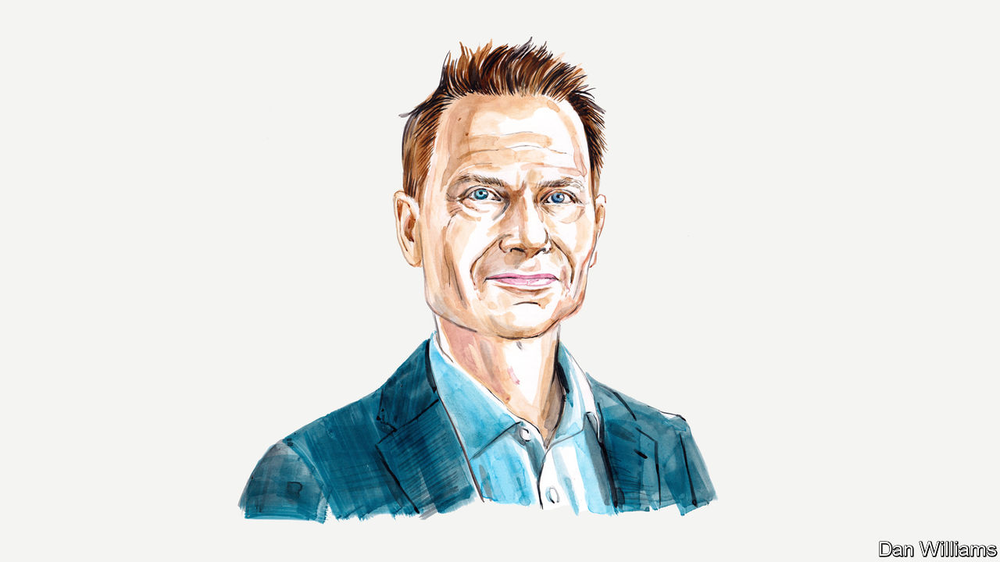

###### The future of WFH

# Nicholas Bloom predicts a working-from-home Nike swoosh 

##### Firms, employees and society will all benefit, reckons the Stanford economist 

 

> Aug 29th 2023 

THE MEDIA are full of stories of how firms from Amazon to Zoom are dragging their employees back into the office. So is working from home (WFH) over? Was this simply a pandemic-era remote-work boom extended by tight labour markets?

No. I believe that, having stabilised, WFH will soon start growing again. Remote working is set to undergo a Nike swoosh, with an initial post-pandemic drop, followed by its current stabilisation and a future long-run surge.

Before the pandemic about 5% of full paid days were worked from home across Europe and America. Working from home was something professionals would do occasionally, perhaps to look after a sick child or let in the plumber. Now about 25% of the workforce is on a hybrid schedule, working from home typically one or two days a week. Another 8% are working a fully remote schedule. Overall, about 20% of all days are now worked from home. Looking ahead, two powerful economic forces will drive WFH up, perhaps to 30% of days worked a decade from now.


The first and most powerful of these is improving technology. In 1965 just 0.4% of days were worked from home in America. The share then doubled roughly every 15 years until 2019, driven by technological advances. These included the personal computer in the 1980s, the spread of laptops in the 1990s, the explosion of the internet in the 2000s and most recently cloud file-sharing and video calls. 

These technologies made it easier to work remotely. Imagine trying to work from home without a computer or the internet. I saw this first-hand as a child of two working parents. My parents would occasionally work from home when child-care emergencies happened, and it was a challenging experience. This remote work in the 1980s required carrying wads of paper to the office and back, and being excluded from meetings and key decisions at work. Now we all video-conference on sleek laptops, instantly cloud-sharing files, and connect (fairly) seamlessly with remote colleagues.

The rate of technological progress is accelerating thanks to the Schumpeterian economics of “market-size effects”. When markets grow, firms want to innovate to serve the newly enlarged and more profitable market. As WFH has jumped since 2019, the rewards from producing the best video camera, video-conference package or desk-scheduling software have also shot up. 

I see the virtual gold rush that this has provoked in Silicon Valley, where I live: venture capitalists, startups and established technology firms are racing to build the next remote-working gadget or app. One indicator of this is filings with America’s patent office. The share of new filings mentioning words such as “telework”, “work from home” or “remote work” spiked after the world went into covid-induced lockdown and remains at double the pre-pandemic level. The surge in WFH has sown the technological seeds of its own future acceleration.

The second force supporting remote working is business “cohort effects”. Data show that younger startups tend to be more remote-focused. These firms have been born in an era when having an office is optional and meeting customers and business partners online is standard. Many see forgoing offices and using more remote workers as a key cost-saving strategy. As a result, employees at today’s new firms work almost twice as many days from home as those at firms founded 30 years ago. 

Society should embrace the Nike swoosh of WFH. Employees gain. They put a value on hybrid working that is equivalent to an 8% pay increase. Indeed, recruiters I talk to argue that the “big two” employment perks—pensions and health care—have become the “big three” with the addition of remote working. 

Firms gain, too. Studies find that hybrid working can reduce employee turnover by 30-50%, as well as saving office costs and allowing companies to better tap global markets for talent. Indeed, American firms reported record profits in 2022 and the American economy has seen annual labour productivity growth accelerate from 1.2% in the five years before the pandemic to 1.5% sinceThere are many factors at play here, of course, but the surge in remote working is one potential contributor to this productivity renaissance.

This positive impact may seem puzzling given complaints by some executives that WFH is damaging productivity. There are two confusions here. First, while fully remote work can potentially reduce individual productivity, three times as many Europeans and Americans work a hybrid schedule as a fully remote one. Research suggests that the blend provided by hybrid working—a few days a week in the office, quiet time at home for deep work and hours of exhausting commuting time saved—increases productivity. 

Furthermore, even if fully remote working reduces individual productivity, by releasing billions of dollars of office and transportation capital for other parts of the economy to use, it stokes a rise in aggregate productivity. Productivity is about outputs relative to inputs, and although fully remote workers may produce less per hour they use a lot less capital, so their impact on aggregate productivity is likely to be positive.

With less travelling to work, the environment also benefits. WFH has reduced global commuting by a staggering 50bn miles a year from the pre-pandemic level. Finally, society gains by allowing parents to spend more time at home, easing the burdens of child care, and to be more involved in raising the next generation.

This shift to hybrid working has been perhaps the most radical change to office life since the introduction of the computer. A decade from now my Stanford students may look back to the pre-pandemic norm of five-day weeks in the office the same way we marvel at old photographs of besuited office workers bashing away on typewriters: quaint, puzzling and something that feels like a bygone era. ■


