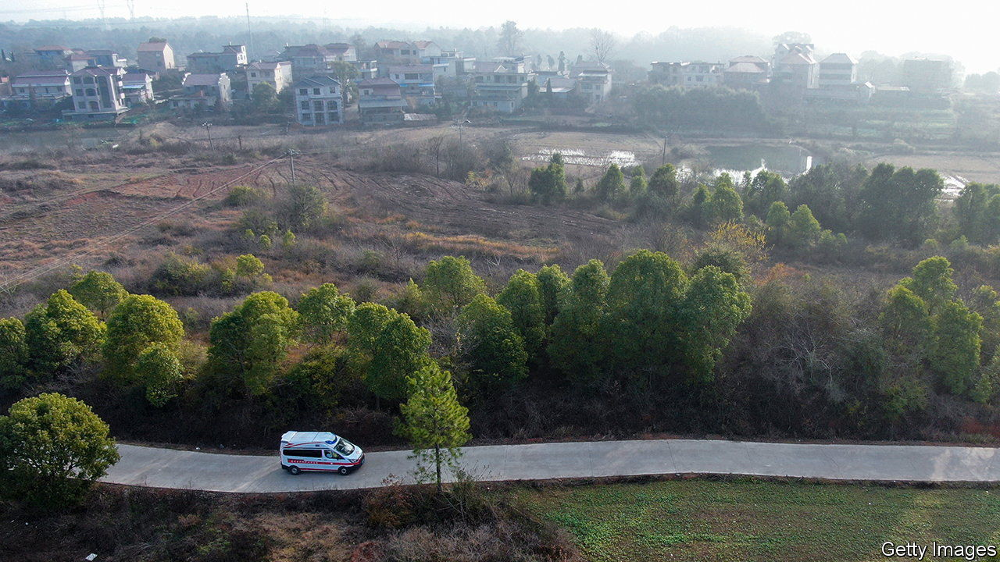
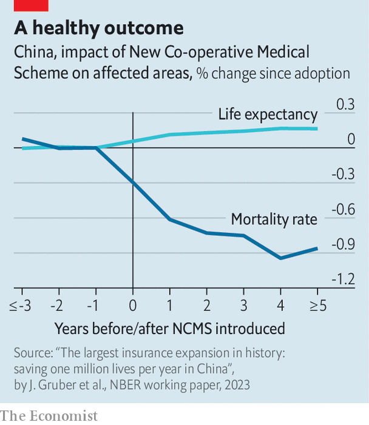

###### Coverage that counted

# An old health insurance scheme in China may have saved millions 

##### But there is still plenty of room for improvement 

 

> Aug 31st 2023 

In a country of 1.4bn people, even small improvements in health care can have a big impact. That appears to have been the case with the New Co-operative Medical Scheme (NCMS), a health-insurance plan for rural Chinese that was launched in 2003 and folded into a more comprehensive programme in 2013. Though it is perhaps best known for being stingy, the NCMS saved millions of lives, according to a new working paper by Jonathan Gruber of the Massachusetts Institute of Technology, Junjian Yi of Peking University and Mengyun Lin of Xiamen University.

At the time the NCMS was introduced, China’s health-care system was ailing. The government had long neglected it. Many families had to pay for treatment out of their own pocket, even as the cost of care spiked. Under pressure to come up with a fix, the state introduced the NCMS.

 


Within five years the scheme had enrolled over 800m people in the countryside. But it wasn’t very generous. People had to pay large deductibles before the insurance kicked in. Once it did, the plan still only covered a portion of the cost of treatment (sometimes as little as 50%). And total compensation was capped. Because of all this, and the voluntary nature of the scheme, previous studies concluded that it wasn’t all that effective.

But Mr Gruber and his team argue that the old research was flawed because it failed to account for different characteristics of counties, such as GDP, that may have influenced health outcomes. The new study used a complicated process to try and isolate the effects of the NCMS.

The team’s findings show that the scheme led to a 20% decline in mortality and a 4% increase in life expectancy in the counties where it was implemented. Between 2003 and 2010, the average life expectancy across China increased by 2.5 years. The NCMS may have been responsible for 78% of that, say the researchers. At its height, the scheme saved more than 1m lives per year. Participants were 13% less likely to be seriously ill than those not enrolled in the plan. They also spent considerably less on health care.

Millions of lives saved is a lot. But the NCMS’s size, rather than the ingenuity of its design or the generosity of its benefits, may be the biggest reason for its success. On a per person basis, the researchers found that the programme saved one life per 900 people enrolled, making it much less effective than Medicaid, an insurance scheme for poor Americans which is thought to save over one in 600 enrolled. 

The NCMS was merged with another scheme to become a programme called Urban and Rural Residents Basic Medical Insurance. Meanwhile, the Employee Basic Medical Insurance scheme provides insurance to people with formal job contracts. Together they cover 95% of the population. 

Time for a follow-up

Reimbursement rates are now higher, but people still complain that the plans are too parsimonious. The cost of treatment keeps growing. Drugs imported from the West, which are often more effective than those produced locally, are not covered. Graft is also a problem. In July the authorities launched a sweeping anti-corruption campaign in the health sector.

Big reforms are still needed. But even imperfect ones can save many lives, as the NCMS seems to show. ■


