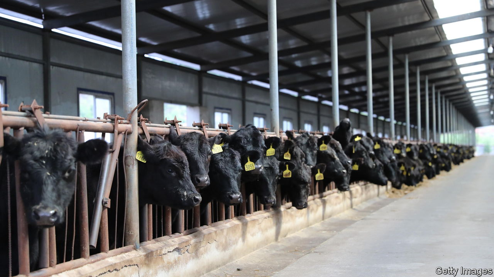

###### No love for livestock

# China has embraced pets, but animal welfare is still a problem 

##### Why is the public largely indifferent to cruelty on farms? 

 

> Aug 31st 2023 

Mao Zedong may have regarded them as a bourgeois luxury, but pets are on the rise in China. Around 116m cats and dogs share a home with humans in Chinese cities. It is not always clear who is holding the leash. At a recent pet fair in Shanghai items for sale included a spa machine for cats and ball gowns for dogs. Analysts say young people are increasingly choosing “fur babies” over children. China’s pet industry grew by 25% last year.

Care for these four-legged friends is being displayed in other ways, too. NGOs have set up rescue-and-adoption centres in cities. Recently, dozens of cats and dogs were saved by people using kayaks during floods near Beijing, a show of concern for animal lives that would have baffled many Chinese a generation or so ago. Activists have pressed the government to pass a law against animal cruelty and to ban the trade in dog meat, which is eaten by a small portion of the population. There has been some progress in these areas.

Broadly speaking, though, the state of animal welfare in China remains dire. That presents a puzzle. China’s urban “pet parents” sound as soppy as animal-lovers in any number of rich societies, and are just as convinced that their furry companions have distinct personalities. Just ask Liu Fan, a 25-year-old at the Shanghai pet fair, who takes her cat out to the beach to watch the sunrise. But when it comes to farm animals—including pigs, a species that outsmarts dogs or cats—China’s grim welfare standards are often as cruel as those of much poorer countries, where the idea that animals have feelings or rights is an unthinkable luxury. Opinion polls and consumer-spending habits indicate that one driver of continued poor treatment on farms and in slaughterhouses is widespread public indifference to such cruelty, including among besotted pet owners. 

As so often, this has an outsize impact because China is very large. While the Chinese are far behind Westerners when it comes to meat and fish consumption on a per-person basis, China is among the countries with the most livestock. Concerns about food safety have led to improvements in the way big farms are run. But little has been done to increase the well-being of animals. On a scale of A (excellent) to G (poor), World Animal Protection, a pressure group in London, gives China a G for farm-animal welfare (Britain receives a D, America an E). 

Western farms are not sanctuaries, but the mood in many places has turned against practices that are still common in China. Animals on Chinese farms can be slaughtered without being stunned first. Chickens are often stuffed into cramped wire cages. Pigs are increasingly kept inside giant facilities. Critics say these increase the risk of disease outbreaks and mass culls, and that poor standards help animal diseases cross over into humans. 

Whereas in countries such as Britain sales of free-range eggs have overtaken those of caged ones, such labels are rare in China. Few companies bother to make any claims at all about animal welfare. Some analysts believe that there is an untapped market for food that can be shown to come from well-treated livestock. After all, China’s growing middle class shells out for higher-quality and organic food.

Surveys, though, suggest that many Chinese are relatively uninterested in the welfare of the animals they eat. One from 2018 found that just 37% believed animals used for food could feel as much pain as humans. Fewer than half thought it was important that these animals were treated well. Respondents in America, Brazil, India and Russia displayed more compassion. Few Chinese seem to make dietary choices based on concerns about animal suffering (as opposed to their own health). Less than 5% of Chinese are vegetarian. 

Education is part of the problem, says Peter Li of the University of Houston-Downtown. Some Chinese assume that activists want to give animals the kinds of comforts that many humans still lack. A man selling robot buddies for lonely dogs at the fair in Shanghai argues that livestock, unlike pets, do not need to be treated well. In fact, he says, “animals that are killed painlessly don’t taste as good as those that are naturally slaughtered”.

Some in China, including many nationalists, argue that notions of animal welfare are a Western import, at odds with Chinese culture. The best-known advocate of this position was Zhao Nanyuan, a former professor at Tsinghua University who died in 2020. He called arguments in favour of animal rights “foreign trash” and claimed that activists were in league with “neo-imperialists” (running dogs, perhaps). An animal-rights scholar contacted for this article said the subject had become too sensitive. They asked to remain anonymous, lest they be branded a foreign agent.

China, though, has its own traditions of treating animals well, such as those advocated by Buddhists. Activists can also point to Taiwan, an island with a shared culture and history—and where animal welfare is taken more seriously. About 14% of Taiwan’s population is vegetarian. The real Western import, argues Mr Li, is factory farming—an approach to animal husbandry that aims to maximise production and often involves inhumane treatment.

For now, the government shows little interest in improving animal welfare. It is more concerned about food security and maintaining social stability by keeping prices low. When it comes to farming animals, regulators are not going to introduce onerous regulations unless they believe it is necessary for public health, says Even Pay of Trivium China, a consultancy. 

In the decades since the “reform and opening” period, meat and seafood consumption has risen rapidly in China. Many of its people, especially those who remember harder times, see this as a marker of progress. But activists see a growing problem. While meat consumption is projected to fall in places like America over the next decade, it is expected to keep rising in China. The challenge, then, is to convince the Chinese that improvements in animal welfare are also a sign of progress. ■


