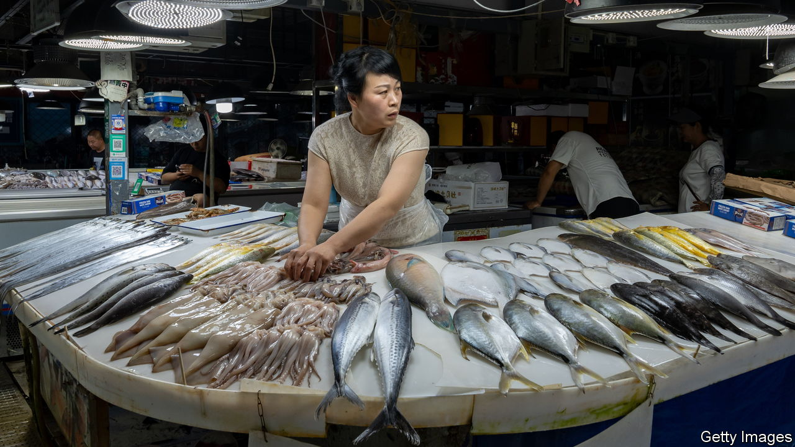

###### Water fight

# China is stoking anger over Japan’s release of nuclear wastewater 

##### The feud may have more to do with politics than health 

 

> Aug 30th 2023 

On August 24th the government of Japan began releasing water into the ocean. This is not just any water, mind you, but treated wastewater from the Fukushima nuclear plant, which was destroyed 12 years ago by a tsunami. Japan has dealt with the situation carefully, putting the liquid through an advanced filtration and dilution process. It still contains a potentially harmful radionuclide called tritium. But experts say the levels are so low that this is not a concern. Japan wants to release more than a million tonnes of the water over the next 30 years. Many scientists back the plan, as does the UN’s International Atomic Energy Agency.

China, though, has blasted Japan’s actions, calling them reckless. The government has banned imports of Japanese seafood. State media has endlessly covered the story, with little mention of the scientists who support the plan. Nationalist netizens have taken it from there, promoting unfounded claims about contaminated fish and poisoned humans, and calling for a boycott of Japanese goods. A few Chinese cities have experienced a salt-buying frenzy, with people queuing for hours to purchase a bag. Some seem to think that salt may become tainted or that it is useful in treating radiation sickness (it is not).

There are, to be sure, scientists and environmental activists who also oppose Japan’s plan. Some claim that more studies are needed to assess the potential impact. Others say that the authorities in Japan are not to be trusted. The disaster in Fukushima exposed alarming levels of official corruption, incompetence and deception.

But China’s response may have more to do with politics than anything else. Anti-Japanese sentiment in the country runs deep. Chinese nationalists often invoke Japan’s invasion and occupation of China during the 1930s and 1940s. A dispute over five islets in the East China Sea a decade ago led to talk of war. More recently, officials in Beijing have watched with frustration as Japan draws closer to America and shows increasing support for Taiwan, a self-governing island that China claims. On the wastewater issue, Japan says China has rebuffed its offers to hold meetings where it would address any worries.

A different type of meeting has also complicated the situation. On August 18th President Joe Biden hosted Japan’s prime minister, Kishida Fumio, and South Korea’s president, Yoon Suk-yeol, for an unprecedented summit. A rancorous history has often divided Japan and South Korea. China’s assertiveness has brought them closer. Now, though, China may spy an opportunity to drive a wedge between them. South Korea’s government has supported Japan’s wastewater plan, but the Korean opposition and much of the public are against it. (The Japanese public is also divided on the issue.)

For China, the wastewater release has come at a convenient time. The country’s economy is struggling. Each week seems to bring a new batch of disappointing data. Japan’s actions have provided a distraction from the bad news. But concerns about the economy may undermine China’s response. No country buys more seafood from Japan. The ban on imports risks hurting Chinese businesses nearly as much as Japanese fishermen. It may not last long. ■


