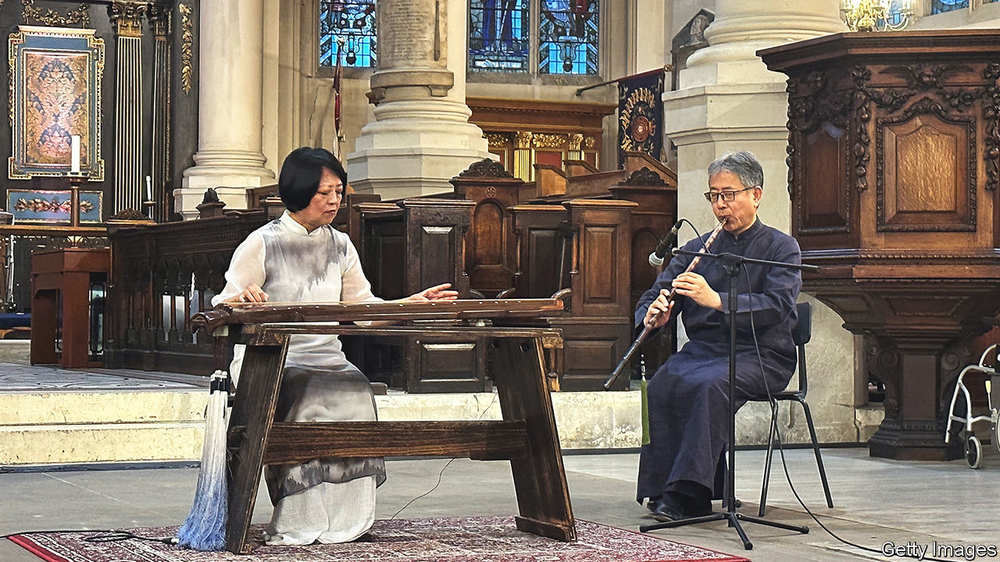

###### Instruments of power

# China’s Communist Party has co-opted ancient music 

##### The dulcet tones of the guqin come with a message 

 

> Aug 31st 2023 

At a church in the heart of London the soft tinkle of a , or ancient zither, rings out. The audience at the London International Chinese Music festival (pictured) is told that the sound of this seven-stringed instrument will transport them back in time and bring them joy and peace. Mastery of the , which dates back 3,000 years, was once considered a must for the elite in imperial China. Even Confucius played it. These days the Communist Party is hoping the  and other traditional instruments will also bring it joy, by promoting Chinese civilisation and the party’s self-styled embodiment of it.

In the late 1990s a young Chinese pianist called Lang Lang became a star of classical music, performing with the world’s top orchestras. At the opening ceremony of the summer Olympics in Beijing in 2008, he played a central role. But when Beijing hosted the Olympics again in 2022 (this time the winter games), the opening ceremony featured Chinese folk instruments, such as the  and .

The party’s founders had little good to say about China’s pre-communist history. But Xi Jinping, the current leader, has backed the revival of old instruments. They feature on China’s list of nominations for UNESCO‘s record of “intangible cultural heritage of humanity”. This is part of a broader effort to celebrate past glories. China’s ancient culture is the “root and soul” of the nation, says Mr Xi, who aims to build “cultural confidence”. 

China often uses its civilisation as a shield against criticism by Western countries over human rights and democracy. They should not try to impose their own values on China’s unique culture, suggests Mr Xi. At the same time, China is presenting a softer side to the West in the form of plucked strings and piped tunes. The party sponsors international festivals and concerts. Earlier this year Mr Xi and Emmanuel Macron, the president of France, enjoyed a  recital in the southern city of Guangzhou.

The party has a history of co-opting music for its own causes. Under Mao Zedong ostensibly old folk songs were rewritten with revolutionary lyrics and sometimes composed from scratch, says Kai Tang of the University of Music and Performing Arts Vienna. The solo repertory associated with the , a traditional form of flute, was composed almost entirely after 1949 and, in the early days, made up mostly of revolutionary music.

Today, the effort to revive ancient instruments is showing some signs of success. Moyun, a Chinese musician who plays covers of pop songs on her , has 2.3m followers on Bilibili, China’s equivalent of YouTube. Abigail Washburn, an American banjo player, released an album in 2020 with Wu Fei, a Chinese composer and  player. But the plinks of ancient instruments are still drowned out by the piano, which 40m Chinese are learning to play.■


