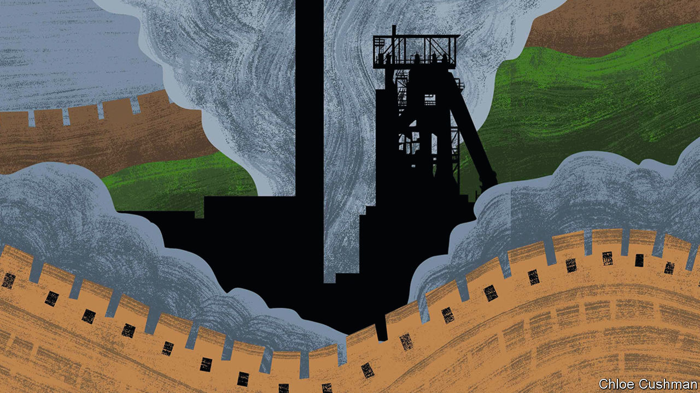

###### Chaguan

# When China thought America might invade 

##### Economic logic was not enough to stop a ruinous Mao-era drive for self-reliance 

 

> Aug 31st 2023 

When foreign foes threaten, an impregnable fortress is worth more than a comfortable home. Time and again, that doctrine guided China’s Communist Party in its first decades of rule. Under Chairman Mao Zedong, talk of invasion was a constant. In those dark times, the usual priorities of peacetime government—feeding and clothing the masses, striving to raise living standards—were all too often neglected. In their stead came campaigns to ready China for war. 

One such campaign built a complete military-industrial complex in China’s inland mountains, known as the “Third Front”. Begun in 1964, it was a state secret for more than a decade, though it involved at least 15m workers and consumed resources at a fearsome rate. Chinese elsewhere paid an unwitting price in austerity and consumer shortages. Labourers were often recruited from coastal or border regions deemed at risk of attack by America, India, the Soviet Union and other hostile powers. Grouped into militarised brigades, they laid railways far into China’s rugged western and south-western interior. They built steelworks and mines, armaments factories and nuclear sites in remote valleys and deserts, some of them underground. Though rail lines and other infrastructure helped to open up inland China, the costs, both human and financial, were staggering. When the campaign wound down in the late 1970s, most Third Front projects were deemed unviable and were scrapped, merged or moved.

Some tough but rational party bosses—among them Deng Xiaoping, the flinty survivor of several Maoist purges, and Mao’s eventual successor—tried to slow or shrink the Third Front when it was first mooted. Their resistance is ably described by Covell Meyskens, a historian at the Naval Postgraduate School in California, in his book “Mao’s Third Front: The Militarisation of Cold War China”. These relative pragmatists drafted a five-year plan that sought to restore orderly food production in rural areas and to develop modern factories, especially on the coast, to provide clothes and other necessities. Their plan was, in effect, a rebuke of Mao’s Great Leap Forward, an earlier exercise in grassroots radicalism that killed 30m people in a man-made famine.

Mao sensed opposition and counter-attacked. Party doctrine already described coastal development as a legacy of colonialism. Mao called coastal cities easy targets for foreign attack, too. He ordered key industries to move to remote mountain ranges, aping tactical retreats staged by early communist guerrillas. The country must build a rear base before war broke out, Mao insisted. Still, central planners and allies in the leadership played for time and called for more studies—right up to the moment in August 1964 that America accused North Vietnam of attacking one its warships, bringing conflict and a superpower’s armed forces to China’s southern border. Mao used this security crisis to outflank other leaders, argues Mr Meyskens. Bowing to Mao as their supreme military strategist, top officials approved his most urgent priorities within days, including the building from scratch of Panzhihua, a steelmaking city in the mountains of the south-west, and a ban on new industrial projects in 15 coastal cities.

History does not have to repeat perfectly to offer lessons in the present. Mao was a revolutionary who saw terror and anarchy as useful tools. By contrast, Xi Jinping, China’s supreme leader, is an austere nationalist obsessed with order and party control. For his part, Mao seems to have relished China’s break with the Soviet Union in the early 1960s and the turn to autarky that followed. Mr Xi’s calls for self-reliance in food and in core technologies are more complicated. Even as his regime abhors dependency on America, its envoys tirelessly lobby Western allies in Asia and Europe to provide know-how that China needs to grow strong. For all those differences, the Third Front should be studied by blithe sorts who insist that Mr Xi’s party must deliver growth and material prosperity to maintain its legitimacy, and so will never break with the rich West. Economic self-interest is a powerful force. But a lesson from 1964 is that once America seemed truly to threaten China, economic planners fell silent and security fanatics took charge.

Once, Panzhihua was too secret to appear on maps. Today, it is a sleepy city of 1.2m people in southern Sichuan, anchored by its still-active, state-owned steelworks, and by mines for iron ore, titanium and vanadium. Chaguan reached the city by high-speed train from Kunming, two and a half hours to the south. The Kunming-Chengdu rail line was also a Third Front project, cut through barren mountains at a cost of two deaths per kilometre of track. In the city centre high-arched bridges cross the Jinsha river, whose fast brown waters drowned pioneering workers crossing by boat. In the air, a faint oily tang is the only trace of the steelmaking that once poisoned local skies and water sources. 

In a dangerous age, old instincts stir

The city’s harsh beginnings are hard to imagine now: the lack of fresh food, the wolves that terrorised the first arrivals, the tents and huts of earth and straw that housed workers sent to terrace steep mountainsides. But several middle-aged residents are proud to recall fathers sent to the Third Front six decades ago, toiling alone for years before sending for wives and children to join them. 

A phrase of Mao’s, “Until Panzhihua is built, I won’t sleep”, is carved on a boulder outside the city’s Museum of the Third Front, near another old slogan: “Good People and Good Horses Go to the Third Front”. Inside, a father and his 12-year-old son from Guangxi, in China’s far south, examine a life-size diorama of a mine entrance. Grumbling that today’s young take comfort for granted, the man brought his son to discover how earlier generations endured hardship. He praises Mr Xi for updating Mao’s calls for self-reliance, predicting that a global contest for resources is “definitely going to cause a war”. Not all Chinese feel such danger. For those that do, Panzhihua awaits their visit. ■


