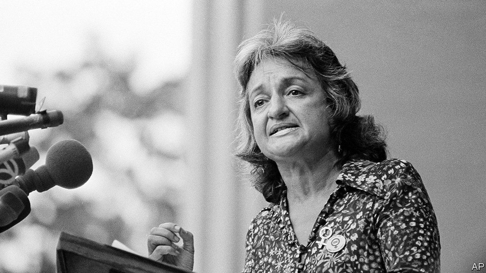

###### The fierce urgency of NOW

# Betty Friedan and America’s forgotten feminists 

##### Two new books aim to refresh a movement’s collective memory 

 

> Aug 31st 2023 

By Rachel Shteir. 

By Katherine Turk. 

Ask an enlightened twenty-something of either sex if he or she is a feminist, and you may get a resounding “Yes!” Ask this feminist to name someone famous for  a feminist, and you will draw a blank stare. Feminism is hotter than ever, but the women who created modern feminism are . 

It is in the nature of the activist to believe that she is the first to see a particular injustice. “Don’t trust anybody over 30,” said a free-speech campaigner, Jack Weinberg, in 1964. Today the brush-off “OK, boomer” sends a similar message.

One casualty of such forgetfulness is the cohort of women who invented modern feminism in the 1960s and 1970s. They are largely ignored or paid only the most backhanded of compliments. A youthful television watcher, for example, will know the legendary founder of  magazine, Gloria Steinem, in one of two ways: from the 2020 TV series “”in which the main character is Ms Steinem’s conservative nemesis Phyllis Schlafly, or through her cameo in “And Just Like That”, the reboot of the HBO series “Sex and the City”. The likes of Ms Steinem (now 89), her fellow founder Letty Cottin Pogrebin (84) and Susan Brownmiller (88), author of “Against Our Will”, a pioneering study of rape culture, surely deserve better.

Two new books aim to restore some collective memory. The first, by Katherine Turk, is a history of the National Organisation for Women (NOW), founded in 1966 as an umbrella group for the women’s movement. The book is by turns tedious and thrilling—like activism itself, in which the peaks of mass marches require the valleys of door-knocking and envelope-stuffing.

Even youngsters may know that NOW was co-founded by , whose 1963 book “The Feminine Mystique” was a bestseller. Ms Turk makes the bold choice of focusing instead on three lesser-known figures from NOW’s early years.

Patricia Hill Burnett was a Detroit socialite and a Republican, in a time when NOW still had bipartisan support. A former winner of the Miss Michigan beauty pageant, she led NOW’s efforts to plant chapters outside America. She mostly failed, but her internationalism shaped NOW’s ambition to liberate women everywhere.

Mary Jean Collins grew up in a working-class Irish Catholic family in Milwaukee and learned her feminism from the nuns at her women’s college. She moved to Chicago in 1968, started NOW chapters throughout the Midwest and later came out as a lesbian. She helped run NOW’s campaign against Sears, then the world’s largest retail chain, infamous for its discriminatory hiring practices and low pay for women.

Aileen Hernandez was born to Jamaican immigrants in New York City. She became a union organiser and the first woman to serve on the Equal Employment Opportunity Commission, a powerful federal agency. She was not the only black leader in NOW’s early years, but she has received too little recognition even within the movement, despite having been NOW’s president from 1970-71. It would be 50 years before NOW had another black president.

By telling the story of NOW through this disparate group of women, Ms Turk moves the historical memory well beyond Friedan. As Rachel Shteir’s new biography shows, Friedan herself desired a movement with broad appeal, and thus with room for all Ms Turk’s characters. Her fears that radicals would poison the movement were chalked up to simple bigotry—and it is true that she labelled lesbians “the lavender menace”, for which she spent decades apologising. But she was also afraid that any focus on what is now called identity politics would distract from issues like abortion rights and .

Ms Shteir concludes that Friedan was not entirely wrong. Although women’s choices today have expanded, she writes, “the social, political and economic equality for women that Friedan imagined remains elusive.” Like many revolutionaries, Friedan, who died in 2006 on her 85th birthday, could be abrasive and self-righteous. She was also a proud Jew and a Zionist, in a women’s movement that has seen a good deal of anti-Semitism. (Ms Turk conspicuously neglects Jewish women’s presence in the movement.) But she remains rightly renowned—unlike too many of her fellow pioneers of feminism. ■


