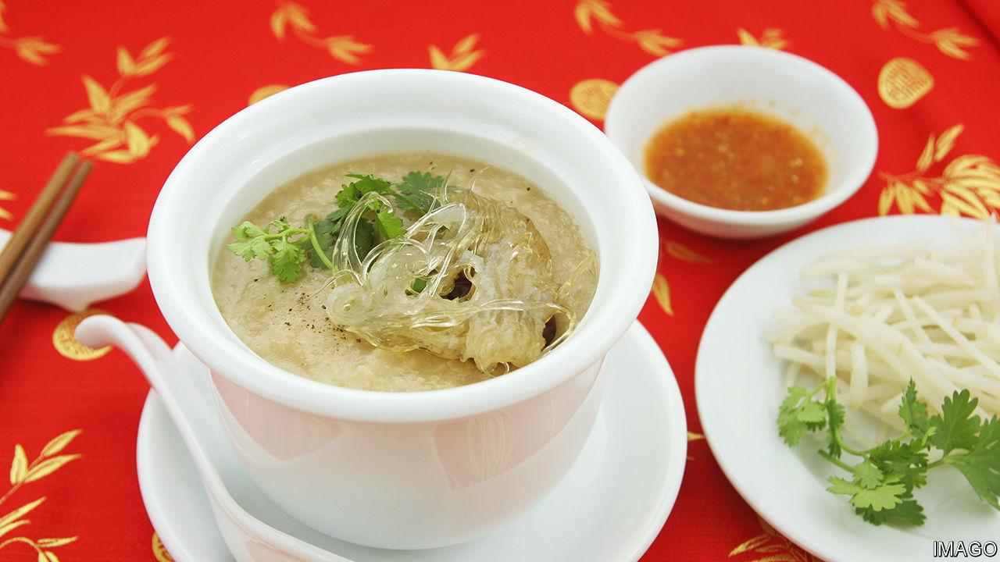

###### World in a dish

# Chinese food is more diverse than Western eaters might think 

##### In “Invitation to a Banquet” Fuchsia Dunlop celebrates the cuisine’s spread and savour 

 

> Aug 30th 2023 

ABOUT A DECADE ago, this correspondent attended a banquet in Guangzhou. The  was gentle and slithery, the sea cucumber rich and gelatinous and the fish sparklingly fresh and . The most memorable dish, however, was the plain white cup of broth served at the end. Made from chicken, probably with ham and dried scallop as well, it was simple, austere and perfect.

Ending a banquet with soup may seem odd to Westerners, accustomed as they are to sweets at a meal’s close. But, as , an English food writer, explains in an authoritative new book, stock is a unique, intrinsic expression of a chef’s art, much as a voice is for a singer. And the “transparent, almost invisible soup…in its quiet golden, ineffable loveliness” is an ideal conclusion to a banquet, with its opulence and strong flavours.

“Invitation to a Banquet” is Ms Dunlop’s seventh book. Unlike those for which she is best known, including “The Food of Sichuan” and “Revolutionary Kitchen” (about Hunanese cuisine), this is not a cookbook. Instead, she has chosen 30 dishes and used each to illuminate different aspects of Chinese cuisine—and, in turn, Chinese life and history. 

This is less of a departure for Ms Dunlop than it seems. Like other outsiders who spend their lives focused on a foreign cuisine—as , an English food writer, did in Mexico, or Paula Wolfert, an American, did in the Middle East—she is more a gatherer than an inventor of recipes. Ms Dunlop’s well-researched cookbooks read as mini-ethnographies. 

Readers will not learn how to make braised pomelo pith with shrimp eggs but how and why Chinese chefs have long prized unusual (and to Western palates, sometimes off-putting) ingredients, such as the bitter pith of a giant citrus fruit. An apparently humble, but in fact exceptionally laborious, dish of braised carp’s tail is a jumping-off point for a discussion of the importance of , or mouth-feel, in Chinese cuisine. 

Westerners, Ms Dunlop argues, “have traditionally assumed that the Chinese eat marginal animal parts out of poverty and desperation”, when in fact turning up one’s nose at gizzards, cartilage and jellyfish shuts the door on a range of foods that is wonderfully  (“slippery and crunchy, often in a wet way”).

In aggregate, Ms Dunlop makes a compelling case for the superiority of Chinese cuisine, but in a delighted and expansive rather than chauvinistic way. She shows how it has assimilated foreign influences (as other cuisines have, too), how it has changed with China’s increasing wealth and how central it is to the country’s intellectual and cultural history. 

She makes an equally compelling case that what Westerners think of as “”, meaning what most can find at their local takeaway, is neither inauthentic nor wrong. Instead, it is a diasporic offshoot that reflects local tastes but is about as representative of the cuisine’s diversity as a frozen pizza is of Italy’s. Immigration and adventurousness have made the real thing more accessible than ever . Eaters should savour that. ■


