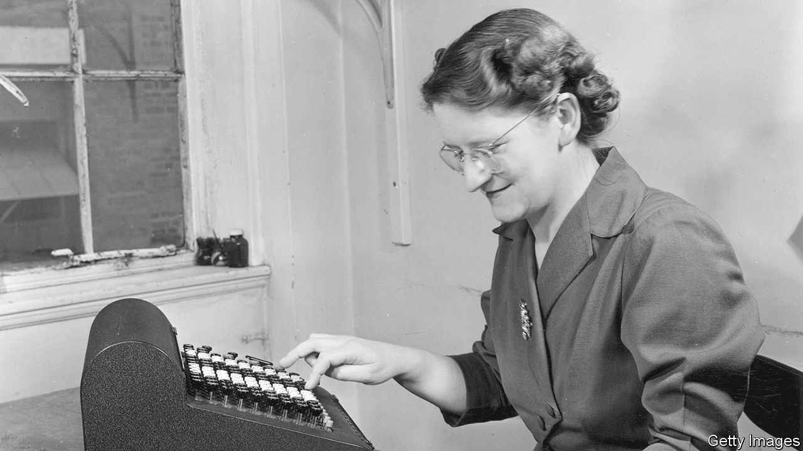

###### Coolly calculating

# How the pocket calculator paved the way for the digital age 

##### The evolution of the calculator offers a new perspective on the history of computing 

 

> Aug 31st 2023 

 By Keith Houston. 

WHEN WAS the last time you used a calculator? Having enjoyed a brief heyday in the 1970s, these once miraculous-seeming gizmos now mostly languish in desk drawers. Keith Houston’s sprightly history aims to give the calculator the recognition it deserves as a stepping stone to the digital era. Calculators, he argues, “helped usher in the world of ubiquitous computing”.

It is a tale that starts with a 42,000-year-old tally stick found in South Africa and moves through finger-counting systems to the abacus and the slide-rule. But Mr Houston’s narrative really gets going with the advent of the clockwork calculating devices in the 17th century. These in turn gave way to ever smaller and more capable electrical devices in which numbers were crunched by relays, valves and ultimately transistors.

All this is recounted with wry wit, plus numerous detours into mathematics,  and social history. Modern jargon has deep roots: “digit” and “digital” recall finger-counting systems; “calculi” were pebbles used by Romans on abacus-like ; a cursor was originally a sliding indicator on a slide-rule, pioneered by Isaac Newton; and computers were originally people, many of them women, who performed calculations, often in teams.

Most human computers were anonymous—in 1944 an American government committee even used “kilogirl” as a unit of computing power—but not all. Mr Houston explains how John Glenn, an American astronaut, insisted on having the trajectory of his spacecraft hand-checked by , an expert in orbital mechanics, using a Friden STW-10 electro-mechanical calculator.

The first purely electrical calculator, the desk-sized Casio 14-A, showed where things were heading. Fierce competition between firms in America, Europe and Japan led to smaller, cheaper models. Calculator development was computing’s cutting edge. The first microprocessor, the Intel 4004, was designed for a calculator made by Busicom, a Japanese firm. Hewlett-Packard’s HP-35, launched in 1972, was the first smash-hit consumer-electronics product. Calculators drove the miniaturisation and democratisation of computing. 

And it was a calculating app—VisiCalc, the first spreadsheet program—that kick-started personal computing. To do a quick sum today, it is quicker to open an app on your phone or computer than to reach into a drawer. Calculators, Mr Houston writes, are now “everywhere and nowhere at once”. His thesis adds up. He makes a convincing case, in sum, for the significance of the calculator.■


