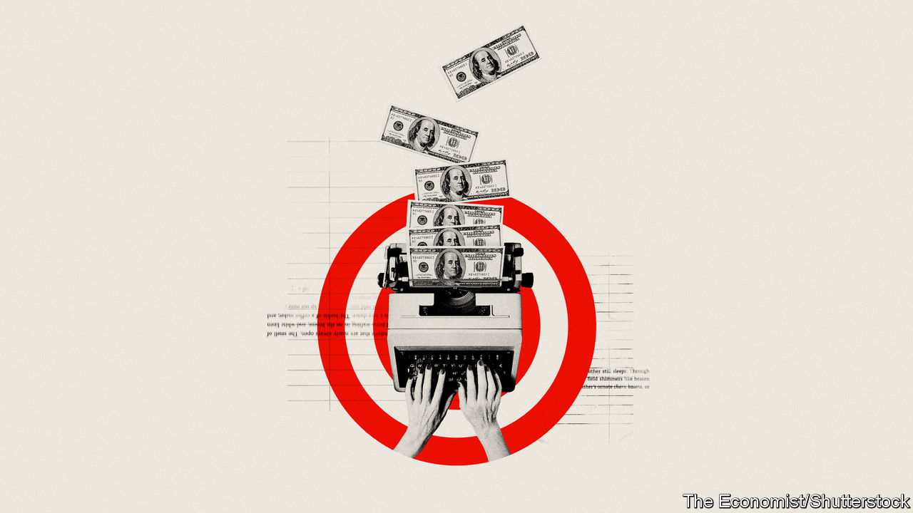

###### Pulp fiction

# How to write a bestseller 

##### No one knows. But a good guess is quickly. And don’t stint on the full stops 

 

> Aug 25th 2023 

DANIELLE STEEL books deal with “Family. Courage. Loyalty”, as the cover of one explains. They are also about “Wealth. Fear. Revenge. Love”, as the cover of another has it. Ms Steel herself has said she writes “about stuff that happens to all of us”. Though arguably she focuses a little more on the sort of stuff that involves Wealth. Palazzos. Emotions in Capital Letters. A little less on the sort of stuff that involves Tax Returns. Cutting One’s Toenails. Buying Groceries.

But that hardly matters. For her books are also about selling staggering numbers of copies. Ms Steel has written over 200 books—the latest, “Happiness”, came out in August, and her next, “Second Act”, will be released in October. She is one of the world’s bestselling living authors (according to some claims, the best) and has sold over a billion copies. Her novels are a literary sediment, settling on the shelves of holiday cottages everywhere. She has created not merely books but a brand: everyone, whether or not they have read them (and most will claim “not”), knows what “a Danielle Steel” is. And so naturally the  ignores her.

Publishing is an odd business. It is worth around $37bn in Britain and America alone, but you would never know this from the literature that it produces, which focuses on books in the brainy vein rather than anything so vulgar as volumes that actually sell. One authoritative history of English literature contains 60-odd mentions of “”; ten on “the sublime”; eight on “blank verse”—but a blank silence for concepts such as “business” and “turnover”. 

In another literary history, popular novels—those “jam tarts for the mind” as William Thackeray, the British novelist, called them—are mentioned, but with a wince, under the heading: “Problems of popular culture”. When Gore Vidal wrote an article on bestsellers it opened with the observation that “shit has its own integrity”—and became more dismissive from there.

The book business, however, depends on those despised bestsellers. September is when publishers release the titles that they hope will be their money-spinners. Yet most books will be loss-making. To produce, print and publicise a book costs about £12,000-15,000 ($15,000-19,000), says Mark Richards of Swift Press, an independent publisher. He reckons that it takes around 5,000 copies to break even. Most books never come close: only 0.4% of titles in Britain last year sold more than that, according to Nielsen BookData. Ms Steel’s books, by contrast, have sold 268,000 in Britain this year. Jam tarts they may be, but that is why people gobble them up.

And yet publishers seem to have an almost total inability to predict which books will sell. As Markus Dohle, then the boss of Penguin Random House, a large publisher, said last year, “Success is random. Bestsellers are random. So that’s why we are the Random House.” Editors less sagely select winners than buy literary lottery tickets and hope for the best. Taking credit for a bestseller is, as Jonathan Karp, the chief executive of Simon &amp; Schuster, has said, “like taking credit for the weather”. 

The word “best-seller” first appeared in the 1890s, with the first authoritative lists following soon after. Patterns emerged quickly. The writing can be good (H.G. Wells, an English writer, shot to the top of early rankings); but it need not be (just read “The Da Vinci Code” by Dan Brown). Sex sells well, but celebrity sells best. Prince Harry’s  published in January, broke records for the fastest-selling non-fiction book.

In 2018 a group of researchers from Northeastern University analysed almost eight years’ worth of  bestsellers and observed a few general patterns. Some elements of bestsellers are similar, says Burcu Yucesoy, the lead author. Aspiring writers should bear in mind that fiction sells better than non-; thrillers and romance sell best of all; name recognition matters (so write lots); and if you must write non-fiction, which does not sell, make it biography, which does. 

Writers are often unable to explain their own success in helpful ways. In 1956  the creator of James Bond, wrote an essay on how to write a successful book, in which he argued that: “There is only one recipe for a bestseller, and it is a very simple one.” All bestsellers “have one quality: you simply have to turn the page”. This is true—but entirely dodges the question. Jo Nesbo, a Norwegian thriller writer, thinks good prose is like good food: “You can’t tell what the ingredients are necessarily…but you know it when you see it and you read it.” Lionel Shriver, an American author, believes that “if there were such a thing as just following the rules…then everyone would write a bestseller. No one sits down and is determined to craft a story that only five people will read.”

But make your way through  bestsellers, and trends become clearer. Of the top ten bestsellers in one recent week, three were romances; one was a thriller; four were by a single author, Colleen Hoover, a romantic novelist whose first book, “Slammed”, was self-published, proving the unpredictability point. Only one of the ten, “The Covenant of Water”, is a literary sort of book. It has glum characters, too many similes and a tendency to use words such as “gloaming”. 

Here comes the sun

The settings of bestsellers are often exotic: Fleming observed that “the sun is always shining in my books.” Ms Steel’s books have titles such as “Five Days in Paris” and “Sunset in St. Tropez”, rather than “A Fortnight in Glasgow”. Their female characters tend to be called names like “Lily” and say things like “I only want you”; their male ones say things like “We’ve got rifles and grenades. They’ve got .50-cals.” Accountants are not overrepresented in their pages. There are certain stylistic traits too: sentences tend to be short. Really short. And repetitive. Really repetitive. Think Hemingway. On holiday.

Almost all bestsellers make the most of any research they have done. A recent Danielle Steel opens with the heroine looking out over Rome, at “Saint Peter’s Basilica and Vatican City, the dome of the San Carlo al Corso Basilica, and to the north, the Villa Medici and the Borghese Gardens”. This is one way to run up a word count. “The Da Vinci Code”, similarly, offers such detailed tours through Paris that the overall effect is less like reading a book than switching on a verbose satnav.

But perhaps the most striking quality about bestselling authors is how prolific they are: James Patterson, an American thriller writer, has churned out more than 340 books (some in collaboration with other writers). Such speed, as Truman Capote once put it, is less writing than typing. “Don’t get it right, get it writ” is a common theme among bestselling authors. Ms Steel says that she writes until her nails bleed. Fleming recommended writing 2,000 words a day and not sullying this with “too much introspection and self-criticism”. 

The sentences in bestsellers might have benefited from a little more introspection—or at the very least a second read. In one, a character finds her lover in bed with someone else and observes that “the only thing that struck me was that his face was as expressionless as his buttocks, which stared at me from the bed.” Reread that sentence several times, and you may still feel it has not given up all its secrets.

However, if you really want to write a bestseller, then ignore Ms Steel and other novelists. Because the book that sold the most copies in America in the past ten years was by none of them. It was “Oh, the Places You’ll Go!” by Dr Seuss. Number three was that other literary classic, “The Very Hungry Caterpillar” by Eric Carle. Children’s books not only sell well, but they also keep selling, year after year, building fans across generations. 

And, incidentally, they obey the bestseller formula perfectly: sentences of Hemingwayesque brevity; pleasant settings and, of course, excellent weather. Or, as Eric Carle described it: “One Sunday morning the warm sun came up and—pop!” Out of the book came a world-beating, bestselling marvel. ■


