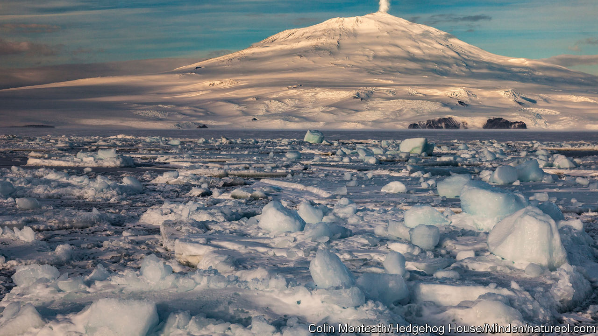

###### Some like it hot

# Long feared, volcanoes help the planet 

##### A new book argues that volcanoes aid with carbon capture and environmental resets 

 

> Aug 31st 2023 

By Clive Oppenheimer. 

MOUNT EREBUS—named after one of the primordial beings in Greek mythology, son of Chaos, personification of darkness—is the southernmost active volcano in the world. More people have been to space than have travelled to  and set foot on Mount Erebus (pictured). That is for good reason. When humans first climbed it in the early 1900s, the journey involved violent winds, occasional frostbite and bowls of “hoosh” (a potent, greasy combination of boiled, dehydrated beef and fat, which would not go bad). 

Clive Oppenheimer, a professor of volcanology at Cambridge University, has spent 13 seasons—cumulatively an entire year of his life—living near the summit of Mount Erebus. In “Mountains of Fire” he regales readers with gripping stories of his travels, as well as those of adventurers past. He does not just describe what the volcanoes look like, but how they feel and what they mean to the .

A volcano is a rupture in the crust of a planet. Through that opening, molten rock and hot gases escape. This can be a sudden and thunderous puff of ash and steam, or it can be a protracted ooze of lava, razing everything in its path. Perhaps because of volcanoes’ danger, their longevity and importance are often overlooked. But they live hundreds of thousands of years, and the gases they release come from the inside of the Earth. They are probably the very gases that created Earth’s atmosphere billions of years ago. Volcanoes “made the world fit for human purpose”, Dr Oppenheimer writes.

In total he has visited more than a hundred different volcanoes. Few people have come into contact with as many fiery mountains as Dr Oppenheimer has. Yet millions live close to them: around 800m people have their home within 100km of an active volcano. For some of the more than 1m Javanese who have settled in the shadow of Merapi, a , it is a kingdom of ghosts, where the physical and spirit world merge. A gatekeeper is charged with maintaining the volcano’s “equilibrium” through daily observances and annual ceremonies. In 2010, even after ominous earthquakes and belching gas, the gatekeeper at the time refused to leave his post. He was found afterwards, his body scorched in the position of prayer.

Both awful and awesome, volcanoes have much more to offer than dramatic geological events, which Dr Oppenheimer documented in his previous book, “Eruptions that Shook the World”. “Mountains of Fire” is a love letter to volcanoes and an investigation into all the ways that they have and continue to sustain humanity—spiritually and scientifically. 

Volcanic regions are hotbeds of biodiversity. The lava islands of the Galapagos are textbook examples of evolution in action. Volcanic eruptions can act as a reset button; as lava hardens and begins to erode over the course of years or centuries, the released nutrients and minerals create rich soil. Some of the world’s most productive regions for farming, such as in Indonesia and Central America, owe their abundance to eruptions past. Volcanoes can also help build up underground aquifers. For example, without the Tibesti and its five volcanoes in the north of Chad and in southern Libya, the eastern Sahara would be even more arid.

Science still has a lot to learn from the tiny organisms that live in and near volcanoes, in the harshest environments, such as the hot-acid crater lake of Ijen on Java. Some might one day find a use for these micro-organisms in medicine or air purification. Volcanoes also produce , which accounts for significant shares of electricity supply in a growing number of countries, including El Salvador, Kenya and New Zealand. The most common type of volcanic rock, basalt, is capable of permanently trapping carbon dioxide, making volcanoes an important player in the game of  and storage. Long viewed as a fearsome enemy of civilisation, volcanoes may yet become a saviour. ■


