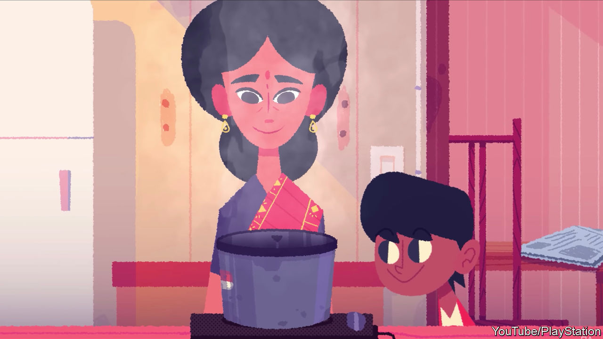

###### Hands up, don’t shoot

# Some developers are pushing back against violent video games 

##### Gratuitous bloodshed and the rise of female gamers have contributed to a backlash 

 

> Aug 31st 2023 

A Tamil mother, recently immigrated to Canada, stirs . Her young son looks on, sniffing the delectable aromas. This is a scene in Venba, a recently released  attracting attention. Through a series of cooking puzzles—in which players learn to prepare ingredients in the correct order or work out the various items missing from recipes—it offers an emotionally intense family saga, serving up topics like immigration and identity, alongside Tamil food. 

Unlike the noisy,  that dominate gaming and its public image, Venba is peaceful and gentle. It cost less than $1m to make but quickly managed to break into the top-sellers on Steam, a PC gaming hub, sitting alongside rivals that cost as much as $100m. It might not get the recognition or nearly as many users as “Call of Duty” and “Assassin’s Creed” do. But Venba is important, because it is part of a growing trend of non-violent games attracting both game developers and players.

Recently Steam held a sale, offering nearly 250 “wholesome” games that do not feature any violence. Such a notion would have been impossible until the recent past: there were just so few games that did not involve bloodlust. “The Best Non-Violent Video Games”, a new book by James Batchelor, a gaming expert, celebrates 300  from the past 50 years, all the way back to Pong (an early game that features a ball and two paddles, like a virtual game of tennis). More than half of them came out in the past ten years.

Two factors are contributing to the rise of kinder, gentler games. One is a backlash by those who design games. Many independent developers, who can choose their own projects (versus those who work for larger firms), do not want to spend their careers designing games about killing, says Mr Batchelor. Job Stauffer, a game-industry veteran, contributed to violent productions such as the “Grand Theft Auto” series, but has started refusing to work on brutal or murderous ones. “We see media reports of mass shootings and wars day after day,” he explains. “I decided that I didn’t want to be a part of the problem, creating entertainment that involves firing rockets into buses,” he adds.

Chris Chancey, a Canadian game developer, was in the midst of making a combat and adventure game when he learned that four-fifths of the games demonstrated at a leading gaming convention involved violence. This prompted him to change course and design something that cut against the trend. In the resulting game, “Rainbow Billy: The Curse of the Leviathan”, players speak instead of kill each other. It is popular with parents. “I get a lot of messages from parents who want to play games with their kids, but who don’t want to expose them to gore and violence,” he says.

As gaming becomes a pastime for the entire family, it is becoming more diverse, and this is fuelling demand for titles that do not involve pixelated machine guns or swords. When people think about gamers, they often picture them as male and on the cusp of puberty. Some are. But in reality, the average age of people who regularly play games is around 33, and about half are female. Wren Brier, developer of the popular narrative puzzle game “Unpacking”, says the tastes and preferences of women gamers have started to influence developers; many are looking for play where caring and friendship are on display, instead of shooting and domination.

Just like real life, however, peaceful experiences can exist alongside conflict and bloodshed. The most lavish productions and biggest commercial successes in gaming still usually include slaughter. (Many of the biggest Hollywood films do too, although they are not seeing the same backlash from film-industry folk or viewers—at least not yet.) “As soon as we attach a certain dollar amount to a project, it’s like violence becomes as understood a feature as having graphics,” says Laralyn McWilliams, a game developer. She hopes this will change in the future, as more developers and gamers choose a side. But of the 20 top-selling premium games so far this year, 15 feature combat. ■


