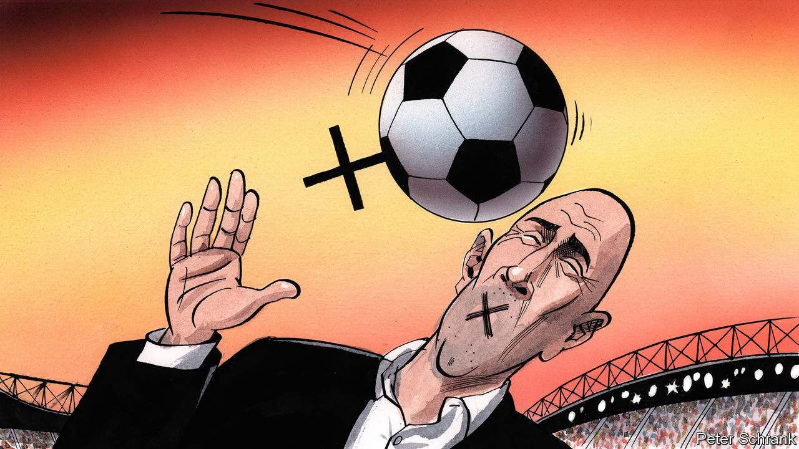

###### Charlemagne

# A sexism scandal in Spanish football hides the country’s progress 

##### Much of society has left outdated attitudes behind. But business has yet to catch up 

 

> Aug 29th 2023 

IN 1997 ANA ORANTES appeared on a Spanish television show to describe decades of vicious abuse by her husband: wild jealousy, beatings and isolation. Two weeks later she was found tied to a chair and burned to death by the man she had denounced. Spain was shocked not only by her murder, but also by the fact that she had called the police many times, to no avail.

Compared with such abuse, the kiss Luis Rubiales planted on an unwilling Jenni Hermoso on August 20th might seem trivial. Ms Hermoso and Spain’s women’s football team had just , and while passing out medals, Mr Rubiales, the head of the RFEF, Spain’s football federation, grabbed the back of her head, pulled her towards him and planted his mouth on hers. A “peck”, he later said, and consensual. 

She disagrees. The uproar that has consumed Spain since shows how the country still is, say many Spanish feminists. But the uproar can also be taken as an example of just how feminist the country has become. When Spain’s first modern left-wing government (1982-96) pulled Spain into Europe, Spanish society went on an orgy of personal liberalisation; but in Spanish life, sexism was slow to fade. By contrast, the second Socialist government, that of José Luis Rodríguez Zapatero (2003-11), quickly set about passing a gender-violence law, filling half the cabinet with women and liberalising abortion. It also introduced gay marriage and other laws in a burst of progress so sudden that it has been called the “second transition”, after the first one following Francisco Franco’s death in 1975. 

In today’s politics, Spanish women are doing . Pedro Sánchez, the prime minister, boasts a cabinet not just featuring women, but dominated by them: all three deputy prime ministers, and the ministers of economy, finance, labour, justice, defence and industry, as well as those ministries traditionally given to women, such as education and social affairs. Ministers, male and female, have been unanimous in calling for Mr Rubiales to go. Nor is their disgust a left-wing monopoly. The star figure of the conservative opposition, Madrid’s regional president, Isabel Díaz Ayuso, is known for her delight in skewering left-wing pieties. But even she has called Mr Rubiales’s behaviour “disgraceful”. 

Political progress is reflected, though unevenly, in society. The press extensively reports on violence against women, and the radio frequently reminds women of the hotline they can call to report it. The streets fill with huge demonstrations on March 8th, International Women’s Day. Sexual freedom for women and men is taken for granted. Last year a law banned street harassment, in the country once known for : florid compliments offered to a woman in public.

All this is why  (“disgusting”) trended on social media moments after Mr Rubiales forced his mouth on to Ms Hermoso’s, and #SeAcabo (“It’s over”) has become the Spanish equivalent of #MeToo. Though it is not, obviously, over, the tide has surely turned. Those who seem not to have detected that include Mr Rubiales’s mother, who locked herself into a church and declared a hunger strike in support of her son (she was later taken to hospital). To barricade oneself in a church is something that would occur to fewer and fewer Spaniards, among whom religious practice has declined about as quickly as feminism has grown.

But being locked in a conservative bastion is a good metaphor for the reaction of the Spanish football federation. On August 25th Mr Rubiales gave a speech in which he was widely expected to resign. Instead he declared his refusal to do so, blaming a “false feminism” for the predicament he was in. The audience that heartily applauded him included the trainers of the women’s and men’s national teams, leading to calls for them to quit too. 

Spanish sport is not unusually sexist. Women athletes are closely followed and their victories celebrated: last year Barcelona’s women’s team broke its own world attendance record for a women’s event, packing 91,600 fans into Camp Nou for its 5-1 rout of Wolfsburg in the Champions League semi-final. The national team’s World Cup win dominated newspaper front pages in the same way that the men’s title did in 2010. 

Inequality does persist in pay. A long-running saga over the lower earnings of the women’s national team relative to the men provided a backdrop of disgruntlement to the tournament. But such complaints are common in other countries too.

Bored with the board

The area of Spanish life that remains most stubbornly stuck in the past—besides the Catholic leadership, dominated by ultraconservatives—is business. A study from 2017 found that just 22% of top executive positions were held by women, a bit better than in Britain or America but worse than the 35% average in euro-zone countries. (Its authors blame policies that make it hard to combine parenting and work.) And surely enough, at the RFEF, a business as much as a sporting body, just 9% of the governing board are women. Such clubbishness may explain more than anything the roomful of men applauding Mr Rubiales’s rant against feminism. Some of that audience seem to have wised up subsequently. The two national trainers who first clapped have since denounced Mr Rubiales. On August 28th the regional football bodies that make up the national one unanimously called for Mr Rubiales to go.

Fifty years ago, Spanish women were second-class citizens. Twenty-five years ago, they were shocked by Ana Orantes’s murder into demanding social progress to match their legal emancipation. Today, attitudes often seem to resemble those in Scandinavia more than in neighbouring countries, where vigorous feminist movements still face strong headwinds. #MeToo has led to progress in France and, to a lesser extent, Italy. But in Spain the push began long ago, and has won broad and deep social approval—however slow those like Mr Rubiales have been to notice it. ■


