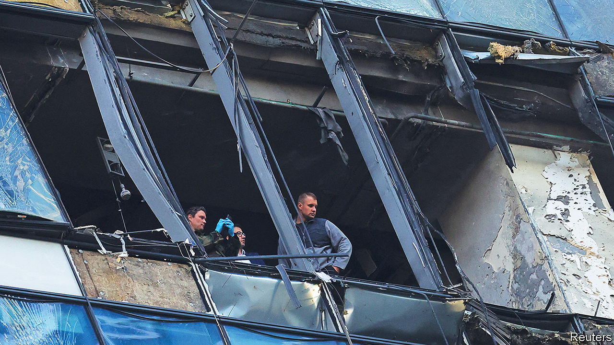
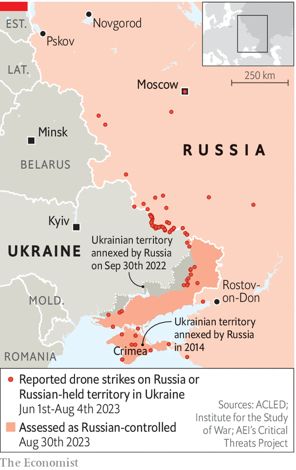

###### Buzzing with ideas

# Inside Ukraine’s drone war against Putin 

##### New types of drone are striking deep inside Russia, but scaling up is hard 

 

> Aug 27th 2023 


EARLY IN THE morning of August 25th, a group of drone developers headed to a launch point in southern Ukraine for one of the most daring aerial missions over Russian-controlled territory to date: an attack on a military base deep in Crimea. It was described as a test launch, with many of the prototypes in the drone swarm . But some of them did the job. 

 


There were explosions inside the base and several dead, with wounded soldiers seen streaming into the , according to local sources. That capped a miserable week for the Kremlin, already struggling to explain more than a dozen drones striking the heart of Moscow, repeated shutdowns of major airports and unexplained explosions at arms factories, airfields, fuel depots and railways. And on August 30th Ukraine launched what appeared to be its most extensive drone assault on Russian territory yet, with attacks on six regions. In the western city of Pskov drones reportedly hit an airport, damaging four transport planes.

A source close to the developers of Morok (“dark spirit”), one of the prototype drones used in the Crimean operation, says Ukraine’s new aerial strike capacity is the result of “seeds sown many months ago”. Morok’s development had been a “miraculous” journey: after one risky test launch a few kilometres from the Russian border, its developers escaped incoming Russian rockets by minutes. Now they aim to step up serial production. 

Fast and capable of carrying a heavy payload over several hundred kilometres, Morok is among the more promising fixed-wing kamikaze designs being considered by Ukraine. It has come this far largely without government funding, relying on hard work and a few friendly benefactors. But like other developers, Morok’s team now faces a difficult task getting the resources to scale up. 

Ukraine’s drone programme is driven by necessity. Russia, a missile superpower, began the war with a clear superiority in long-range strike capacity. It later began buying cheap Shahed kamikaze drones from Iran. Ukraine, on the other hand, has not been allowed to use Western-donated weapons in Russia itself, and so has been looking for other ways to hit back. 

Part of the answer has been developing new missiles, or repurposing old ones: the vintage S-200 surface-to-air missile is now used in surface-to-surface mode. Meanwhile, a network of volunteers and government groups has been racing to develop better domestically made drones. 

The drone campaign is being stepped up now for a number of reasons. The headline-making strikes on Moscow are intended to have a psychological impact, bringing ordinary Russians closer to the reality of war. But Ukrainian military insiders say most of their operations are designed to directly support the country’s three-month-old counter-offensive. 

Much of this is too prosaic to make news. Drones target “fuel depots, logistics, ammunition dumps and delivery routes”, says “Detective”, the pseudonym of a drone co-ordinator in Ukraine’s military intelligence. “We respond to appeals from our brigades. They tell us they know where Russian arms are being stored, but have no way of hitting them, and they plead with us to help.” Detective says much of his recent work has been focused on airfields near Ukraine’s borders. This “might” have included a recent strike that hit a Tu-22M strategic bomber based near Novgorod, he adds with a wink. 

Russia’s extensive air-defence and electronic-warfare capacity means that any Ukrainian attack requires meticulous planning. Ukraine has developed algorithms that appear to work. Operators launch in the early morning (when defenders’ concentration might be lapsing) and use an order of attack designed to keep air defences busy. They gather intelligence (often from Western partners) about radars, electronic warfare and air-defence assets. Russia cannot lock down the entirety of its vast territory. “If you can scuttle past 60km of jamming stations on the border, you are in the Russian hinterlands and it’s game on,” says the Morok source. About 35-40% of drones make it through to the general vicinity of the target. Feedback about a strike’s success is compiled from satellites, tracking devices, social-media reports and local agents. 

Unusually, Ukraine’s drone programme has no single command or procurement structure. Several state organisations, including all the intelligence agencies, have their own drone initiatives. Freelance developers are also in the mix. These components are organised in cells that do not communicate with each other. 

This helps security and competition, but can make optimisation and mass production difficult. The central government, especially the Ministry of Digital Transformation, has tried to streamline financing and remove red tape. But bureaucracy, corruption and vested interests in the Ukrainian arms industry continue to act as a drag on development. Some of the operations targeting Moscow appear to be PR projects designed to bring a prototype to the attention of procurement bosses, rather than having military value. 

Finance is not the only barrier to scaling up. Cheap components and electronics are hard to find. So are aviation specialists. Russia is doing better on this front: though slow to get going, it has now geared up mass production. Russia’s state enterprises have prioritised the war’s most effective weapons. These include versatile Kh-101 cruise missiles; wings to convert free-fall bombs into glide bombs; Lancet strike drones, capable of taking out Ukrainian armour and air defence; and Iranian Shaheds, which are now reportedly being produced in a new factory in Tatarstan. An Ukrainian intelligence source said Russia was likely to be stockpiling ahead of a renewed campaign on energy infrastructure this coming winter. 

On the front lines, Russia has erased Ukraine’s initial three-to-one advantage in tactical drones. The two sides are now at parity, a source close to Ukraine’s commander-in-chief says. New electronic-warfare jamming boxes, fitted on tanks and other assets, are meanwhile reducing the ability of Ukraine’s  to guide payloads into the most vulnerable sections of a target. 

A source within Ukraine’s general staff suggests any technological advantage his country once enjoyed was necessarily temporary. Both sides are learning from the other, he says, and reverse engineering is getting quicker: “We had the experience of defending against Russian drones, and we got better quickly. They will too.” Ukraine will need to think of new asymmetric ways to use drones, including using artificial intelligence to improve accuracy. The government has dedicated a new budget line of 40bn hryvnia ($1.1bn) for drones, a huge sum for Ukraine. 

Detective says he regularly receives grateful calls from the front lines, thanking him for his latest successful strike. “They tell how they have enjoyed two or three days without Russian bombs,” he says. “Calls like that make the difficulties of the job worth it.” ■

