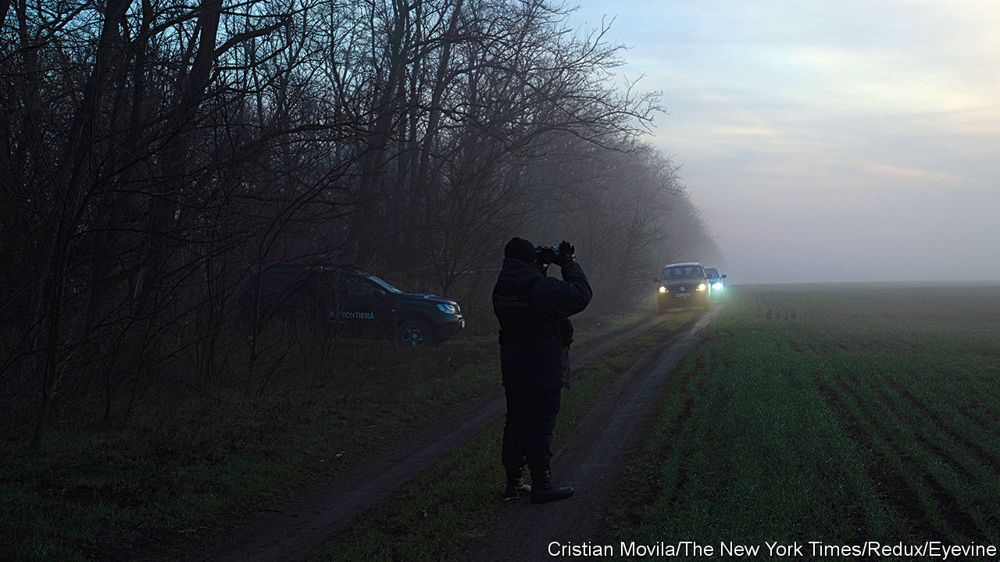

###### Escaping the war

# Thousands of Ukrainian men are avoiding military service 

##### There are many ways to do it 

 

> Aug 31st 2023 


IN THE MORNING gloom of the railway station at Chop, a border town in Ukraine, passengers queue for the train to Zahony, a 13-minute journey away in Hungary. From there one can travel to Budapest, and then the world. Outside the station a platoon of soldiers puff out their chests at a ceremony celebrating Ukraine’s Flag Day. But not all Ukrainian men are so eager to take up arms. Thousands have fled abroad, though no one knows quite how many. 

In the queue of about 130 people, only 20 are male. Men aged 18-60 are not allowed to leave Ukraine unless they qualify for an exemption. Four of those waiting are young lads who look close to turning 18. To avoid the risk of mobilisation, they must leave before then. Of course, some men find ways to get out anyway, legally or illegally. On August 11th President Volodymyr Zelensky announced he was sacking the heads of the country’s regional military recruitment centres, where officials were alleged to be selling travel permits for up to $10,000. “Bribery during war is treason,” Mr Zelensky railed.

In Uzhhorod, a town on the nearby Slovakian border, Oleksiy, aged 25, rues the fact that he did not flee with his cousin the day the Russians invaded. War is “legalised murder”, he says, “and I don’t want to be part of it.” He dithered for a couple of days, and by then it was too late to leave legally. Because students are exempt from mobilisation, he has enrolled in a second degree programme. But he will have to pay for his studies: only a first university degree is free in Ukraine. 

The number of draft-eligible men who have registered as students is “massive”, says Dmytro Tuzhansky, the director of the Institute for Central European Strategy, a think-tank based in Uzhhorod. One way to avoid mobilisation, he says, is to register as the carer of a disabled family member—whether or not they actually need care. A marriage of convenience with a disabled person is another option. One scheme has couples “separating”, with the man being given full custody of the children. 

Since the invasion, some 6,100 men have been caught at Ukraine’s border crossings trying to get out using counterfeit or fraudulently obtained permissions, says Lieutenant Colonel Olena Trachuk, spokeswoman of the Chop detachment of Ukraine’s State Border Service. But the number has fallen to a handful a week. 

The guards now focus on catching Ukrainian men who try to slip out of the country elsewhere along the border, not at official crossings. Since the invasion began, they have nabbed some 13,600 people trying to do so. But even so, Colonel Trachuk thinks that in the Chop sector, for every man who is caught, another gets across. A third of those apprehended are intercepted before they ever reach the border, at checkpoints or in bus and railway stations, because they lack a credible story. Locals, bus and railway workers keep a beady eye and rat out potential draft-dodgers to border guards. 

Oleksiy contemplated trekking across the border, but says the going rate for a guide was $5,000. He reckons that the chances of success are too low to risk such a sum. Some instead try to plot their own routes on their phones, says Colonel Trachuk, but get lost because remote border regions lack internet access. To date, 19 have been found drowned in the Tisza river, which forms part of Ukraine’s border with Hungary and Romania. 

Men caught trying to hike across the border can be fined, but not jailed. Those who help them risk prison. Using fraudulent documents is a criminal offence, but crossing the border illegally is not. If they succeed, neighbouring countries do not send them back. In the initial period after the invasion most men trying to get across were driven by fear, says Colonel Trachuk. Now she reckons half are looking for work. But those trying to escape military service must live at risk of being apprehended by recruitment officers and press-ganged. At the beginning of the invasion Ivan, a 42-year-old musician in Uzhhorod, contemplated enlisting, but changed his mind when he saw coffins arriving. Now, he says, he is in constant fear of being called up: “I feel like I am hanging in the air.” ■

