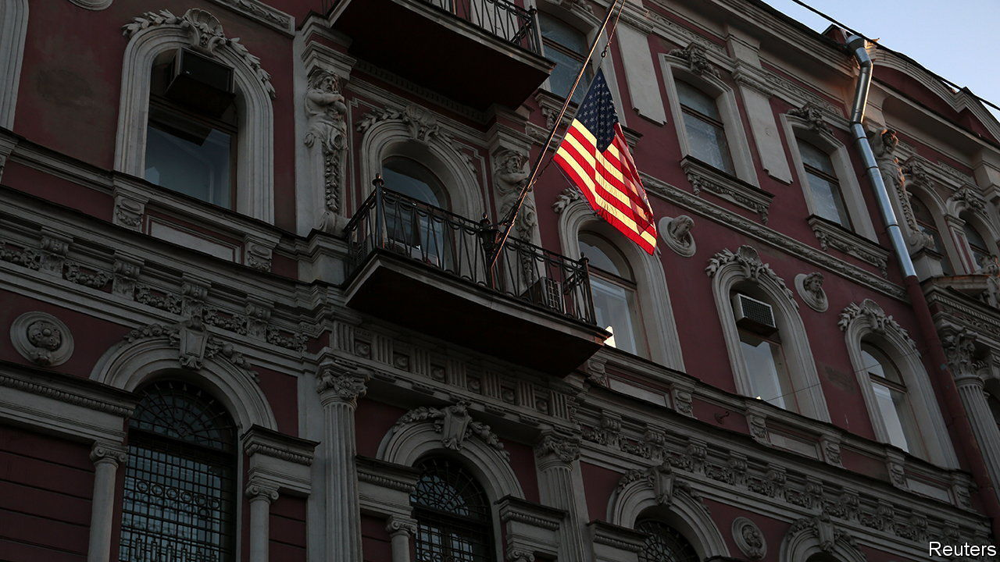
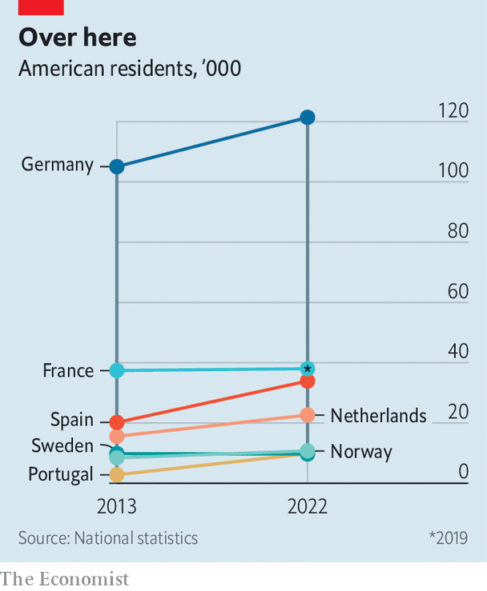

###### Getting out

# Why Europe is a magnet for more Americans 

##### The number seeking to escape violence and political strife in the United States is small but growing 

 

> Aug 28th 2023 

“WHAT I ENVY you is your liberty,” says Count Valentin de Bellegarde to Christopher Newman, the protagonist of Henry James’s novel “”. Rich, self-made and free of class prejudice, Newman moves to Paris for fun, only to be sucked into the intrigues of the French aristocracy. The template still describes one type of American expat: the well-off innocent who comes to Europe for amusement or edification. Another sort, however, comes not to enjoy the old world but to escape the new one. “I didn’t know what would happen to me in France,” said James Baldwin, a black writer, of his decision to emigrate in 1948, “but I knew what would happen to me in New York.”

More Americans are moving to Europe lately, and many are fleers rather than seekers. The statistics are messy, but in some countries the trend is clear. In 2013-22 the number of Americans in the Netherlands increased from about 15,500 to 24,000; in Portugal it tripled to almost 10,000; and in Spain it rose from about 20,000 to nearly 34,000. In other places, such as France, Germany and the Nordic countries, the number grew moderately or held steady. Britain thinks the number of resident Americans rose from 137,000 in 2013 to 166,000 in 2021 (the latest estimate).

 


Meanwhile, more and more Americans say they want out of their own country. Few of those who vowed to leave if Donald Trump were elected in 2016 actually did so. But Gallup, a pollster, found in 2018 that the share of Americans who said they would like to move permanently to another country had risen from 11% under Barack Obama to 16% under Mr Trump; by 2022 it was 17%, Joe Biden’s election notwithstanding. The follow-through rate remains tiny: a few tens of thousands of émigrés out of a population of 330m. But many recent expats say they left partly out of despair at where the United States is heading.

“I do a phone call once a month with Americans asking me how to come over here,” says Caroline Behringer, an American who moved in 2017. Ms Behringer, a former aide to Nancy Pelosi, the then leader of the Democrats in the House of Representatives, left her job and joined her partner in Amsterdam after Mr Trump’s victory. For most expats, she says, politics was not so much the reason they left as a reason not to go back: “Not just the election, but the continued divisiveness”.

“The thing we hear all the time is that the work-life balance is so much better here,” says Tracy Metz, who heads the John Adams Institute, an American-Dutch cultural venue. American workers toil for 1,811 hours a year, Europeans just 1,571; the well-rested Dutch put in a mere 1,427. The Netherlands once attracted Yanks seeking to smoke marijuana or marry same-sex partners. Now the attractions are more mainstream, Ms Metz says. The rise of international English makes things easier for Americans, who are notoriously bad at languages: 28% of the bachelor’s programmes at Dutch universities are in English. Online job ads require English almost as frequently as they require Dutch.

Some émigrés are drawn to Europe’s robust social safety-nets. Heather Caldwell Urquhart, a writer who moved to Lisbon in 2021, had taken a clerical job in Massachusetts simply to get health insurance. In Portugal she and her family pay for coverage a fraction of what an equivalent American plan would cost. “We didn’t realise how shredded the United States’ social fabric was until we got here,” she says.

“We felt the tension lift” within weeks of leaving America, agrees Sylvia Johnson, a psychiatrist who moved to Lisbon in 2022. For Ms Johnson and her family, who are black, the central issues were racism and violence. She had been trying for years to persuade her husband Stanley, a lawyer, to move abroad. The strife after the murder of George Floyd in 2021 brought him around. He recalls saying: “‘I think we need to get a gun.’ When I said that out loud, I was like, if I have to live in a country where I need a gun to protect my family, then this is not the country for me.”

Stanley had a cross burned on his lawn while growing up in Virginia. Several of Sylvia’s relatives were killed by guns. Now they are relaxing some of the wariness that black Americans develop for detecting prejudice and coping with police. Though there is some racism in Portugal, they say, they do not worry about violence.

Other factors are more prosaic. The huge increase in remote working during the pandemic made living abroad more feasible. And the European countries that lure the most Americans have set up tempting deals for foreigners. The Netherlands lets companies exempt 30% of skilled foreign workers’ income from taxes. In Portugal a residential visa requires income of just 150% of the national minimum wage, or about €1,100 ($1,190) a month—an easy hurdle for American retirees. Foreigners can pay a 10% flat tax on “passive income”, such as investments or a pension. Spain’s “Beckham law” offers a 24% flat tax for income earned in the country. Several countries are introducing “digital nomad” visas for tech freelancers.

Such deals explain why these places are getting a lot of non-rich American expats. Other countries target the Christopher Newmans of the world. Italy aims to attract “high-net-worth individuals” by letting them pay €100,000 a year in income tax regardless of how much they earn. France has a complicated exemption aimed at foreign business executives. Germany, though, has none.

For all American expats’ tales of disillusion, it is less important than practical matters. “Everybody has convoluted how-I-ended-up-here stories,” says Amanda Klekowski von Koppenfels of the University of Kent, an expert on the American diaspora. Many travel for education or work, fall in love and settle down. Still, she says, there has been a change. Americans once felt that their country was the ultimate immigrant nation; leaving seemed odd. Now they are aware that Europe has its advantages: “Good health care, better transportation, less gun violence, there’s racism but a lot less deadly.”

To listen to the new American expats is to get a sense that “The American” has been partly upended. Americans are still richer than Europeans. But when they come to the continent, they no longer arrive as egalitarians in lands of aristocracy and prejudice. Instead they admire Europe’s universal health care, efficient public transport, lower crime and lower income inequality. In a way, they envy the Europeans’ liberty. ■

