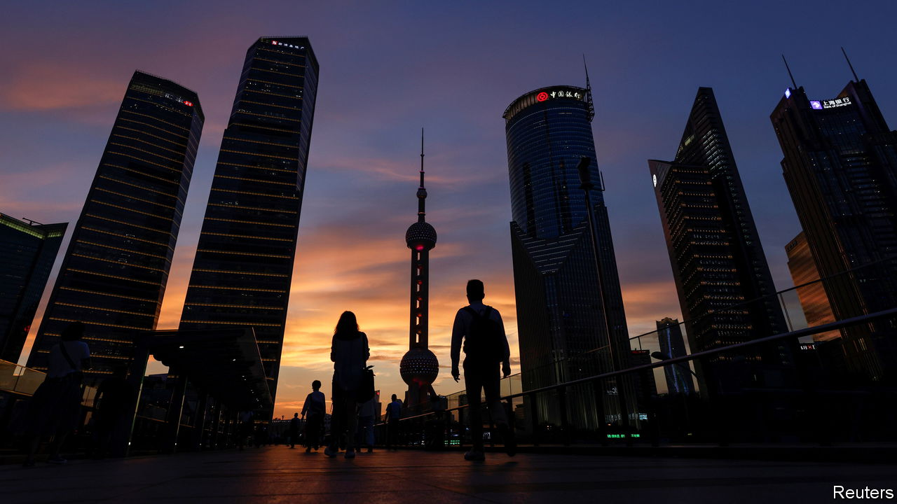

###### Ubiquitous, opaque, tangled

# China’s shadow-banking industry threatens its financial system 

##### Weak economic growth means the country is particularly vulnerable to contagion 

 

> Aug 28th 2023 

Shares in Xinhua Trust, a Chinese shadow lender, are selling for rock-bottom prices. The outfit went bankrupt in May, becoming the first Chinese trust to fall in more than two decades. Since then chunks of the firm have been put up for sale on Taobao, an online e-commerce platform, at a 30% discount. Its company cars were recently added to the auction, which has been mandated by a court. A bargain-hunter could snap up Xinhua trademarks for just 12,000 yuan ($1,650). 

The lender’s demise was a warning: the same forces that brought it down are now ripping through China’s trust industry, which has assets of 21trn yuan. The country’s economic growth has been , and property developers are caught in a daunting wave of  and restructurings. China’s trusts, which channel funds from investors to infrastructure, property and other opportunities, are exposed to both developments. Although Xinhua’s bankruptcy has been straightforward, a bigger blow-up may be on the way at Zhongrong, one of the country’s largest trusts, which missed client payments in mid-August. Panicked investors fear more firms will be ensnared, and that collapses will lead to further economic problems.

During China’s years of strong growth, trusts and their investors flourished, with investment products often offering annual returns of 10% or more. Property developers and local governments were willing to pay lofty interest rates, transactions required less regulatory scrutiny than bank lending and trusts benefited from the widespread perception that investors’ cash was safeguarded by the state in a fashion similar to bank deposits. That perception is now long gone—and as more developers default, it is likely that more shadow banks will be unable to pay out. 

Zhongrong, which managed about 630bn yuan in trust products at the end of last year, shows how pain has spread from property to the financial system. When Sunac, China’s fifth-largest developer, defaulted last year, local governments began freezing company funds in order to ensure that projects were finished. One place where funds were frozen was Wuhan, a city in central China, and the money included investments linked to Zhongrong. Across the industry, about 7% of trust products were invested in the property sector at the end of March. Indirect investments via securities push that exposure to as much as 30%, reckon analysts at anz, a bank. 

The risk of contagion is high because lending by trusts is ubiquitous and opaque, and investment in them produces tangled ties. On August 29th Jingwei Textile Machinery, a state-backed firm and Zhongrong’s largest investor, announced it would delist from the Shenzhen stock exchange, citing “market changes”. Other listed firms that invest in Zhongrong’s products say the company has missed payments. Trusts have meanwhile invested about 4.6trn yuan in stocks, bonds and other funds. They have also lent to local-government projects—and now cities and provinces across China are struggling to repay debts, which are estimated to have hit 57trn yuan at the end of 2022. 

There is another avenue through which trouble may spread. Zhongrong is controlled by a larger investment manager, called Zhongzhi, which has about 1trn yuan in assets under management across an array of divisions. Zhongzhi has also been thrown into a liquidity crisis and has reportedly been unable to pay the 230bn yuan it owes to some 150,000 investors. Across the country, similar investment-management firms have millions of customers. Since news of Zhongzhi’s troubles broke, phones have been ringing off the hook as worried clients, many of whom are regular white-collar workers, seek to confirm their savings are safe, reports an executive at another of these companies.

These sorts of links between trusts, local governments and developers, and the possibility of larger financial firms getting caught in the trouble, have spooked investors. Indeed, Zhongrong’s troubles have contributed to the poor performance of the Chinese stockmarket. The csi 300, a benchmark index, fell by more than 6% in August. Government interventions, which included a cut to stamp duty on August 27th, have had little impact.

Officials are aware of these problems. After all, they inadvertently brought many into being. Since 2017 China’s shadow banks have been under intense scrutiny as part of an effort to transfer opaque off-balance-sheet lending to banks. The official attack was ramped up in 2020 when the state introduced sharp restrictions on leverage at property developers. As a result of such moves, the issuance of shadow-banking products in the first half of this year was at its weakest in a decade, according to Capital Economics, a research firm. The crackdown has sapped liquidity and confidence from the market, pushing both developers and trust firms towards default.

The rich get poorer

In the short term, much of the pain will be borne by wealthy investors: the threshold for putting money into a trust is usually more than 300,000 yuan. Most cannot even demand the return of initial investments, since products usually have terms that prevent investors from withdrawing, sometimes for up to two years. This may stop a fully fledged financial crisis caused by a run on shadow lenders, and will give the government time to deal with the mess. Bloomberg, a news service, has reported that China’s banking regulator has already set up a task force to examine the problems at Zhongzhi. Given the connections such firms have across the economy, inspectors might not like what they find. ■


