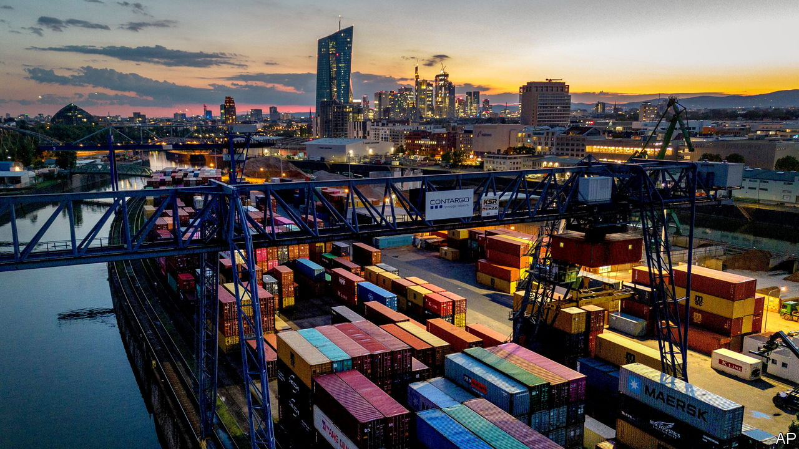
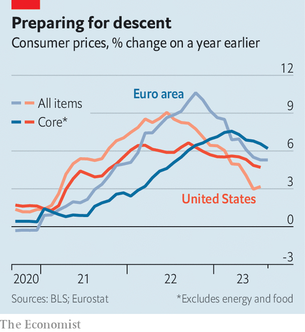

###### Brace for impact

# Europe’s economy looks to be heading for trouble 

##### Will policymakers still lift interest rates? 

 

> Aug 31st 2023 

Europe’s summer was a strange mixture of heavy rainfall and wildfires. The continent’s economy was also plagued by extremes. Inflation remained hot: prices rose by 5.3% in August compared with a year earlier. And officials are increasingly worried by the cloudy growth outlook. A recent drop in the purchasing managers’ index (pmi) suggests the bloc is facing recession. 

Ahead of the next meeting of the European Central Bank (ecb) on September 14th, policymakers will be worried by the possible emergence of stagflation (a situation in which low growth is paired with entrenched inflation). Christine Lagarde, the central bank’s president, recently reiterated her commitment to bringing down inflation and setting interest rates at “sufficiently restrictive levels for as long as necessary to achieve a timely return of inflation to our 2% medium-term target”. In plain English: the ecb would much prefer a “hard landing”, featuring economic pain, than failing to reduce price rises. 

 


The problem is that the ecb risks crashing the plane. Euro-zone inflation is proving as stubborn as the American variety. In Europe, price rises were sparked by increasing energy costs; in America, they were more demand-driven. But in both places inflation has followed a similar path, with Europe slightly behind. Now the question is whether core inflation, which excludes volatile energy and food prices, will come in to land. So far, it is staying stubbornly high (see chart).

This is in part because Europe has, like America, so far managed to dodge recession. At the end of last year, when many expected a European downturn, monetary tightening had yet to hit the economy and national governments offered generous handouts in order to counteract the energy shock. The service sector showed decent growth, and industrial order books remained full from the post-covid boom.

Gloom is now spreading across the continent. The global economy is weakening, and order books have plenty of blank pages. State support for households is also running out. Retail energy prices remain higher than before last year’s crisis; real incomes have yet to recover. Activity in the service industry contracted in August, according to the pmi survey. The sector is at its weakest in two and a half years. 

Higher interest rates have also started to affect the European economy, as intended by the ecb’s policymakers. Construction, which is traditionally sensitive to interest rates, is feeling the pain. Stingier bank lending is leading to a 0.4 percentage-point reduction in gdp growth each quarter, according to Goldman Sachs, a bank. Corporate insolvencies rose by more than 8% in the year’s second quarter, compared with the first, and have reached their highest since 2015. The impact of tighter monetary policy will peak in the second half of this year, predicts Oliver Rakau of Oxford Economics, a consultancy. 

A hard landing is thus almost guaranteed. But the return of inflation to the ecb’s 2% target remains some way off. Two forces are pulling prices in different directions. One is the situation in the labour market. Unemployment remains at a record low. Although firms are hiring fewer workers, there is no imminent danger of mass lay-offs—in part because bosses want to hold on to workers that are increasingly scarce in an ageing continent. As a result, wages across the bloc are rising, even if not by enough to make up for earlier inflation. 

The other force, which is pulling down inflation, is weakening demand for goods and services. During the covid pandemic, price growth took off in advance of wage growth, causing companies’ profits to rise strongly alongside inflation. If companies now find that demand is drying up, it is possible that inflation will fall at the same time as wage growth stays high, bringing profits back down. Indeed, prices on wholesale markets for goods are already falling fast, and import prices are also declining. At some point, these lower prices will be passed on to consumers.

Which of these two forces will win out? At the moment, it looks like the answer will be weak demand, since it has spread to the service sector, too. This suggests that euro-zone inflation might fall in relatively short order. But the ecb appears unconvinced, and seems ready to lift its main rate to 4.5% from 4.25%. Policymakers would be better off holding rates steady, so that they can assess the danger of a crash. ■


