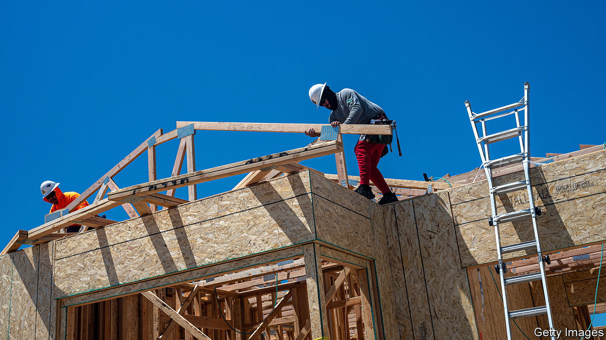
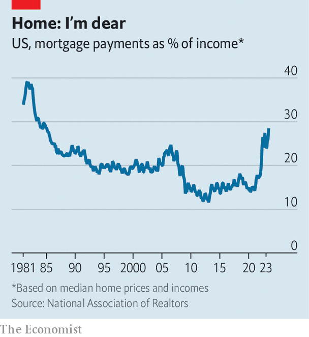

###### The property paradox

# How can American house prices still be rising? 

##### Mortgage payments are at their highest since the mid-1980s 

 

> Aug 30th 2023 

Homeownership regularly nears the top of surveys about what Americans most want in life. Alas, this part of the American dream has rarely been harder to attain. Those looking to enter the property market face a triple whammy of high prices, costly mortgages and limited choice. Together these factors have conspired to make housing deeply unaffordable, with little sign of relief on the horizon. 

Yet in a roundabout way, the property crunch also helps explain one of the most pressing economic conundrums of the day: why American growth has remained robust, defying predictions of a recession.

 


Although housing is usually among the sectors most sensitive to interest rates, things have not been quite so straightforward in America. As the Federal Reserve turned hawkish over the past two years, mortgage rates soared, ascending from less than 3% to more than 7%. For the median family buying the median home, mortgage payments doubled from roughly 14% of monthly household income in 2020 to nearly 29% in June, the highest since 1985, according to the National Association of Realtors (see chart).

Surprisingly, the jump in mortgage rates has not led to a decline in house prices. They fell briefly as rates began to rise but have since rebounded to the record highs hit early last year after covid-era stimulus washed across the economy. Figures released on August 29th showed that this rebound may be gaining strength: house prices in the second quarter of the year rose at an annualised pace of 15%, according to the s&amp;p Case-Shiller index, a benchmark for American property prices. 

What explains this impressive resilience? For something the size of America’s property market—where annual sales are worth about $2trn, scattered across a continent-sized economy, in which some regions are flourishing and others contracting—there is inevitably a nuanced answer. However, a good summary came in late August from Douglas Yearley, chief executive of Toll Brothers, one of America’s biggest homebuilders, during an earnings call. “There are still buyers out there. They have very few options,” he explained.

Although demand for homes has fallen as rates have risen, the supply of properties has fallen almost in lockstep. Homebuyers typically obtain fixed-rate mortgages for 30 years—unheard of in most countries but viewed almost as a constitutional right in America, owing to the role of Fannie Mae and Freddie Mac, two giant government-backed firms, which buy up mortgages from lenders and securitise them. In enabling lenders to offer long-term fixed rates, their objective is to make it easier for people to buy homes. But now long-term rates are serving as an impediment, since homeowners who got low-interest mortgages before the Fed raised rates have no desire to give them up, and so are unwilling to sell their homes. Redfin, a property platform, calculates that 82% of homeowners have mortgage rates below 5%. Charlie Dougherty of Wells Fargo, a bank, calls the result “a state of suspended animation” for the housing market. 

The decline in transactions, all else being equal, ought to hurt the economy, dampening housing-related activity, with less money spent on remodelling, new construction, furniture and so on. This is not how things have played out, however. Unable to trade up to nicer digs, locked-in homeowners have invested more in fixing up their current homes. The rise of remote working has reinforced this trend, with people adding extra office space to their houses. Remodelling expenditures in 2022 reached nearly $570bn, or about 2% of gdp, up by 40% in nominal terms from 2019, according to the Joint Centre for Housing Studies at Harvard University.

Many of those braving the market in order to purchase homes have opted for new-builds, rather than existing stock. One advantage of newly built homes is that they are actually available. This means that they account for about one-third of active listings this year, up from an average of 13% over the two decades before the covid-19 pandemic, according to the National Association of Home Builders. As Daryl Fairweather of Redfin puts it: “Builders are benefiting because they don’t have competition from existing homeowners.” 

Homebuilders have also been bold in offering incentives to buyers. Most strikingly, they have been “buying down” as much as 1.5 percentage points on mortgage rates, by paying a one-time fee upfront that reduces future interest payments. This has allowed their in-house mortgage companies to offer rates of roughly 5%. For homebuilders, these buy-downs are equivalent to knocking off about 6% from their selling price, which they can easily afford given the strength of their balance-sheets. For buyers, the lower mortgage rates are welcome relief in the current environment, which has translated into a pick-up in both purchases and construction. New starts on single-family homes bottomed out late last year. In July starts were up by nearly 10% compared with a year earlier.

Property types now wonder whether the price resilience will continue. The market faces a test as mortgage rates climb even higher. For much of the past year rates had seemed to stabilise at around 6.5%, but since the start of August investors have concluded that the Fed will keep policy tight for longer, which has pushed mortgages towards 7.5%. “The higher rates go, the more demand falls. This is going to catch up with the homebuilders pretty quickly,” reckons John Burns, a property consultant. To counter a slowdown, some lenders may offer riskier deals. Zillow, a property platform, has started promoting downpayments of just 1% on homes in Arizona, a once-hot market. If prices fall, owners with little equity in their homes may be among the first to default.

Should the property market remain resilient, however, it is the Fed’s policymakers who will face a test. Strong housing-market activity contributes to an overheating economy. A sustained rebound in prices would also complicate the inflation outlook. The relationship is not entirely straightforward, since property shows up in inflation indices in terms of rents, rather than purchase prices. Moreover, the main inflation gauges tend to lag behind high-frequency measures of rents by at least six months. These measures have fallen for much of the past year, and the decline is just now filtering into official inflation indices—a process that will probably continue into early 2024.

What happens after that is much less certain. On the one hand, a record number of apartment units are currently under construction, and this supply ought to keep a lid on rents. On the other hand, the unaffordability of housing is forcing more would-be buyers into the rental market, which could push up rents and add to inflation. One big thing is clear: until interest rates come back down, millions of Americans will have little choice but to defer their dream of homeownership. ■


