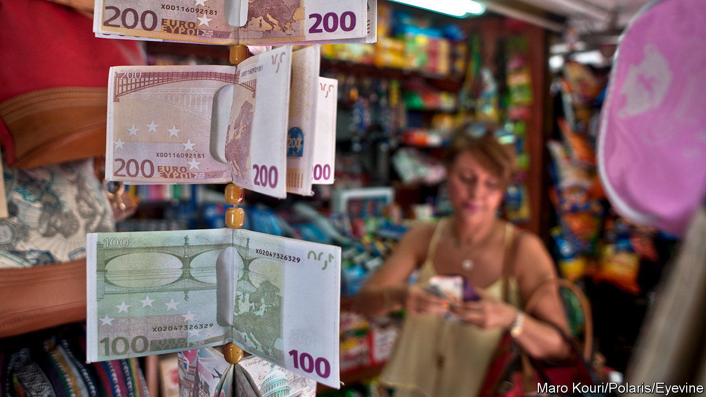

###### How to make money

# Which country’s genius deserves the €500 note? 

##### Europe prepares for a fight 

 

> Aug 31st 2023 

Money can look like just about anything. In ancient China, bronze knives circulated as a means of payment; during the Depression, Californians used clamshells instead of cash; in 1970 Irish shoppers were forced, by a banking strike, to make do with ious written on toilet paper. As Hyman Minsky, an economist, put it: “Anyone can create money; the problem is getting it accepted.” 

Europeans will soon need to accept a new-look euro. A European Central Bank (ecb) survey, which closed at the end of August, asked respondents to choose between seven themes, varying from “hands: together we build Europe” to “rivers, the water of life in Europe” and “our Europe, ourselves”. A design contest will now follow, and updated euros will emerge from cash machines in 2026. 

Economists see money as a neutral medium of exchange, but images on banknotes are some of the world’s most recreated designs. For governments, they are an opportunity to put propaganda in pockets, and transmit a certain idea of the state. Birds, another possible theme, would symbolise “freedom of movement”, the ecb says, as well as celebrate the eu birds directive, which protects nature. Such a rosy picture of European co-operation is in stark contrast with the messages sent a century ago: the German 10,000 mark note, introduced in 1922, included a vampire, representing France, sucking a German worker dry. 

Putting dead presidents on money, as America does, or monarchs, like Britain, is a less appealing option in Europe. A squabbling bloc of 20 countries, including those for which the term “nationalism” was coined, are unlikely to be satisfied with a focus on any one country’s leaders, even those long gone. Famous artists, a mooted alternative, will almost certainly end up with an argument over which country’s genius deserves the €500 note, which ends up on the €5 and which misses out altogether.

The ecb previously managed to swerve these dilemmas by using imaginary bridges. These showcased the continent’s traditional architectural styles (baroque, neoclassical and so on) without favouring any single country’s monuments. That was until Spijkenisse, in the Netherlands, spoiled things. The suburb of Rotterdam turned the images into reality, employing dyed concrete to match the colour of the banknotes. 

Whatever the end product looks like, cash is on the way out. According to the ecb, it was used for just 59% of euro transactions last year, down from 72% three years previously. For many Europeans, especially younger ones, money no longer looks like paper or coins, but whatever a smartphone screen displays. Ultimately, then, the new look for the euro will be decided more by graphic designers in Silicon Valley than central bankers in Frankfurt.■


