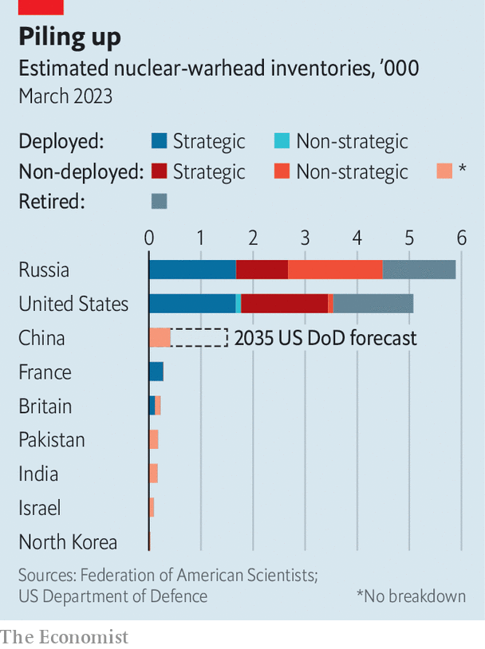

###### Oppenheimer’s nightmares

# A new nuclear arms race looms 

##### It will be harder to stop than the contest of the cold war 

 

> Aug 29th 2023 

From offices in America’s State Department and Russia’s Ministry of Defence, officials take turns “pinging” each other every couple of hours just to check the line is working. Then, almost always, silence follows. It is the dying heartbeat of global nuclear arms control.

Until March the direct link between the Nuclear Risk Reduction Centres (nrrcs) of the world’s two biggest nuclear powers was alive with messages informing each other about the movement of missiles and bombers. Under New start, which came into force in 2011 and which includes caps on long-range nuclear weapons, there were 2,000-odd such notifications in 2022. No longer. The half-yearly updates on warhead numbers have stopped, too. And there have been no on-site inspections since March 2020. 

For now, Russia and America still abide by the treaty’s confines on warhead numbers. They also exchange notifications of upcoming ballistic-missile launches under a previous accord (they have swapped only a few such messages in recent months). And they still hear from each other through separate multilateral channels used for the dozen or so agreements requiring notification through nrrcs.

Nevertheless, the world is drifting towards a new nuclear arms race. It will probably be harder to stop than that of the cold war, not least because of the complexity of  involving a rising China. The danger of “a chain reaction that would destroy the entire world”—the words spoken by Robert Oppenheimer, the father of the atomic bomb, at the end of Christopher Nolan’s eponymous film—looms ever larger.

 


That humanity averted annihilation owes much to the many agreements between America and the Soviet Union, now Russia, that limited nuclear weapons and built trust even as each retained the means to destroy the other. They brought down the global nuclear stockpile from 70,400 warheads in 1986 to 12,500 today (see chart). 

That era is ending, for four main reasons: America’s abandonment of agreements, Russia’s invasion of Ukraine, China’s nuclear build-up and disruptive technology. Begin with America. In 2002 President George W. Bush withdrew from the Anti-Ballistic Missile Treaty (which limited anti-missile defences), pointing to the dangers from North Korea and Iran. And in 2019 another Republican president, Donald Trump, pulled out of the  (which eliminated that category of missiles), citing cheating by Russia and China’s rise. 

Democratic presidents have been keener on arms control.  was negotiated by Barack Obama and then renewed for five years by Joe Biden in 2021. It limits each side’s “strategic” nuclear weapons (long-distance arms with high destructive power) to 1,550 deployed warheads and 700 deployed intercontinental ballistic missiles (ICBMs), bombers and submarine-launched ballistic missiles.

But New start does not control “non-strategic” or “tactical” weapons, usually smaller ones for battlefield use. Russia is thought to have 1,800 of them and America just 200. Nor does it capture Russia’s work on things such as nuclear-propelled cruise missiles and torpedoes. In turn, Russia complains that the nuclear arsenals of Britain and France, American allies with more than 200 warheads each, are excluded. New start is set to expire in February 2026, and there is little prospect of a follow-on deal. In less than three years, the last major restraint on the world’s nuclear stockpile may well be removed.

For that blame Russia’s invasion of Ukraine, and its  to use nuclear weapons. Western countries have armed Ukraine, but have not sent their own troops, in part for fear of “world war three”. In February Russia said it would “suspend” New start, halting notifications. America  in March and June. Each side has since become ever less certain about the other’s posture, magnifying the risk of nuclear brinkmanship—especially at a time when the Kremlin is at war. Poland says Russia has started moving tactical weapons to Belarus. 

Then there is China, which is already racing to build up its . Unconstrained by treaties, it has long observed a “minimal deterrence” policy with a few hundred warheads. But the Pentagon estimates its stockpile will grow to perhaps 1,500 by 2035. That is close to New start’s deployed limit.

Nuclear tensions could spread further and unpredictably. India, which has an unresolved border dispute with China, may feel compelled to increase its stockpile, currently estimated at more than 160 warheads. That in turn may prompt Pakistan, with a similar number, to build up. North Korea, with perhaps 30 warheads, is intensively testing ICBMs. And Iran has become a threshold nuclear state.

New technologies could aggravate matters. Hypersonic missiles are harder to detect and shoot down than ballistic ones. Improvements in sensors and accuracy heighten worries about a disabling surprise attack. And the spread of artificial intelligence (aI) raises questions of how far nuclear war might be fought by computers.

In response, America has been flashing its nuclear sabre, if not quite rattling it. Its ballistic-missile submarines, which usually lurk unseen for months-long patrols, have been surfacing around the world of late. In July the  moored in the South Korean port of Busan, and the  called at Faslane in Scotland. In May naval commanders from Japan and South Korea embarked the  off Guam. Last October the  popped up in the Arabian Sea, in an apparent signal to Iran, for a visit by the head of America’s Central Command.

The “silent service” is no longer silent. “You can’t have a credible deterrent without communicating your capabilities,” Rear Admiral Jeffrey Jablon, commander of America’s submarine force in the Indo-Pacific, told . “If the adversary doesn’t know anything about that specific deterrent, it’s not a deterrent.” 

America wants to reassure allies that its “extended deterrence”—the promise to defend them from nuclear attack even if they eschew nuclear weapons—remains strong. Some in Poland and South Korea want America to store b61 nuclear gravity bombs in their countries. It has resisted. But showing “boomer” subs serves as warning to foes and reassurance to friends. 

America is busy modernising all three legs of its nuclear “triad” with new ground, air and sea systems. An unspoken aim is to rev up the nuclear industrial base to be able to produce more weapons in future, should they be needed. Some want to go further. A paper in March by the Lawrence Livermore Laboratory, a government-funded institute that among other things designs nuclear warheads, said America’s current nuclear force is “only marginally sufficient”. America should expand it when New start expires by “expeditious uploading”, deploying weapons currently held in reserve, for instance as multiple warheads on icbms; before then, it should demonstrate the ability to do so.

America has a greater “upload capacity” than Russia. The Federation of American Scientists, which campaigns to minimise global risks, calculates that from the current total of about 1,670 deployed strategic warheads each (it uses different counting rules from those for New Start), America could within a couple of years deploy 3,570 compared with 2,629 for Russia. Some experts worry that big powers might also resume testing nuclear weapons, an idea discussed in the Trump years. 

Talking of an “inflection point” in the nuclear balance, Jake Sullivan, Mr Biden’s national security adviser, declared in June that America was ready to discuss arms control with Russia and China “without preconditions”. Neither is rushing to take up his offer. Given its heavy losses in Ukraine, Russia is either too aggrieved or too reliant on nuclear weapons to consider a new accord. China, for its part, seems uninterested in limits, possibly until it achieves parity with America. 

Indeed, parity has been the basis of arms control between America and Russia. But it is harder to agree on when three powers are involved. America, in particular, worries that Russia and China might ally against it, given that they have declared a “friendship without limits” and conduct joint air and sea patrols. Mr Sullivan insists that America does not need “to outnumber the combined total of our competitors” to deter them. Yet the pressure for America to increase its numbers may prove irresistible, says James Acton of the Carnegie Endowment for International Peace, an American think-tank. As long as America’s targeting policy rests on “counterforce”—aiming nuclear weapons at the other’s nuclear sites to neutralise them—more weapons in the hands of rivals will mean that America will need more, too. 

Destroyer of worlds

Eric Edelman, the Pentagon’s former under-secretary for policy under Mr Bush, puts it differently, recalling cold-war reckonings about the ability to absorb a first strike and still be able to inflict unacceptable damage on a foe: “If you’ve got two adversaries with 1,500 weapons each and one launched a strike and you ride it out, then retaliate: what reserve do you have left to deal with the other adversary?” He adds: “We don’t really know yet what the right number is, but it’s probably north of 1,550.”

Given the poor prospects for new treaties to limit nuclear weapons, America is exploring less formal arrangements with China to prevent crises turning into conflict. Mr Sullivan proposed, for instance, extending the system of hotlines and notifications with Russia to all five permanent members of the un Security Council. But the Chinese response has been dispiriting. He summarised it thus: “If you wear a seat belt in a car, you’re going to be incentivised to drive faster and more crazy, and then you’ll have a crash. So, in a way, better not to have the seat belt.” 

Controlling the use of artificial intelligence is even harder, given that it cannot be seen and counted as ICBMs can. Even if ai can help decision-making, America, Britain and France have pushed for a norm requiring that there should always be “a man in the loop” when it comes to the use of nuclear weapons.

America’s nrrc remains fully staffed, with 40-odd people tending the lines, hoping for better times between Washington and Moscow. “Maintaining that line in times of good relations is important; it’s much more important when tensions rise, because the potential impact of miscalculations grows as other channels are strained,” says an American official. A Russian-speaker is always on hand. In a wiser world, there would be a Chinese-speaker, too. On screen  is told that he has given people “the power to destroy themselves”. The question now is whether humanity still has the power to save itself in the face of new nuclear nightmares. ■

