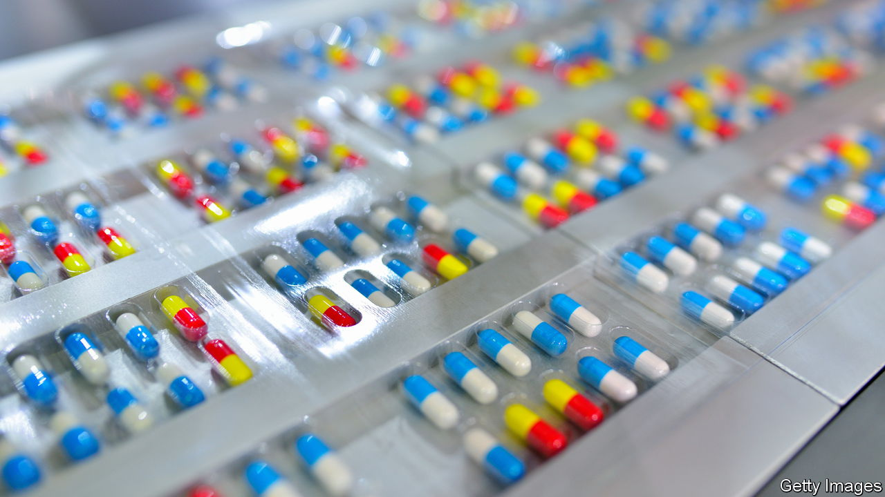
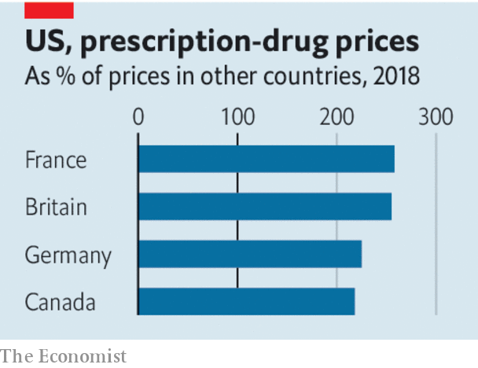

###### Beware side-effects

# America’s new drug-pricing rules have perverse consequences 

##### Medicare’s price mandate will deter innovation 

 

> Aug 30th 2023 

A quirk of American law long barred , the public-health insurer for the elderly, from negotiating with drug firms over prices. Even as the National Health Service in Britain and other government procurers haggled with companies to bring costs down, one of the world’s biggest spenders on drugs was forced to be a price-taker. Americans, meanwhile, spend more than twice as much on prescription medicines as people in other rich countries. In an attempt to lower the bill, the Inflation Reduction Act, signed by Joe Biden last year, now allows Medicare to use its purchasing power. On August 29th the administration revealed a list of ten drugs over which talks will soon begin. 

 


The ban on negotiations was illogical, and allowing Medicare to bargain with drugmakers makes sense. Alas, the new rules are too heavy-handed, and could have . 

A problem is that they have swung from one extreme to another. Officials will not so much be negotiating the price as setting it. The penalties for companies that do not comply with the negotiation process for a single drug are severe: they will either face an excise tax of 65-95% of the product’s sales in America, or have to withdraw all their medicines from public-health programmes altogether. It is like turning up to a fight where only one side has a gun. 

This matters, because setting prices low could harm innovation. Pharmaceutical firms are not earning vast excess profits, considering the risk of their investments. According to research published in 2021, once their spending on research and development is treated as an investment rather than an expense, pharma firms are not making outsize returns compared with the average firm in the s&amp;p 500. If they doubt that they will make a sufficient profit on their investments, they will spend less on finding new drugs. Sure enough, studies suggest that falling revenues hit research and development spending hard. 

This is typical of the unintended and undesirable effects from price regulation. Lower prices are popular with patients today and mean less of a drain on the public purse in the near term. But if they discourage investment in new medicines, that will be to the detriment of patients and society tomorrow.

The new rules will have further . Currently, it can be beneficial for a new drug to win its first approval for use by a small group of patients, such as those with rare or late-stage cancer, and after that to go through trials for diseases that affect more patients. But the new rules allow a fixed term of unregulated pricing that begins with the first drug approval. This encourages firms to seek treatments for the most lucrative diseases first. They may delay or entirely avoid expanding the drug’s use into diseases with fewer patients. Another perverse incentive is to give shorter periods of pricing freedom for molecules that are easier to copy when they come off patent, making them less attractive to develop in the first place. 

In a country that spends as much on health care as the entire German economy produces in a year, American officials are right to want to bring costs down. But, if big pharma isn’t earning excess profits, regulators looking to tackle the problems of health care would do better to pay more attention to the rest of the supply chain. The system is packed with opaque middlemen such as pharmacy benefit managers, many of which are making big rents. A spate of consolidation means these intermediaries are only gaining more pricing power. Mergers of hospitals over the past 20 years, meanwhile, have been shown to lead to stagnation in the quality of care. American health care needs fixing. But price controls on drugs are not the way to do it. ■


