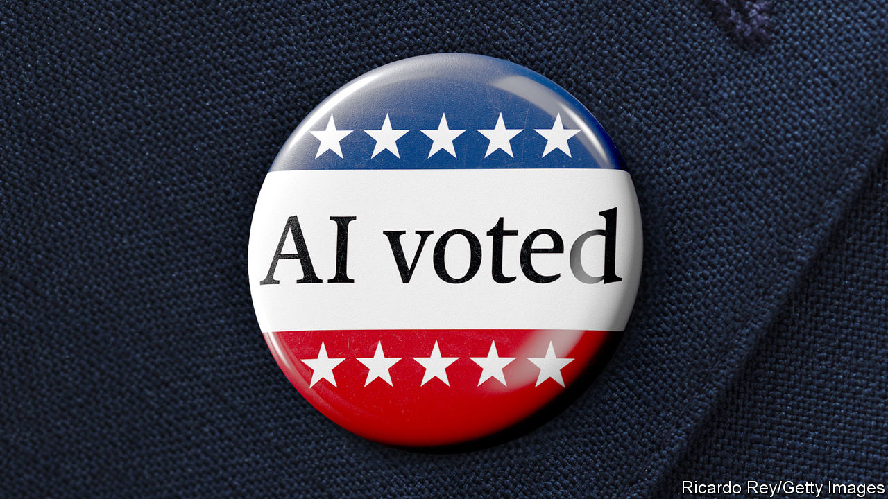

###### AI voted

# How artificial intelligence will affect the elections of 2024 

##### Disinformation will become easier to produce, but it matters less than you might think 

 

> Aug 31st 2023 

Politics is SUPPOSED to be about persuasion; but it has always been stalked by propaganda. Campaigners dissemble, exaggerate and fib. They transmit lies, ranging from bald-faced to white, through whatever means are available. Anti-vaccine conspiracies were once propagated through pamphlets instead of podcasts. A century before , anti-maskers in the era of Spanish flu waged a disinformation campaign. They sent fake messages from the surgeon-general via telegram (the wires, not the smartphone app). Because people are not angels, elections have never been free from falsehoods and mistaken beliefs.

But as the world contemplates a series of votes in 2024, something new is causing a lot of worry. In the past, disinformation has always been created by humans. Advances in  (AI)—with models that can spit out sophisticated essays and create realistic images from text prompts—make synthetic propaganda possible. The fear is that disinformation campaigns may be supercharged in 2024, just as countries with a collective population of some 4bn—including , Britain, India, Indonesia, Mexico and Taiwan—prepare to vote. How worried should their citizens be?

It is important to be precise about what generative-AI tools like  do and do not change. Before they came along, disinformation was already a problem in democracies. The corrosive idea that America’s presidential election in 2020 was rigged brought rioters to the Capitol on January 6th—but it was spread by Donald Trump, Republican elites and conservative mass-media outlets using conventional means. Activists for the BJP in India spread rumours via WhatsApp threads. Propagandists for the Chinese Communist Party transmit talking points to Taiwan through seemingly legitimate news outfits. All of this is done without using generative-AI tools.

What could large-language models change in 2024? One thing is the quantity of disinformation: if the volume of nonsense were multiplied by 1,000 or 100,000, it might persuade people to vote differently. A second concerns quality. Hyper-realistic  could sway voters before false audio, photos and videos could be debunked. A third is microtargeting. With ai, voters may be inundated with highly personalised propaganda at scale. Networks of propaganda bots could be made harder to detect than existing disinformation efforts are. Voters’ trust in their fellow citizens, which in America has been declining for decades, may well suffer as people began to doubt everything. 

This is worrying, but there are reasons to believe AI is not about to wreck humanity’s 2,500-year-old experiment with democracy. Many people think that others are more gullible than they themselves are. In fact, voters are hard to persuade, especially on salient political issues such as whom they want to be president. (Ask yourself what deepfake would change your choice between Joe Biden and Mr Trump.) The multi-billion-dollar campaign industry in America that uses humans to persuade voters can generate only minute changes in their behaviour.

Tools to produce believable fake images and text have existed for decades. Although generative AI might be a labour-saving technology for internet troll farms, it is not clear that effort was the binding constraint in the production of disinformation. New image-generation algorithms are impressive, but without tuning and human judgment they are still prone to produce pictures of people with six fingers on each hand, making the possibility of personalised deepfakes remote for the time being. Even if these AI-augmented tactics were to prove effective, they would soon be adopted by many interested parties: the cumulative effect of these influence operations would be to make social networks even more cacophonous and unusable. It is hard to prove that mistrust translates into a systematic advantage for one party over the other. 

Social-media platforms, where misinformation spreads, and AI firms say they are focused on the risks. OpenAI, the company behind ChatGPT, says it will monitor usage to try to detect political-influence operations. Big-tech platforms, criticised both for propagating disinformation in the 2016 election and taking down too much in 2020, have become better at identifying suspicious accounts (though they have become loth to arbitrate the truthfulness of content generated by real people). Alphabet and Meta ban the use of manipulated media in political advertising and say they are quick to respond to deepfakes. Other companies are trying to craft a technological standard establishing the provenance of real images and videos. 

Voluntary regulation has limits, however, and the involuntary sort poses risks. Open-source models, like Meta’s Llama, which generates text, and Stable Diffusion, which makes images, can be used without oversight. And not all platforms are created equal—TikTok, the video-sharing social-media company, has ties to China’s government, and the app is designed to promote virality from any source, including new accounts. Twitter (which is now called X) cut its oversight team after it was bought by Elon Musk, and the platform is a haven for bots. The agency regulating elections in America is considering a disclosure requirement for campaigns using synthetically generated images. This is sensible, though malicious actors will not comply with it. Some in America are calling for a Chinese-style system of extreme regulation. There, AI algorithms must be registered with a government body and somehow embody core socialist values. Such heavy-handed control would erode the advantage America has in AI innovation. 

Politics was never pure

Technological determinism, which pins all the foibles of people on the tools they use, is tempting. But it is also wrong. Although it is important to be mindful of the potential of generative AI to disrupt democracies, panic is unwarranted. Before the technological advances of the past two years, people were quite capable of transmitting all manner of destructive and terrible ideas to one another. The American presidential campaign of 2024 will be marred by disinformation about the rule of law and the integrity of elections. But its progenitor will not be something newfangled like ChatGPT. It will be Mr Trump. ■


