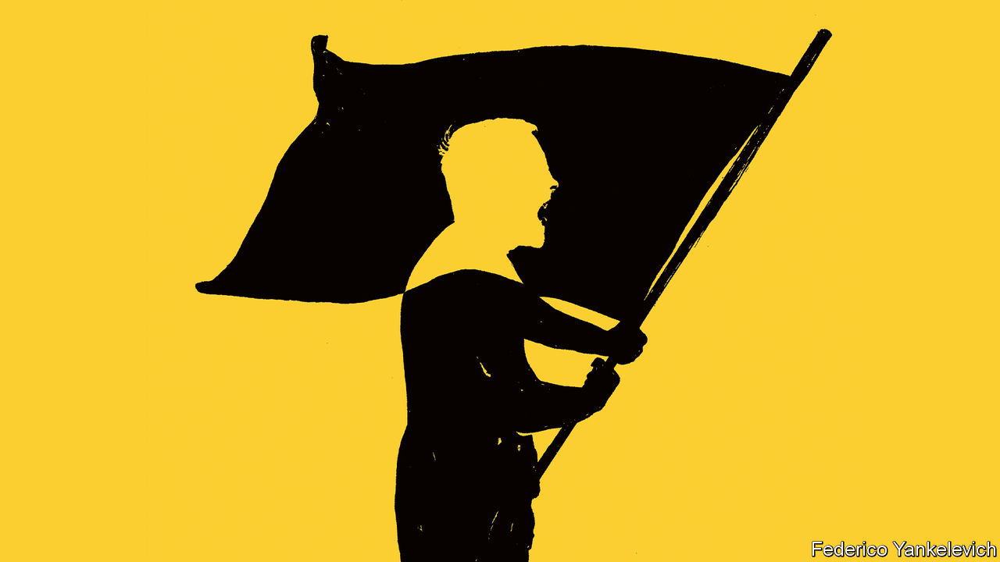

###### Global politics

# How paranoid nationalism corrupts 

##### Cynical leaders are scaremongering to win and abuse power 

 

> Aug 31st 2023 

PEOPLE SEEK strength and solace in their tribe, their faith or their nation. And you can see why. If they feel empathy for their fellow citizens, they are more likely to pull together for the common good. In the 19th and 20th centuries love of country spurred people to seek their freedom from imperial capitals in distant countries. Today Ukrainians are making  to defend their homeland against Russian invaders.

Unfortunately, the love of “us” has an ugly cousin: the fear and suspicion of “them”, a paranoid nationalism that works against tolerant values such as an openness to unfamiliar people and new ideas. What is more, cynical politicians have come to understand that they can exploit this sort of nationalism, by whipping up mistrust and hatred and harnessing them to benefit themselves and their cronies.

The post-war order of open trade and universal values is strained by the rivalry of America and China. Ordinary people feel threatened by forces beyond their control, from hunger and poverty to climate change and violence. Using paranoid nationalism, parasitic politicians prey on their citizens’ fears and degrade the global order, all in the pursuit of their own power.

As our , paranoid nationalism works by a mix of exaggeration and lies. Vladimir Putin claims that Ukraine is a NATO puppet, whose Nazi cliques threaten Russia; India’s ruling party warns that Muslims are waging a “love jihad” to seduce Hindu maidens; Tunisia’s president decries a black African “plot” to replace his country’s Arab majority. Preachers of paranoid nationalism harm the targets of their rhetoric, obviously, but their real intention is to hoodwink their own followers. By inflaming nationalist fervour, self-serving leaders can more easily win power and, once in office, they can distract public attention from their abuses by calling out the supposed enemies who would otherwise keep them in check.

, the president of Nicaragua, shows how effective this can be. Since he returned to power in 2006, he has demonised the United States and branded his opponents “agents of the Yankee empire”. He controls the media and has put his family in positions of influence. After mass protests erupted in 2018 at the regime’s graft and brutality, the Ortegas called the protesters “vampires” and locked them up. On August 23rd they banned the Jesuits, a Catholic order that has worked in Nicaragua since before it was a country, on the pretext that a Jesuit university was a “centre of terrorism”.

Rabble-rousing often leads to robbery. Like the Ortegas, some nationalist leaders seek to capture the state by stuffing it with their cronies or ethnic kin. The use of this technique under Jacob Zuma, a former president of South Africa, is one reason why the national power company is too riddled with corruption to keep the lights on. Our statistical analysis suggests that governments have grown more nationalistic since 2012, and that the more nationalistic they are, the more corrupt they tend to be.

But the more important role of paranoid nationalism is as a tool to dismantle the checks and balances that underpin good governance: a free press, independent courts, NGOs and a loyal opposition. Leaders do not say: “I want to purge the electoral commission so I can block my political opponents.” They say: “The commissioners are traitors!” They do not admit that they want to suppress NGOs to evade scrutiny. They pass laws defining as “foreign agents” any organisation that receives foreign funds or even advice, and impose draconian controls on such bodies or simply ban them. They do not shut down the press, they own it. By one estimate, at least 50 countries have curbed civil society in recent years. 

An example is the president of Tunisia, Kais Saied. Before he blamed black people for his country’s problems, he was unpopular because of his dismal handling of the economy. Now Tunisians are cheering his bold stand against a tiny, transient minority. Meanwhile Mr Saied has gutted the judiciary and closed the anti-corruption commission, and graft has grown worse.

Abuses are easier when institutions are weak: the despots of Nicaragua, Iran or Zimbabwe are far less constrained than the leaders of say, Hungary or Israel. But in all these countries (and many more), the men in power have invented or exaggerated threats to the nation as a pretext to weaken the courts, the press or the opposition. And this has either prolonged a corrupt administration or made it worse.

Paranoid nationalism is part of a backlash against good governance. The end of the cold war led to a blossoming of democracy around the world. Country after country introduced free elections and limits on executive power. Many power- and plunder-hungry politicians chafed at this. Amid the general disillusion that followed the financial crisis of 2007-09, they saw an opportunity to take back control. Paranoid nationalism gave them a tool to dismantle some of those pesky checks and balances.

Because these restraints often came with Western encouragement, if not Western funding, leaders have found it easier to depict the champions of good government as being foreign stooges. In countries that have endured colonial rule—or interference by the United States, as have many in —the message finds a ready audience. If a leader can create a climate of such deep suspicion that loyalty comes before truth, then every critic can be branded a traitor.

First resort of the scoundrel

Paranoid nationalism is not about to disappear. Leaders are learning from each other. They are also freer to act than they were even a decade ago. Not only has the West lost faith in its programme of spreading democracy and good governance, but China—a paranoid nationalist that is inclined to spot slights and threats around every corner—is promoting the idea that universal values of tolerance and good governance are a racist form of imperialism. It prefers non-interference from abroad and zero-criticism at home. If only they could see through the lies behind paranoid nationalism, ordinary people would realise how wrong China’s campaign is. There is nothing racist or disloyal about wishing for a better life. ■


