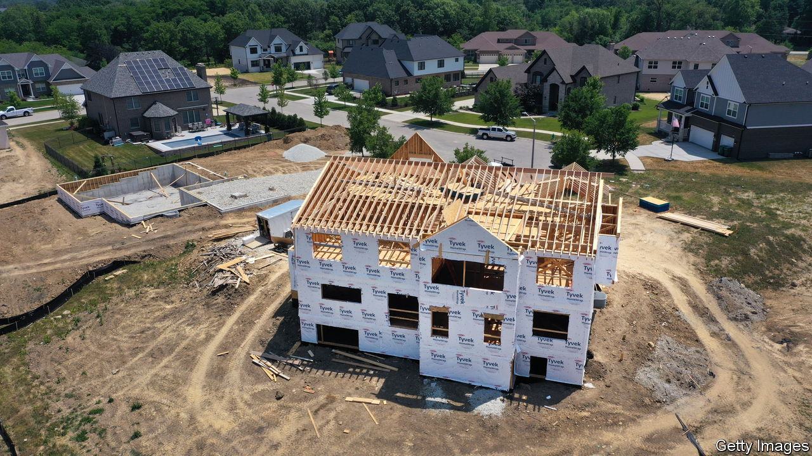

###### Great Danes

# To fix broken mortgage markets, look to Denmark 

##### Rising interest rates have exposed the problems with many home loans 

 

> Aug 31st 2023 

IT MATTERS when mortgages malfunction. Home loans underpin tens of trillions of dollars of financial assets, not to mention some of life’s most important transactions. And though the rich world is mercifully free of the tearaway lending that caused the global financial crisis of 2007-09, mortgage markets remain riddled with problems. The sharp rise in interest rates over the past year and a half has exposed them.

In America buyers have long enjoyed 30-year fixed-rate prepayable mortgages courtesy of the federal government. It implicitly guarantees mortgage-backed securities that are sold to investors through agencies such as Fannie Mae and Freddie Mac. The average 30-year rate stands at over 7.2%, the highest since 2001. It is now clear that anyone who borrowed in, say, early 2021, when the rate was 2.7%, secured the deal of a lifetime—especially as house prices have gone on to rise by nearly a third.

The trouble is that the system has gummed up the housing market. Moving home means borrowing afresh at much higher rates. So homeowners who might usually up sticks are instead staying put. In an otherwise hot economy, sales of existing homes are almost as rare as they were during pandemic lockdowns in 2020. Buyers have been left competing for the much smaller stock of new homes, sales of which are nearly a third higher than a year ago. And house prices, having dipped briefly after rates first rose, are once again reaching . 

If America offers a case study in how government intervention can distort the market, other systems show how severely higher rates threaten some households. In Britain borrowers typically fix their interest rate for only a few years. As a result the screw is steadily turning on borrowers as they refinance cheap loans. By the end of 2026, 2m of them will have faced a rise in annual mortgage payments of more than £3,600 ($4,570)—over 10% of median household income. The situation is similar in Sweden, where almost 90% of loans have a fixed-rate period of two years or less. In New Zealand interest costs alone could soon exceed a fifth of borrowing households’ disposable income. 

Nobody forced homeowners to borrow, and they tend to be well-off. But it is not ideal that, in countries where homeownership is prized, households take enormous, perhaps unwitting, bets on interest rates almost as a rite of passage. Many would take out interest-rate fixes if they could—as many Americans do. 

Fortunately there is a proven middle ground between the distorted American system and a floating-rate free-for-all. In Denmark homebuyers can borrow at 30-year fixed rates, and mortgages are prepayable. About half of borrowers fix for three decades. Yet there is no problem of “locked in” homeowners because a seller can end a mortgage by buying it back at its market value, which falls when rates rise, thereby cashing out the value of their interest-rate fix. Alternatively they can transfer their mortgage to the home’s new owners. The result is greater dynamism: in the first quarter of 2023 housing transactions were down by only 6% on a year earlier, compared with 22% for existing homes in America. 

The government provides no guarantees. The role that Fannie and Freddie play in America is fulfilled in Denmark by highly capitalised mortgage banks. Their thick safety buffers meant that, unlike Fannie and Freddie, they did not require a full-scale government rescue in 2007-09. And unlike America’s agencies, they originate the loans whose payments to investors they guarantee, which encourages prudent lending.

There are catches: mortgage banks are protected from losses by creditor-friendly rules, including swift foreclosure procedures and barriers to declaring bankruptcy. But the flexibility and protection the Danish system offers is enviable when many mortgage markets are either distorting economies or causing hardship. Other countries would do well to try it. ■

