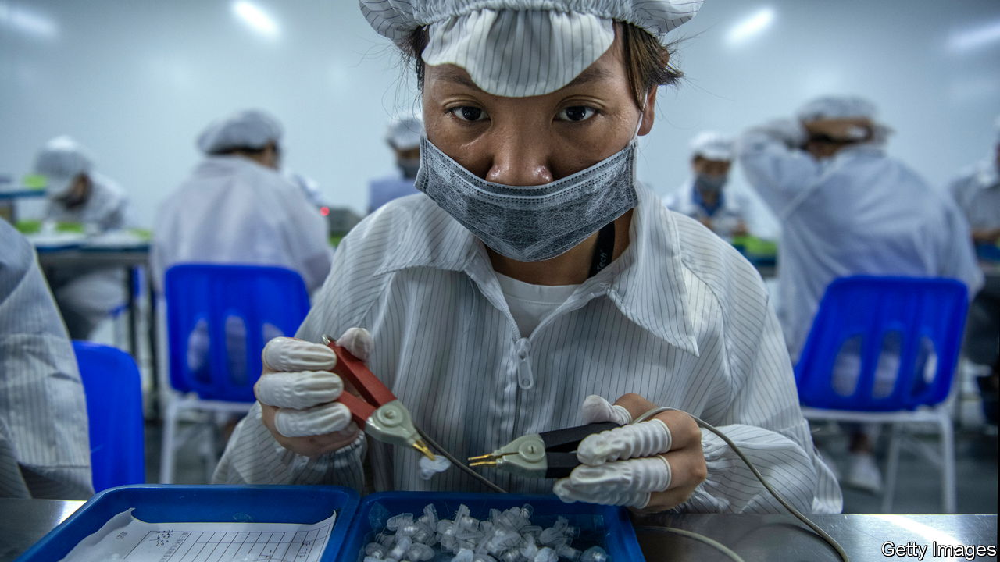

###### On corporate lobbying, ultra-processed foods, life sciences, the British Virgin Islands, Chinese youth, the Luddites, public toilets, holey socks

# Letters to the editor 

##### A selection of correspondence 

 

> Aug 31st 2023 


Reining in the lobby horse

Your assertion that “in a fractious world, businesses cannot hide from politics and geopolitics” (“”, July 29th) is far from being a platitude. Historically, businesses have stayed away from the most contentious social issues in order to preserve their bottom line. Yet this has never prevented them from using their corporate political power, through lobbying and other subtler forms of influence, to bend the rules to serve their own self-interest. 

What is new today is the growing awareness that companies are too often saying one thing, be it on values or purpose, such as stricter green standards, and lobbying for another, against those very standards. The misalignment between corporate lobbying and companies’ commitments to values is a big factor underpinning a lack of progress on numerous critical issues, ranging from the failure to act on the climate emergency to an unfair global tax regime. 

With investors, employees and customers increasingly scrutinising corporate conduct, there is a clear case for greater transparency and responsibility in the way companies exercise their political influence, especially through their unaccountable trade associations. This can start with mandatory reporting and assessment of all corporate political activities. Ultimately, no company can declare itself sustainable unless it fully internalises not only its environmental and social impact, but also its political footprint. 

Alberto Alemanno

Professor of law

HEC Paris

 


Unappetising food

You say that ultra-processed foods (UPFs) are “cheap, tasty and abundant” (, August 7th). “Tasty” is a subjective assessment. There is persuasive evidence, summarised in the book by Chris van Tullekan that you mention, that “addictive” would be a better descriptor. For instance, Pringles crisps are engineered to tell our taste buds that essential nutrients are on the way. But they don’t contain those nutrients so the body demands more. Tricking a billion years of evolution by presenting the body with entirely new chemical formulations is part of what makes UPFs sell. “Cheap” fails to tackle the consequences, which include the costs of rising obesity and diabetes.

Rob Macdonald


 


Reviving life sciences

If the British government wants to help our life-sciences sector flourish it needs to do more to give startups the best chance of realising their potential at home (“”, August 12th). Britain has a strong history in life sciences. In and around research-intensive universities, like Imperial College London and its White City innovation campus, entrepreneurial researchers are turning advances in vaccines and drug discovery, biomaterials and synthetic biology into game-changing startups.

Many of the world’s most pressing problems depend critically on the successful but challenging commercialisation of fundamental science and engineering innovations like these. These kinds of innovations tend to be time-consuming, expensive and risky to bring to market; unattractive factors for investors, especially if longer-term support is uncertain. The result is that too many life-science startups struggle to scale in Britain. If they survive they end up being sold prematurely to overseas companies before they reach their full potential. 

We must avoid British life sciences becoming simply a feeder for overseas markets like America. That means expanding public investment in R&amp;D, creating sustainable, long-term funding and innovative commercialisation models to help deep-tech startups become commercially viable. Policymakers are right to focus on high-potential sectors to deliver economic growth, but they must do more to enable the success of startups on our shores.

Professor Mary Ryan

Vice-provost (research and enterprise)

Imperial College London

 


The British Virgin Islands responds

The patronising and condescending tone with which the British Virgin Islands (BVI) is portrayed in your article on offshore finance in the Caribbean (“”, August 26th), particularly with phrases like “the smell of rotten governance” and observations about the territory appearing “scruffier”, fails to offer an accurate and comprehensive picture. 

First and foremost, it is crucial to underscore a point your article ambiguously conflates: the American arrest of Andrew Fahie, a former premier, and Britain’s launch of a commission into governance are entirely separate from the BVI’s financial-services sector. This sector stands as operationally independent, upholding the highest international regulatory standards, a fact lauded by British representatives and global bodies. In fact, John Rankin, the BVI’s outgoing governor (who was appointed by Britain), highlighted this distinction, noting the commission was “not an investigation into the BVI’s financial services sector.” He went on to express unyielding support for the BVI’s regulatory bodies that consistently align with the stringent English common-law framework. Moreover, we must draw a clear line between the alleged actions of individuals and the broader reputation of the BVI.

The BVI is home to a globally respected international business and finance centre facilitating an estimated $1.4trn in cross-border trade and investment. Investment mediated by BVI Business Companies supports around 2.3m jobs globally and generates an extra $14bn each year in taxes for governments worldwide. 

The BVI’s financial-services industry is known for its resilience and has thrived amid changing global dynamics. We are confident in the continued success and growth of the BVI as a leading global financial centre, with an established international talent pool, world-class regulatory bodies, and unrivalled products and services.

The suggestion of a simplistic liberalisation of the BVI’s immigration policies doesn’t consider the intricate social and economic repercussions. Adopting a broad-brush approach, without understanding the BVI’s unique historical and demographic contexts, is not only patronising but also oversimplifies the challenges faced. Such a narrative lacks depth and overlooks the complexities involved in governing the BVI, a unique and proud country.

International financial centres like the BVI will remain vital cogs in boosting the global economy by facilitating investment and enabling a more efficient global marketplace. I appeal for a more measured, researched, and respectful portrayal of the BVI, with its multifaceted challenges and successes.

Elise Donovan

Chief executive officer

BVI Finance


 


Quiet revolutionaries

Disillusioned and nihilistic young people in China today may not be “revolutionary” in the conventional political sense, but their act of “giving up” is more radical than suggested in your briefing on “” (August 19th). Many young people liken themselves to  (garlic chives), a vegetable that grows only to be harvested repeatedly, or  (consumables), industrial supplies that are utilised and discarded. They see themselves as human fodder fed into the state’s economic-growth machine, exploited and neglected. 

Realising that they are only valued for their productive and reproductive capacities, they have now decided to withdraw from both. The remark by a young man that “we are the last generation” captures the tragically defiant spirit of denying the party the only resource young people can control: their minds and bodies. In a country where political dissent comes at a steep price, this passive act of giving up can be the fiercest form of resistance for many.

James Jiang


 


Reassessing the Luddites

Luddites have indeed had a bad press (, August 19th). The Luddites were weavers who by law had a monopoly on the trade. They viewed the mechanical looms of the Industrial Revolution to be operating outside the law, but their appeals to the crown were ignored. They had no right to organise. But they did try to work with the new factory owners and were willing to operate mechanical looms as long as their incomes were maintained. Factory owners who reached deals with the Luddites did not have their looms smashed. The Luddites were violently repressed. The new factories made inferior products, under conditions that were thought appalling even at the time. 

Robert Ellis


 


Spending a penny

Your article on British toilets reminded me how important it is to keep tabs on the whereabouts of your nearest McDonald’s (“”, August 12th). I recall 20 years ago in Hong Kong that the only toilets to be found were in McDonald’s. When visiting Guangzhou I was advised to use the toilets on the Shenzhen side of the border. With some trepidation, despite them being probably the busiest toilets in the world, I found them to be cleaner than anything in England. It showed what could be done if you put your mind to it.

Keith Appleyard


You omitted to mention the biggest single civilisational disaster that London has experienced since I moved here in 1954: the closing of all the Tube station toilets. In my student days no one ever needed to panic about being caught short in central London, even in the late evening after visiting a theatre or a pub, because every tube station had generous numbers of toilet cubicles, free of charge or penny-in-the-slot, provided equally for both genders. Any political party seeking a universally popular campaign pledge should promise to bring them back. 

Michael Banks


Why not extend the concept of free publicly accessible toilets to any restaurant or café as a condition of their operation? No more sheepish looks, mumbled apologies and buying a coffee you do not want. 

Robert Masters


 


Darn it!

To Bartleby’s refresher on business travel (), may I add one rule. In these times of heightened airport security, when travelling with your boss or colleague make sure that your socks do not have any holes in them.

Milind Phadke


