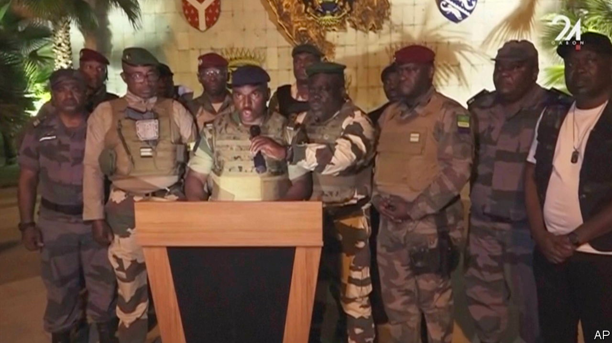
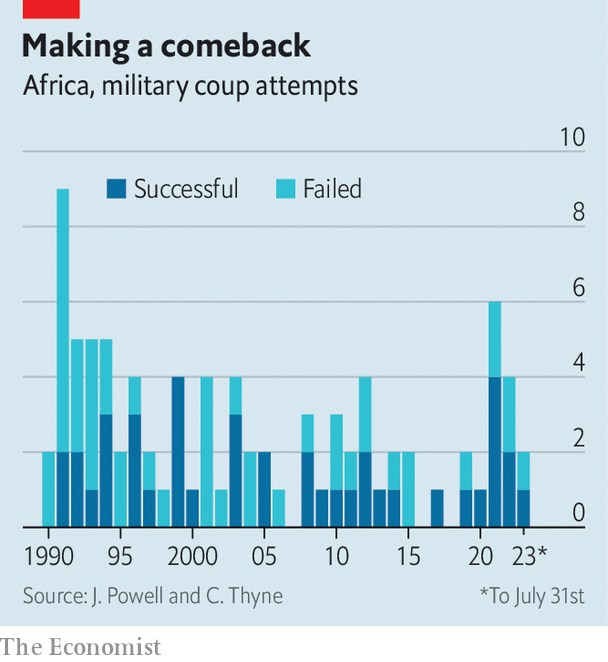

###### Here’s looking at coup, kid

# The coup in Gabon is part of an alarming trend 

##### Since 1990 two-thirds of coups in Africa have been in ex-French colonies 

 

> Aug 30th 2023 

Coups, like colds, are contagious. On August 30th officers in Gabon, a petrostate of 2.4m people in central Africa, became the latest men in uniform to announce on grainy state television that they had taken over their country. A month after generals toppled the democratically elected president of Niger, 2,000km to the north, the apparent putsch underlines how Africa seems to be hurtling backwards. At the start of the 21st century democratic transitions, shifting norms and stronger institutions led to a decline in the frequency of coups. But in the 2020s, as those norms and institutions wither, and African democracy lacks champions, they are becoming common again. 

Every coup has its own causes. Since 1967 Gabon, a former French colony, has been ruled by the Bongo family: first Omar Bongo Ondimba, then from 2009 his son, Ali Bongo Ondimba, who is now under house arrest. The country has the fourth highest GDP per head in sub-Saharan Africa but unemployment and poverty are rife. Last year French authorities reportedly charged nine of Omar Bongo’s 54 children with various financial crimes. Prodemocracy activists worried that an election on August 26th would be rigged, a concern heightened when the internet was shut off on voting day. Yet while the officers tapped into popular discontent, it seems more of a palace coup than a people’s revolution. Brice Clotaire Oligui Nguema, the newly appointed “transitional president”, leads the powerful Republican Guard—and is a cousin of Ali Bongo.

 


Yet Gabon is also part of a broader trend. From 1960 to 2000 there was an average of 40 attempted or successful coups globally per decade, according to data collated by Jonathan Powell and Clayton Thyne, political scientists. In the 2000s there were just 22; in the 2010s, 17. The 2020s have already brought 14. 

Though each case is unique, there are common explanations. The covid-19 pandemic and rising prices globally have hurt African economies, pushing up the cost of living and giving governments fewer resources for patronage. Insecurity, especially in the Sahel, makes military leaders seem more palatable. 

And as with many illegal acts, when there are few consequences more people will try them. At the start of this century African institutions, such as the African Union and regional blocs, were swifter to condemn countries where there had been coups. Leaders of influential countries like Nigeria and South Africa spoke out. Western countries amplified those messages at a time when they were more likely to be listened to. These days African leadership is weak. And even if the West strongly denounces a coup, which is not always a given, there are always China and Russia, which care nothing for democratic norms. 

The events in Gabon are also a reminder that France’s policy towards Africa is in tatters. Since 2000 16 of 24 successful coups in Africa have been in Francophone countries, according to Mr Powell and Mr Thyne’s data. Since 2020 the share is seven out of eight. This is probably not a coincidence. French governments have maintained a more interventionist approach to their former colonies than British ones (France keeps a military base in Gabon), contributing to a sense—exploited by Russia—that the government in Paris props up pliant and venal African elites at the expense of ordinary people living in these countries. The reality is more complicated. But coups are hardly acts of subtlety. ■

