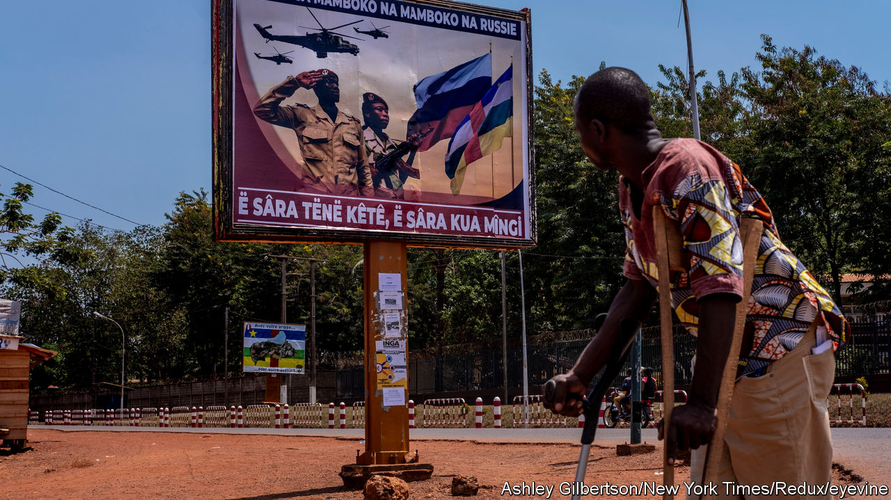
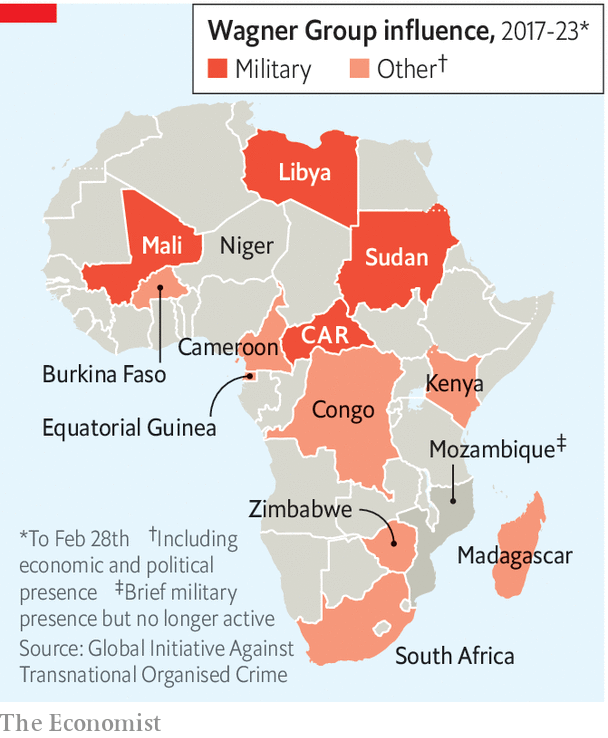

###### Russia in Africa

# Wagner’s customers will have to adjust to new leadership 

##### But Prigozhin will prove hard to replace 

 

> Aug 31st 2023 

The day after Yevgeny Prigozhin’s death Fidèle Gouandjika, an adviser to Faustin-Archange Touadéra, president of the Central African Republic (CAR), eschewed formal attire. He wore green trousers, military boots, a gun belt and a T-shirt reading JE SUIS WAGNER. “Prigozhin is a hero for us…We won’t forget him,” explained Mr Gouandjika. Yet he argued that ties between Russia and the CAR, the country where the Wagner Group is most ensconced, would endure. “Russia has done a lot for the CAR and will continue to do so.”

Over the past six years Wagner has brutally exemplified one half of Russia’s dual approach to Africa. The foreign-policy bureaucracy makes a show of having an Africa policy akin to that of China and Western powers. It hosts glitzy summits. Diplomats like Sergey Lavrov, Russia’s foreign minister, travel the continent signing trade agreements. But in parallel Wagner’s shadow operation blends 19th-century colonial enterprise with 21st-century high-tech gangsterism. Wagner has been the most notorious example of this cheap and somewhat deniable approach to the continent.

In the wake of Prigozhin’s death the future of Wagner’s African ventures—already unclear after his aborted mutiny in June—has been thrown into doubt. Russia seems unwilling to give up his empire, so is scrambling to assert control and reassure its customers. Other entities linked to the Kremlin may pick up Wagner’s businesses. But looking further ahead, it may prove more difficult for them to replicate Wagner’s success, especially if Russia is reluctant to take formal control over a volatile and criminal organisation.

 


At one point or another Wagner tried to establish a presence in about a dozen African countries (see map). But in reality it has a foothold in just four. It is in this quartet of fragile states that the future of Prigozhin’s empire will be decided. 

In the CAR Wagner is entwined with the Touadéra regime. The president has bodyguards and security advisers from Wagner. The group commands CAR troops outside Bangui, the capital, with . In exchange, firms in the Wagner network have muscled in on every kind of business from booze to diamonds and beyond. 

The Kremlin will not want to disrupt the close links between senior Wagner figures and the CAR elite. Wagner fighters can still be spotted around Bangui, shopping and drinking. Yet there are hints that Russia is trying to play down Prigozhin’s legacy. Local media outlets funded by Russian firms have not reported on his death. Mr Touadéra was discouraged from meeting Prigozhin at the Russia-Africa summit held in July. Instead he was introduced to Andrey Averyanov from the GRU, Russia’s military intelligence. “Russia will easily find a leader to continue Prigozhin’s grandiose work,” says Mr Gouandjika. 

Wagner has used the CAR to supply its allies in neighbouring Sudan, another of its main areas of influence. The Rapid Support Forces (RSF)—a paramilitary group that evolved from the genocidal  in Darfur in the 2000s—has since April been fighting a civil war against the Sudanese Armed Forces (SAF). 

Wagner has helped arm the RSF via the CAR in exchange for gold, say American officials. It is a “natural relationship” between “similar animals”, argues Kholood Khair, a Sudanese analyst. Both groups morphed from state-sponsored gangsters to state-threatening putschists. “Prigozhin actually followed Hemedti’s example,” adds Jędrzej Czerep of the Polish Institute of International Affairs using the better known moniker of Muhammad Hamdan Dagalo, the RSF leader. 

Without Prigozhin, Russia seems to be recalibrating its approach to an uncertain war. “Russia may play a slightly more cautious role going forward,” suggests Ms Khair. To date, Wagner has ensured an informal gold-plated relationship with the RSF. Yet there are signs that the Kremlin worries Wagner went too far. Since Prigozhin’s mutiny Russia has seen two visits from Malik Agar, the SAF’s number two. The army controls Port Sudan, where Moscow would like a Red Sea naval base.

By contrast, Libya may be one place where the demise of Prigozhin leads to more concerted effort from Moscow. Wagner has fought for years alongside Khalifa Haftar, a powerful warlord in the east, whose so-called Libyan National Army tried to seize Tripoli, the capital, in 2019. After the march on it failed, Wagner mercenaries stayed at military bases and oil facilities under Mr Haftar’s control.

Russia has already signalled that it wants to preserve this relationship. The day before Mr Prigozhin’s death, Mr Haftar met Yunus-Bek Yevkurov, Russia’s deputy defence minister, in Benghazi, suggesting that Mr Haftar will continue to enjoy Russian support more directly from the state. Russia may eye Libya as a foothold for operations elsewhere in Africa, a possible Mediterranean port and a supplier of oil.

In Mali Wagner has for almost two years been fighting jihadists alongside the ruling junta’s forces. Satellite imagery shows that its base has expanded since Prigozhin’s failed putsch. The Russian security services may be taking a more hands-on role here, too. Assimi Goïta, the junta’s head, reportedly met Mr Averyanov at the Russia-Africa summit. Analysts have recently seen a rise in flights to Mali from Syria, where Wagner has also operated, presumably bringing supplies for Russian fighters. 

How far Russia will go to support Mali is an open question, however. Last year the death toll from armed violence in the three worst-hit parts of the Sahel—Mali, as well as neighbouring Burkina Faso and Niger, which have both experienced coups celebrated by Moscow—leapt by 75% to more than 10,000. This year could be even deadlier, especially as 13,000 UN troops are starting to withdraw from Mali after being kicked out by the junta, following France’s decision to end its near-decade-long mission in the aftermath of Wagner’s arrival. 

Getting in deeper

Wagner may also be used by the junta to tackle enemies other than jihadists. Earlier this month a rebel group in the north of Mali—which, as a signatory to a peace deal signed in 2015, was deemed off limits to operations supported by France and the UN—said it was attacked by the Malian army and Wagner troops. That may endear the group to the junta but it may also create a wider conflagration. “For the junta there is no margin for error,” argues Soumaila Coulibaly of the University of Bamako, in the Malian capital. 

Though the Kremlin is eager to assure African allies that it will not leave them in limbo, it also seems keen to keep up arms-length arrangements. At the Russia-Africa summit several other mercenary groups were looking to hoover up business from the Wagner wreckage. “The Prigozhin empire in Africa is a cake that is now being carved up,” says Ivan Klyszcz of the International Centre for Defence and Security, a think-tank based in Estonia. Yet if African clients ask for formal backing from the Kremlin, the Russian armed forces, which are already struggling in Ukraine, may find it hard to oblige. And arrangements between Wagner and Russia’s proper army may become still more awkward. 

In the long run, argues Mr Czerep, Prigozhin will prove hard to replace. “Without his personality and ways of doing things, I don’t believe this whole infrastructure can continue.” In Africa, he adds, “Prigozhin was like a fish in water.” Those who come next may drown. ■

