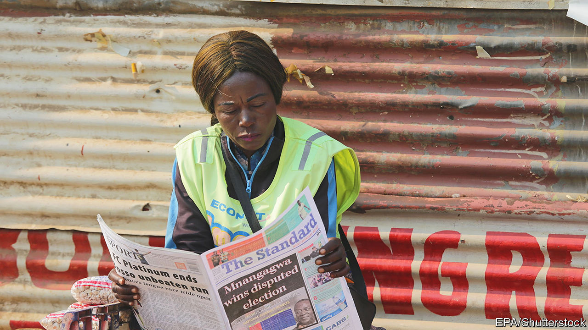

###### Out for the count

# Zimbabwe’s flawed election ensures that its pariah status endures 

##### Emmerson Mnangagwa won a majority of the votes. Or did he? 

 

> Aug 31st 2023 

THE ANNOUNCEMENT late on August 26th that Emmerson Mnangagwa had been re-elected as Zimbabwe’s president added to the abundance of dubiousness that has characterised the country’s elections. The opposition Citizens’ Coalition for Change (ccc) decried the official tallies—53% for Mr Mnangagwa versus 44% for its leader, Nelson Chamisa—as “fake”. It is calling for new elections. The fact that Cyril Ramaphosa, the president of South Africa, the region’s giant, has congratulated his counterpart suggests its efforts will be futile. Either way, Zimbabwe’s abject failure to hold credible elections means that its pariah status will endure for the foreseeable future.

There have been few free and  in Zimbabwe since white rule ended in 1980. Though there was much less of the horrific violence unleashed in 2008 by Robert Mugabe, whom Mr Mnangagwa replaced six years ago in a coup, some of the ruling party’s antics this year were unusually brazen. eu observers noted a “climate of fear”. On election day, August 23rd, ballots did not arrive until dusk in some urban areas, where Zanu-pf is weak, yet were ready in remote rural areas, where it dominates. Independent ngos collating a parallel vote had their offices raided and computers seized. Even observers from the normally gutless regional bloc, the Southern African Development Community (sadc), said the election belied Zimbabwe’s constitution—and criticised efforts to intimidate its delegation.


The ccc says that “this was not an election but coercion.” It argues that it is absurd that, though polls show that more Zimbabweans feel the country is going in the wrong direction than five years ago, Mr Chamisa supposedly won fewer votes (1.96m to 2.15m) and a lower share than at the last election, in 2018 (when he took 45%). It has lawyers who could take its case to the constitutional court. Yet Zimbabwe’s judges are widely seen as biased towards the ruling party. The ccc may consider protests but their supporters understandably worry about being shot on the streets. 

It is tempting to conclude that these elections will change nothing. For many ordinary citizens it will feel that way. Yet, assuming Mr Mnangagwa stays in office, there are several implications.

First, he faces a tough task keeping his web of power stitched together for the next five years. Zanu-pf did better (even officially) in the simultaneous parliamentary elections, winning 136 of 210 contested seats, than he did in the presidential one. Many in Zanu-pf and the security forces complain that Mr Mnangagwa, his family and his political allies from his home region concentrate too much power in their own hands.

Second, Zimbabwe may face a more challenging regional environment. sadc missions typically whitewash dodgy results. It was notable therefore that the regional bloc spoke out, especially the leader of its delegation, a former vice-president of Zambia. Regional leaders will still attend Mr Mnangagwa’s inauguration, but they will do so knowing that Zimbabwe has further sullied the region’s reputation.

Third, the election will set back efforts to bring Zimbabwe in from the cold. Last year the government, supported by the eu and the African Development Bank, agreed to make economic and political reforms in the hope that it could begin clearing the debt arrears which keep it locked out of the mainstream international financial system. That included credible elections. The eu, in particular, looks naive, having spent lots on observers in the belief that the poll might help pave the way for reform. The regime may now rely ever more on its friends in Belarus, China and Russia. (During the election a clutch of Russian “observers” were spotted in the same hotel as the eu observer mission.)

On election day in a poor part of Harare, Alice, a 50-year-old cook, woke early to vote. She found no ballot papers at the polling station. “It was no coincidence,” she said, given that she lives in a stronghold of the ccc. She went to work, making barely more that day than the taxi fare to get to and from the stall where she sweats. But she came back later and at last voted at 2am, once ballots had belatedly arrived. “I can at least say I tried,” she said. Sadly, it was not enough. ■

