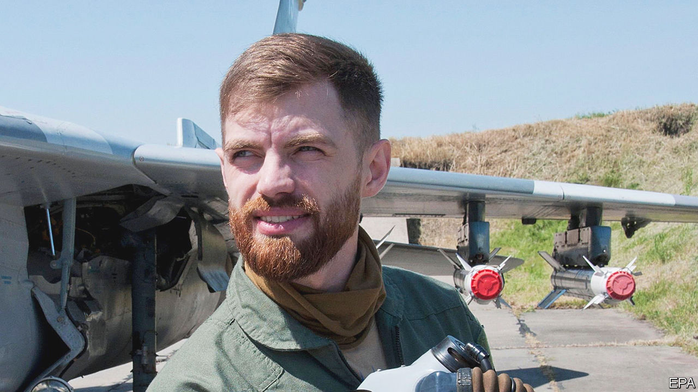

###### How to win a war

# Andriy Pilshchykov pleaded for F-16s to be sent to Ukraine 

##### The fighter pilot, known to many only as “Juice”, died on August 25th, aged 30 

 

> Aug 30th 2023 

As dreams went, it was not a quiet one. And he had it often. He was flying with his squadron in a fourth-generation F-16 fighter jet with a maximum speed of more than 2,000kph, or Mach 2. This Fighting Falcon was the coolest plane there was. Through the frameless bubble canopy he could see perfectly across the immense flat patchwork of Ukraine. With little strain on the control stick he could take the plane through its paces, soaring to 15,000 metres, swooping low or rolling quickly away. Its combat range, with four 454kg bombs on board, was 546km before refuelling. If he was spotted, the F-16’s electronics could jam the enemy’s radar. And as their pilots dithered he could release, one by one, a deadly stream of Sidewinder or Python missiles to blast that Russian shit out of the sky.

In reality, however, Andriy Pilshchykov flew a MiG-29. That was a different world. His plane was a Soviet-era model, upgraded since, but just not in the same class. It was much less adaptable, and needed frequent refuelling. The radar was so poor that he could not detect enemy missiles on his own, but had to take orders from the ground. Worse, the mig’s own R-27 missiles were heat-seeking, so firing them over cities was perilous; if he did not keep them in a radar lock, hard on target, they would make for buildings, camp fires, or anything else. Meanwhile his plane struggled to prevail against Shahed-136 kamikaze drones, slower than he was but too small to spot; let alone against nimbler Russian Su35s, the biggest enemy, firing missiles with a range three times as far as his. It was not a real fight; it was stupid. Ukraine could not win the war against those sorts of odds.

He told everyone so. Yuriy Ignat, an air-force spokesman, was deluged with his messages. But it was the Western powers he had to convince. There his strategy was more dramatic. He gave interviews to any Western media that sought him out, either while on standby, in flight suit and vizored helmet, or in fatigues, with a black bandana hiding half his face. His clothes made the point that he was fighting right now, and his message was urgent. Pakistan, Norway, Morocco, Italy, all had F-16s. Fully 4,600 were scattered round the world. Ukraine should have them too. 

His words were sharpened by the mystery of who he was. He went simply by the call sign “Juice”, a nickname he was given by the California Air National Guard when they were on exercises together. “Juice” came from his orders at bars: always juice, no alcohol. He had that official call sign long before other pilots in Ukraine, and it made him a star among them. When a myth sprang up about the Ghost of Kyiv, who had supposedly destroyed six Russian planes on the first day of the war, it was Juice, with his helmet and handsome blue stare, whose picture ran with the story. 

The “ghost” was in fact his unit, not him. But he liked the idea. “Top Gun: Maverick” was one of his favourite films. When not in his MiG he was often beside it, just waiting for the order to scramble into the sky. When it came, he had mere minutes to be ready. Meals were a snatched bite of a Snickers bar, or a bun from the airfield café. Then he was in the air, chasing, hunting. In the first ten weeks of the war he clocked up 500 combat hours. Night brought little rest; the Russians liked to fly then, so he slept in his flight-suit to be ready. Those sorties were hair-raising, as he raced through the dark without knowing what lay below him, open country or a blacked-out town, and with radar that could not tell drones from birds. Every enemy plane or drone he missed meant lives lost that he could have saved. But often, too close for comfort to heat sources on the ground, he simply had to abort, hoping the ground-to-air crews would finish the job. After nine months of fighting, he had still not “opened his score” of Russian kills. 

He longed to do that. From childhood, building model fighter planes, he had pored over their potted histories and decided, very early, to be a fighter pilot himself. As a teenager, he haunted airfields. By 2011, at 18, he had joined the air force. In 2014, after the annexation of Crimea, he flew missions in the east. The thought of a Russian incursion was always there; with such a neighbour, you had to be ready. The day before the invasion, he bought more ammo for his assault rifle. As a single man, his first thought was autonomous fighting with rifle, pistol, whatever it took, and in the streets or fields, anywhere. He always flew with his pistol stuffed in his home-devised survival vest.

On invasion day itself he raced to the main airfield in Kyiv, only to find there were no planes for him. There were not enough. For some days he had to be a foot soldier, looking out for saboteurs and helping to service more planes. After that, his war got going. As it ground on, he was convinced that the West had to give Ukraine more than ground-based systems such as IRIS-T and NASAMS, welcome and effective though those were. Air-to-air fighting was what would win the war.

Eventually the Americans heard him. In June 2022, because his English was perfect and his presence compelling, he was sent to Washington to make Ukraine’s case. On Capitol Hill he found sympathetic ears. Congressman Adam Kinzinger introduced a bill to fund the training of pilots and crews, with six co-sponsors. America would still not give Ukraine F-16s directly, for fear of escalation, but in August this year Denmark and the Netherlands were allowed to supply them from their stock. On the 24th came news that training of Ukrainians to fly them would start in October in Arizona. Ukraine had already sent a list of 32 pilots. Most did not qualify because their English was bad; but Juice had no problem there. All his pleading had given him useful practice. In a matter of months he, and Ukraine, could be taking the battle to the Russians in the best possible style. 

The very next day, however, he was out doing combat-training in two L-39s over Zhytomyr oblast, 140km west of Kyiv. Those planes were even older than his MiG, 1960s models. So Ukraine laboured along, still waiting. The L-39s collided and crashed, landing in gardens. No one was injured on the ground. ■

